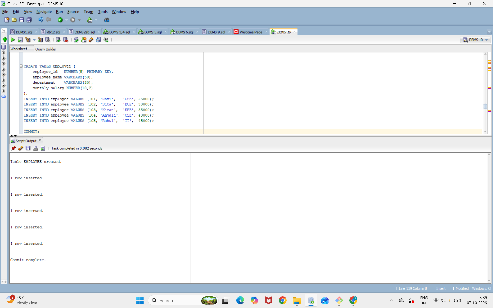
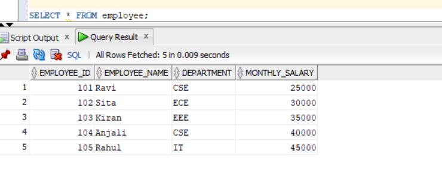
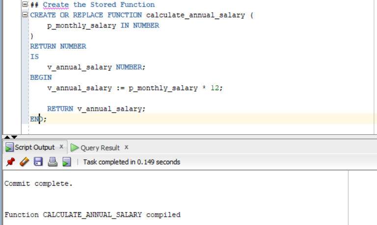
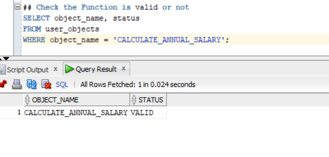
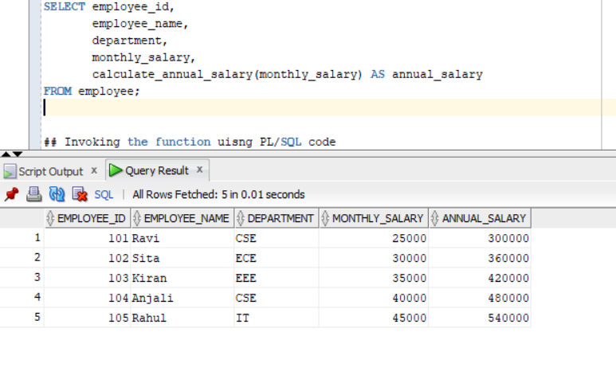
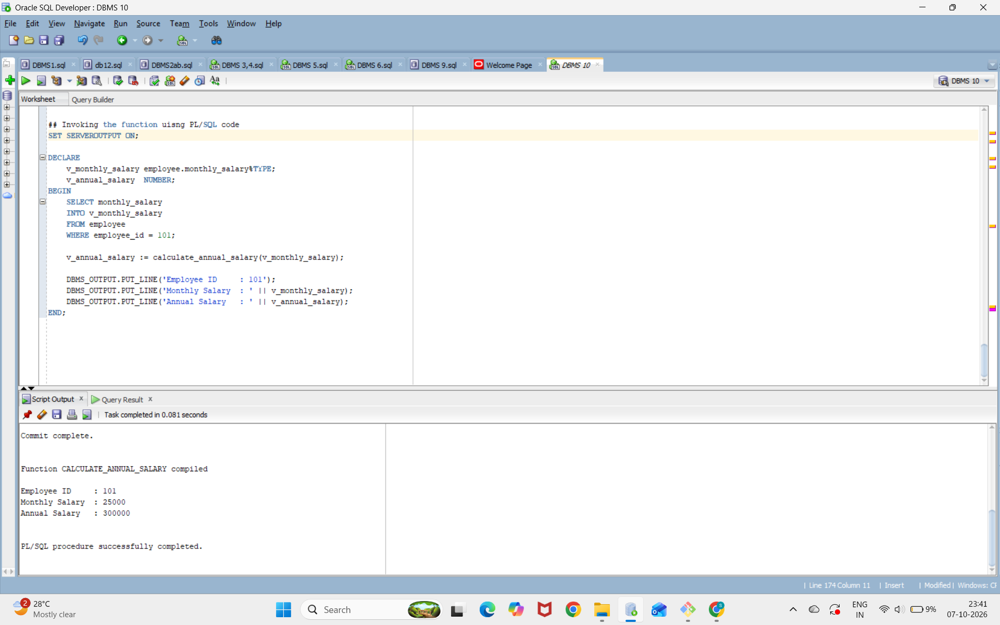

## creating a employee table;
```
CREATE TABLE employee (
    employee_id   NUMBER(5) PRIMARY KEY,
    employee_name VARCHAR2(50),
    department    VARCHAR2(30),
    monthly_salary NUMBER(10,2)
);
```

## inserting values into employee table
```
INSERT INTO employee VALUES (101, 'Ravi',   'CSE', 25000);
INSERT INTO employee VALUES (102, 'Sita',   'ECE', 30000);
INSERT INTO employee VALUES (103, 'Kiran',  'EEE', 35000);
INSERT INTO employee VALUES (104, 'Anjali', 'CSE', 40000);
INSERT INTO employee VALUES (105, 'Rahul',  'IT',  45000);

COMMIT;
```


## displaying employee table
```
SELECT * FROM employee;
```

## Create the Stored Function
```
CREATE OR REPLACE FUNCTION calculate_annual_salary (
    p_monthly_salary IN NUMBER
)
RETURN NUMBER
IS
    v_annual_salary NUMBER;
BEGIN
    v_annual_salary := p_monthly_salary * 12;

    RETURN v_annual_salary;
END;
```

## Check the Function is valid or not
```
SELECT object_name, status
FROM user_objects
WHERE object_name = 'CALCULATE_ANNUAL_SALARY';
```

## Invoke the Function Using a SELECT Statement
```
SELECT employee_id,
       employee_name,
       department,
       monthly_salary,
       calculate_annual_salary(monthly_salary) AS annual_salary
FROM employee;
```

## Invoking the function uisng PL/SQL code
```
SET SERVEROUTPUT ON;

DECLARE
    v_monthly_salary employee.monthly_salary%TYPE;
    v_annual_salary  NUMBER;
BEGIN
    SELECT monthly_salary
    INTO v_monthly_salary
    FROM employee
    WHERE employee_id = 101;

    v_annual_salary := calculate_annual_salary(v_monthly_salary);

    DBMS_OUTPUT.PUT_LINE('Employee ID     : 101');
    DBMS_OUTPUT.PUT_LINE('Monthly Salary  : ' || v_monthly_salary);
    DBMS_OUTPUT.PUT_LINE('Annual Salary   : ' || v_annual_salary);
END;
```

