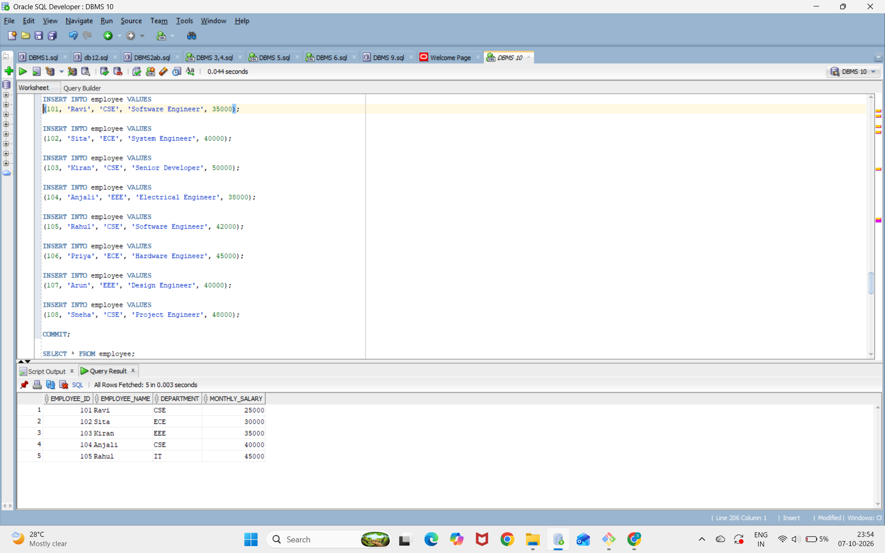

## creating employee table
```
CREATE TABLE employee (
    employee_id   NUMBER(5) PRIMARY KEY,
    employee_name VARCHAR2(50),
    department    VARCHAR2(30),
    designation   VARCHAR2(30),
    salary        NUMBER(10,2)
);
```

## inserting employee table
```
INSERT INTO employee VALUES
(101, 'Ravi', 'CSE', 'Software Engineer', 35000);

INSERT INTO employee VALUES
(102, 'Sita', 'ECE', 'System Engineer', 40000);

INSERT INTO employee VALUES
(103, 'Kiran', 'CSE', 'Senior Developer', 50000);

INSERT INTO employee VALUES
(104, 'Anjali', 'EEE', 'Electrical Engineer', 38000);

INSERT INTO employee VALUES
(105, 'Rahul', 'CSE', 'Software Engineer', 42000);

INSERT INTO employee VALUES
(106, 'Priya', 'ECE', 'Hardware Engineer', 45000);

INSERT INTO employee VALUES
(107, 'Arun', 'EEE', 'Design Engineer', 40000);

INSERT INTO employee VALUES
(108, 'Sneha', 'CSE', 'Project Engineer', 48000);

COMMIT;
```

## displaying values into employee table
```
SELECT * FROM employee;
```


## PL/SQL code
```
SET SERVEROUTPUT ON;

DECLARE

    -- Parameterized cursor
    CURSOR c_employee (p_department VARCHAR2) IS
        SELECT employee_id,
               employee_name,
               department,
               designation,
               salary
        FROM employee
        WHERE department = p_department;

    -- Variables to store employee details
    v_employee_id   employee.employee_id%TYPE;
    v_employee_name employee.employee_name%TYPE;
    v_department    employee.department%TYPE;
    v_designation   employee.designation%TYPE;
    v_salary        employee.salary%TYPE;

BEGIN

    -- Open cursor by passing department name
    OPEN c_employee('CSE');

    -- Fetch employee records
    LOOP

        FETCH c_employee
        INTO v_employee_id,
             v_employee_name,
             v_department,
             v_designation,
             v_salary;

        -- Exit when no more records are available
        EXIT WHEN c_employee%NOTFOUND;

        -- Display employee details
        DBMS_OUTPUT.PUT_LINE('Employee ID   : ' || v_employee_id);
        DBMS_OUTPUT.PUT_LINE('Employee Name : ' || v_employee_name);
        DBMS_OUTPUT.PUT_LINE('Department    : ' || v_department);
        DBMS_OUTPUT.PUT_LINE('Designation   : ' || v_designation);
        DBMS_OUTPUT.PUT_LINE('Salary        : ' || v_salary);
        DBMS_OUTPUT.PUT_LINE('-----------------------------');

    END LOOP;

    -- Close cursor
    CLOSE c_employee;

END;
/
```

