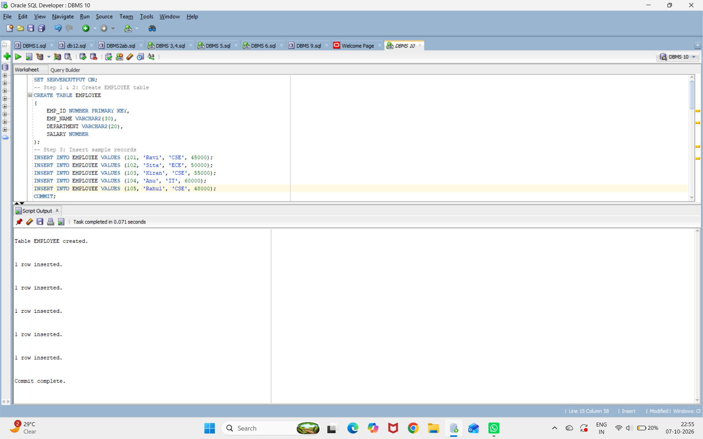
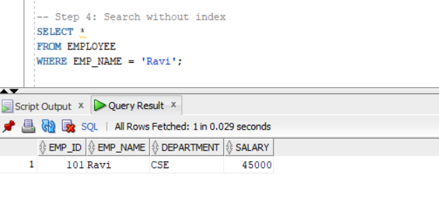
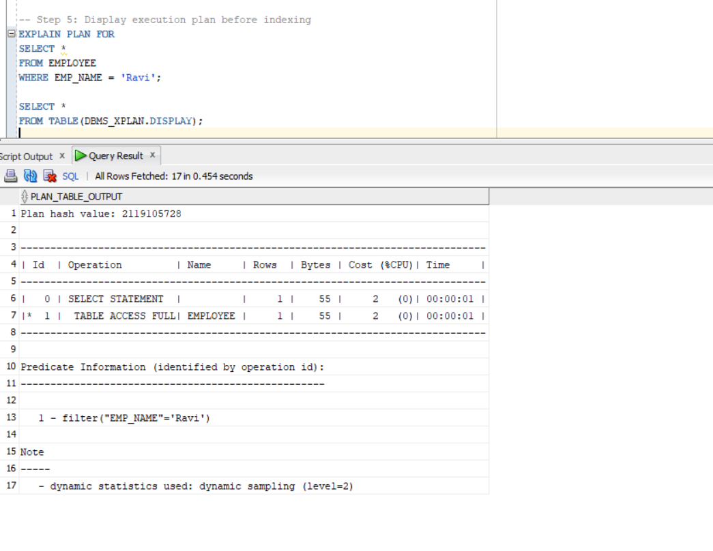
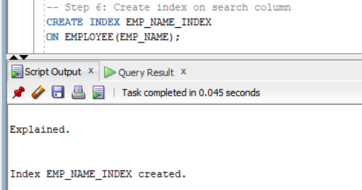
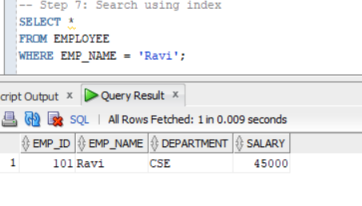
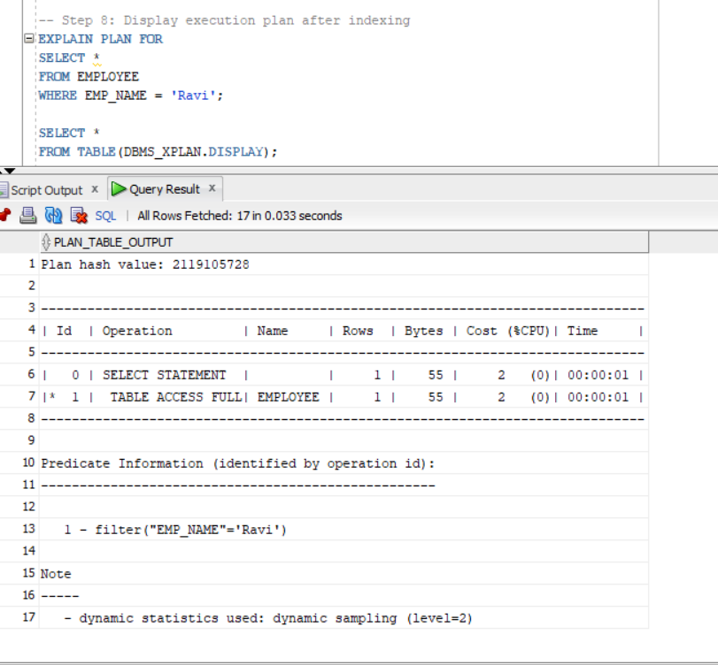
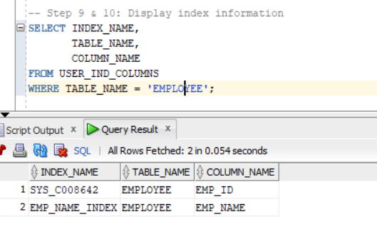
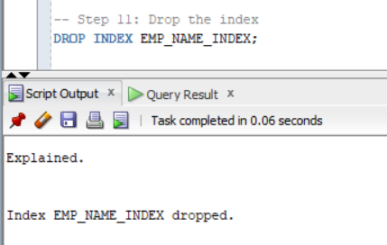
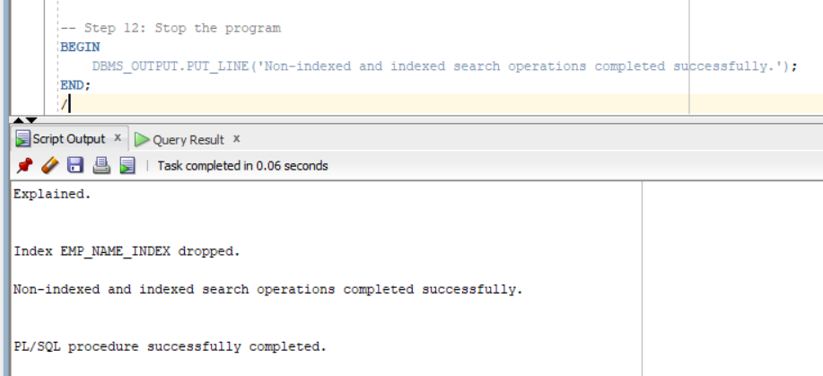

## EXPERIMENT 10
```
SET SERVEROUTPUT ON;
```
## Create EMPLOYEE table
```
CREATE TABLE EMPLOYEE
(
    EMP_ID NUMBER PRIMARY KEY,
    EMP_NAME VARCHAR2(30),
    DEPARTMENT VARCHAR2(20),
    SALARY NUMBER
);
```

## Insert sample records
```
INSERT INTO EMPLOYEE VALUES (101, 'Ravi', 'CSE', 45000);
INSERT INTO EMPLOYEE VALUES (102, 'Sita', 'ECE', 50000);
INSERT INTO EMPLOYEE VALUES (103, 'Kiran', 'CSE', 55000);
INSERT INTO EMPLOYEE VALUES (104, 'Anu', 'IT', 60000);
INSERT INTO EMPLOYEE VALUES (105, 'Rahul', 'CSE', 48000);

COMMIT;
```


##  Search without index
```
SELECT *
FROM EMPLOYEE
WHERE EMP_NAME = 'Ravi';
```

##  Display execution plan before indexing
```
EXPLAIN PLAN FOR
SELECT *
FROM EMPLOYEE
WHERE EMP_NAME = 'Ravi';

SELECT *
FROM TABLE(DBMS_XPLAN.DISPLAY);
```


## Create index on search column
```
CREATE INDEX EMP_NAME_INDEX
ON EMPLOYEE(EMP_NAME);
```


##  Search using index
```
SELECT *
FROM EMPLOYEE
WHERE EMP_NAME = 'Ravi';
```


##  Display execution plan after indexing
```
EXPLAIN PLAN FOR
SELECT *
FROM EMPLOYEE
WHERE EMP_NAME = 'Ravi';

SELECT *
FROM TABLE(DBMS_XPLAN.DISPLAY);
```


## Display index information
```
SELECT INDEX_NAME,
       TABLE_NAME,
       COLUMN_NAME
FROM USER_IND_COLUMNS
WHERE TABLE_NAME = 'EMPLOYEE';
```


## Drop the index
```
DROP INDEX EMP_NAME_INDEX;
```


## Stop the program
```
BEGIN
    DBMS_OUTPUT.PUT_LINE('Non-indexed and indexed search operations completed successfully.');
END;
/
```

