## CREATING THE SAILORS TABLE
```
CREATE TABLE Sailors(
sid NUMBER,
sname VARCHAR2(20),
rating NUMBER,
age REAL );
```


## DESCRIBING THE SAILORS TABLE
```
DESC sailors;
```
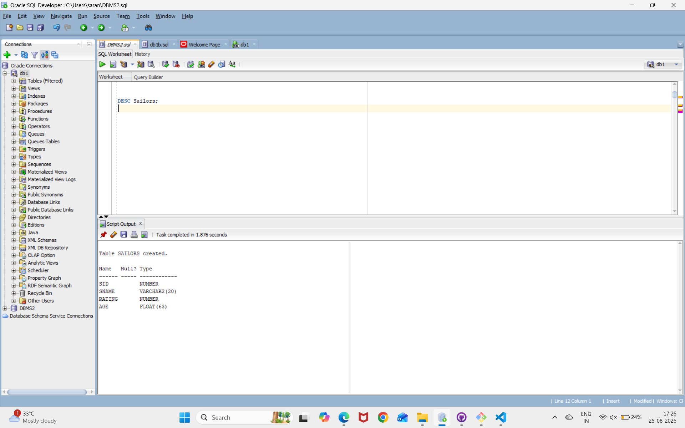

## INSERTING VALUES INTO THE SAILORS TABLE
```
INSERT INTO sailors VALUES(22,'Dustin',7,45.0),(29,'Brutus',1,33.0);
INSERT INTO sailors VALUES(31,'Lubber',8,55.5),(32,'Andy',8,25.5),(58,'Rusty',10,35.0),(64,'Horatio',7,35.0),(71,'Zorba',10,16.0),(74,'Horatio',9,35.0),
(85,'Art',3,25.5),(95,'Bob',3,63.5);
```
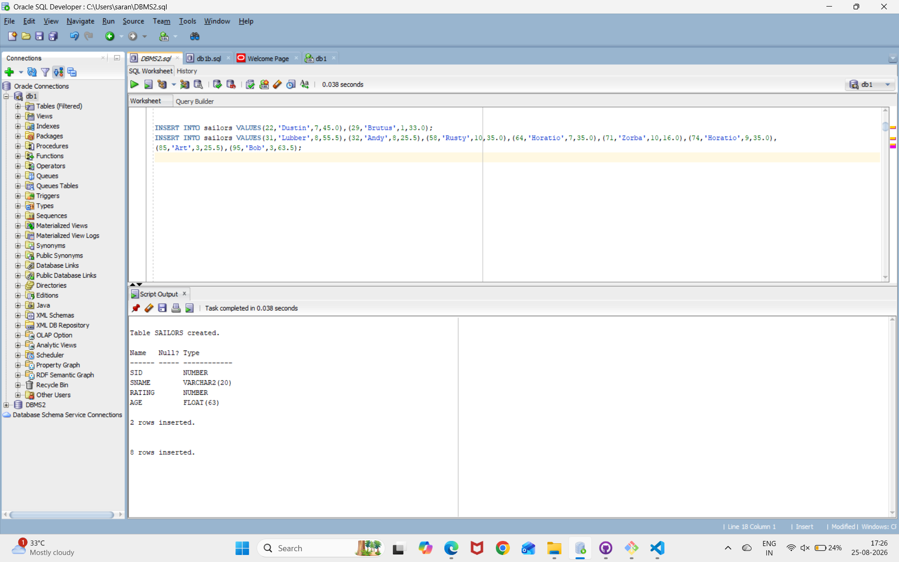

## DISPLAYING THE SAILORS TABLE
``` 
SELECT * FROM Sailors;
```
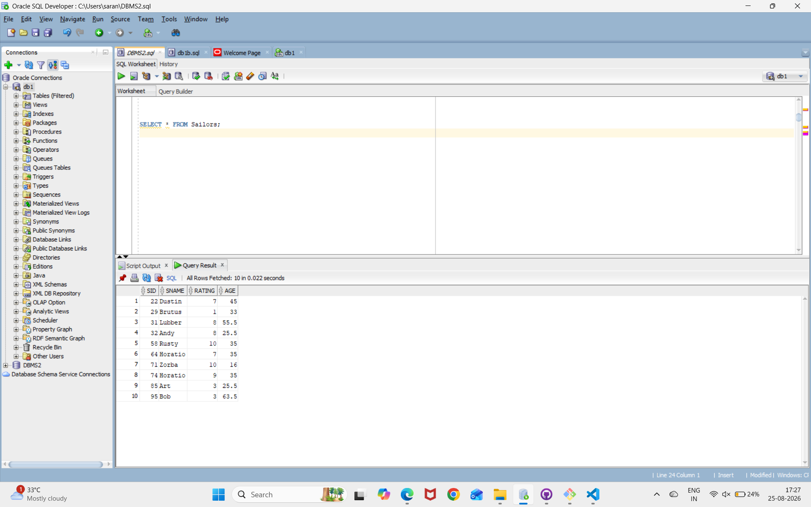


## CREATING THE RESERVES TABLE
```
CREATE TABLE Reserves(
sid NUMBER,
bid NUMBER,
day DATE );
```
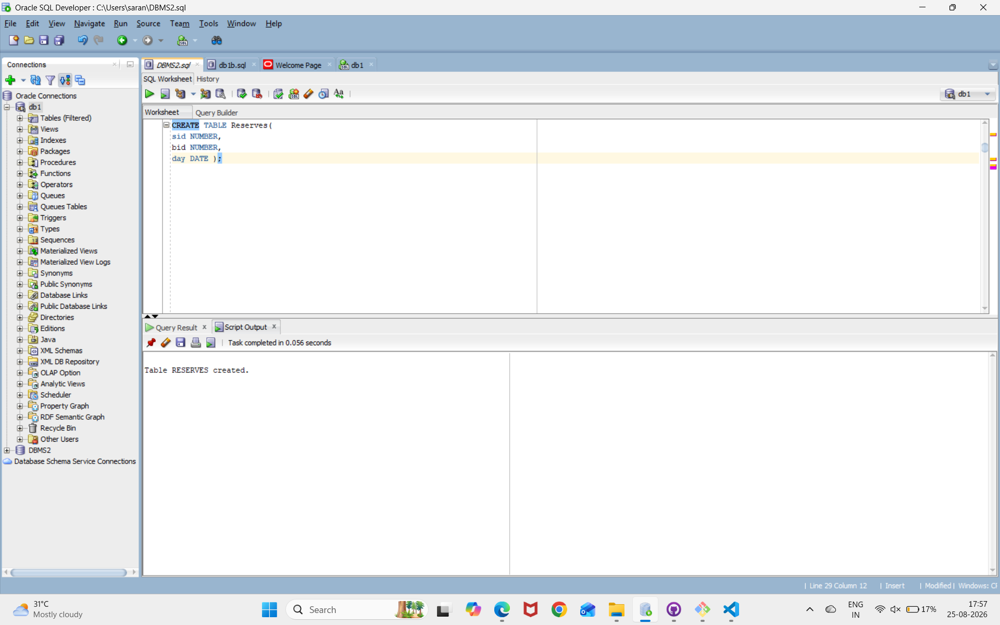

## DESCRIBING THE RESERVES TABLE
```
DESC Reserves;
```
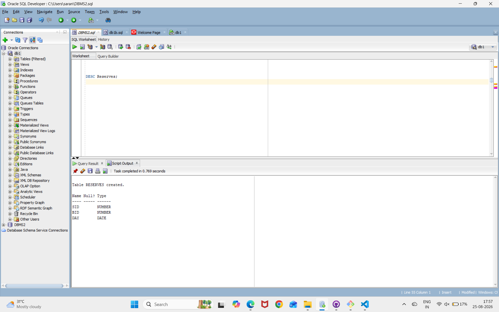

## INSERING VALUES INTO THE RESERVES TABLE
```
INSERT INTO Reserves VALUES(22,101,'10/10/98');
INSERT INTO Reserves VALUES(22,102,'10/10/98');
INSERT INTO Reserves VALUES(22,103,'10/8/98');
INSERT INTO Reserves VALUES(22,104,'10/7/98');
INSERT INTO Reserves VALUES(31,102,'11/10/98');
INSERT INTO Reserves VALUES(31,103,'11/6/98');
INSERT INTO Reserves VALUES(31,104,'11/12/98');
INSERT INTO Reserves VALUES(64,101,'9/5/98');
INSERT INTO Reserves VALUES(64,102,'9/8/98');
INSERT INTO Reserves VALUES(74,103,'9/8/98');
```
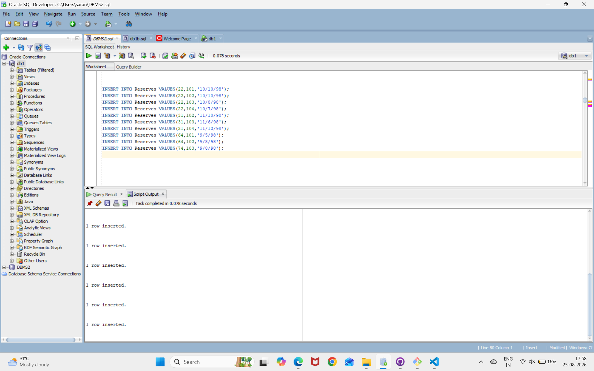

## DISPLAYING THE RESERVES TABLE
```
SELECT *FROM Reserves;
```
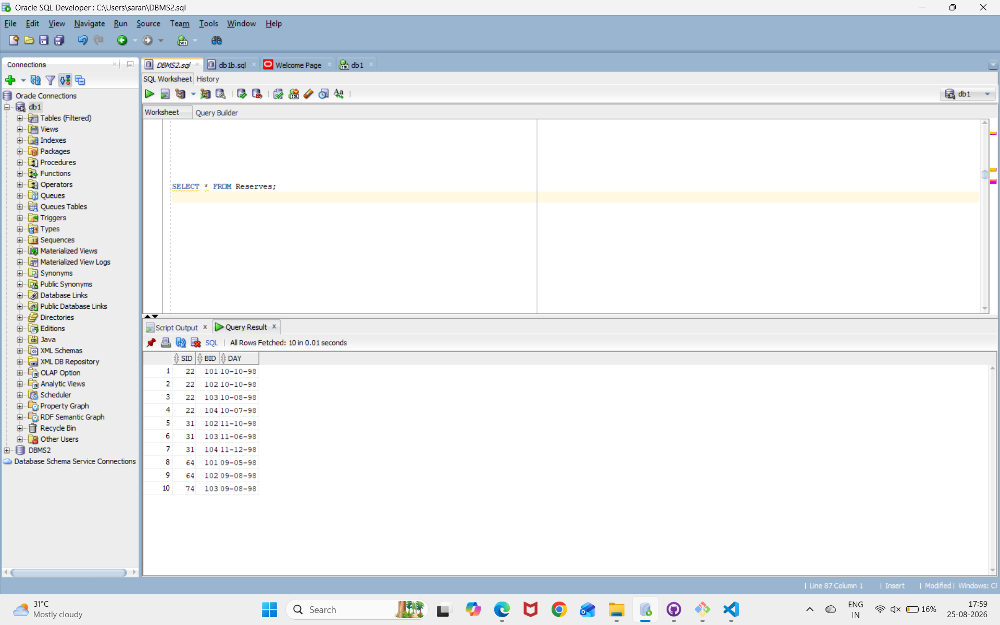

## CREATING THE BOAT TABLE
```
CREATE TABLE Boat(
bid NUMBER,
bname VARCHAR2(20),
color VARCHAR2(30) );
```

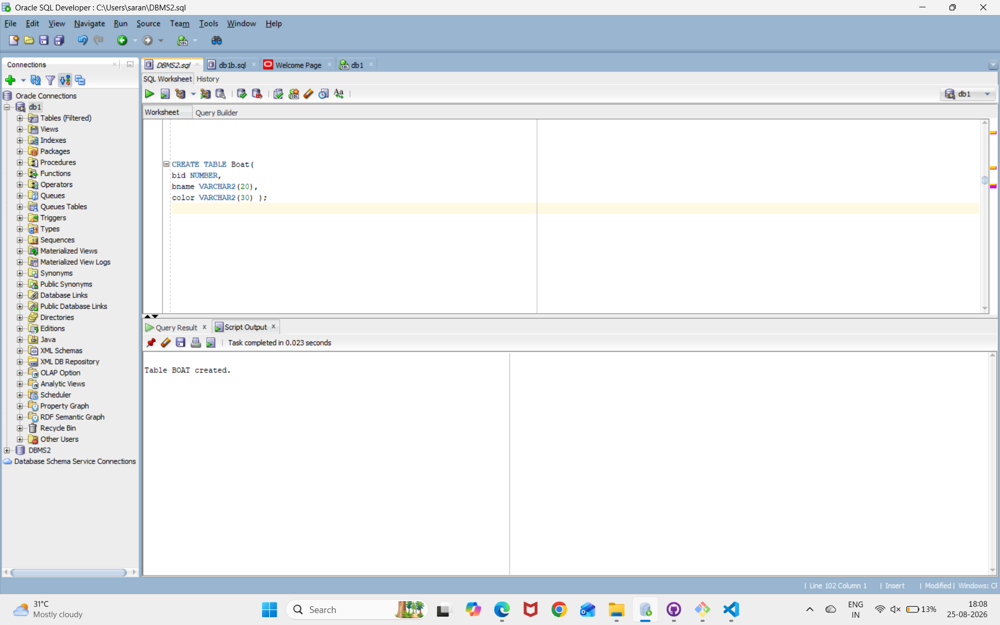

## DISCRIBING THE BOAT TABLE
```
DESC Boat;
```
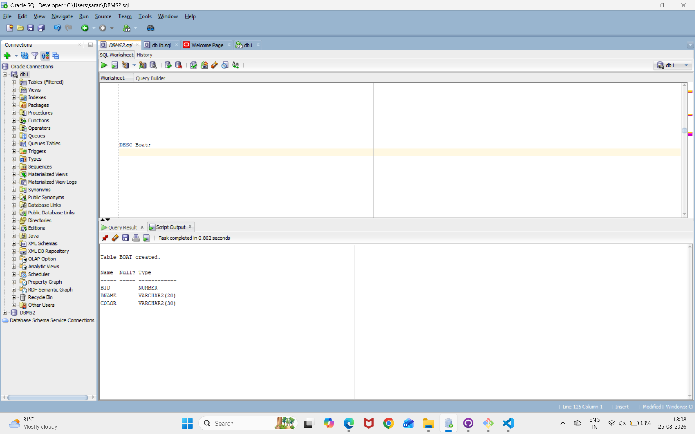

## INSERTING VALUES INTO THE BOAT TABLE
```
INSERT INTO Boat VALUES(101,'Interlake','blue'),(102,'Interlake','red'),(103,'Clipper','green'),(104,'Marine','red');
```
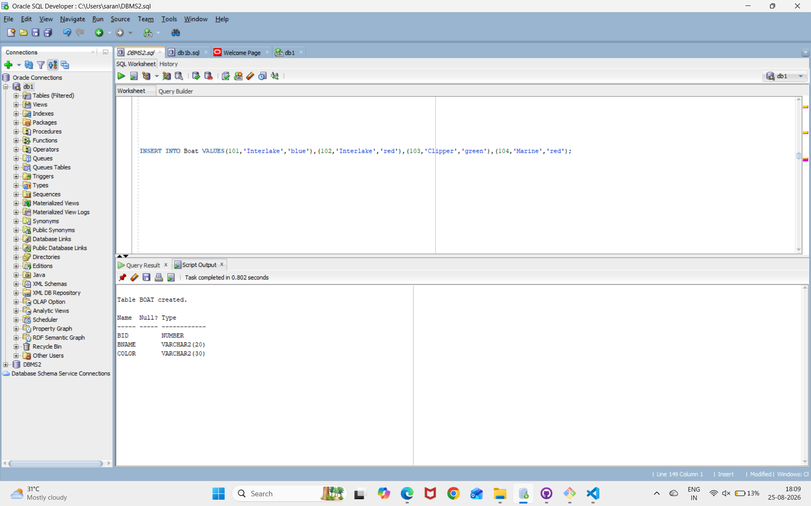

## DISPLAYING THE BOAT TABLE
```
SELECT * FROM Boat;
```
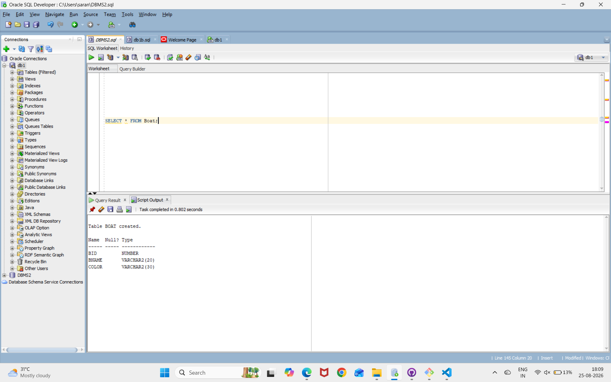

