## 1.Find the names and ages of all sailors. 
```
SELECT sname,age FROM sailors;
```

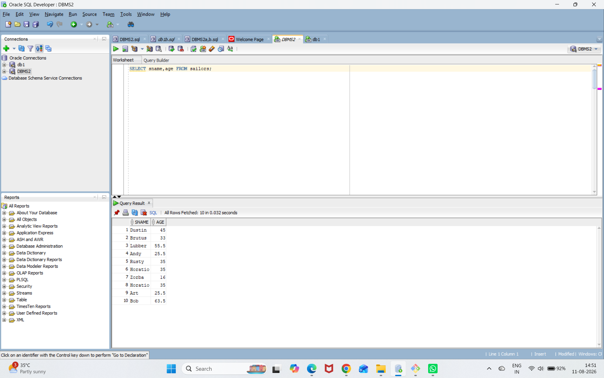

## 2.Find all sailors with a rating above 7.
```
SELECT *FROM sailors
WHERE rating>7;
```

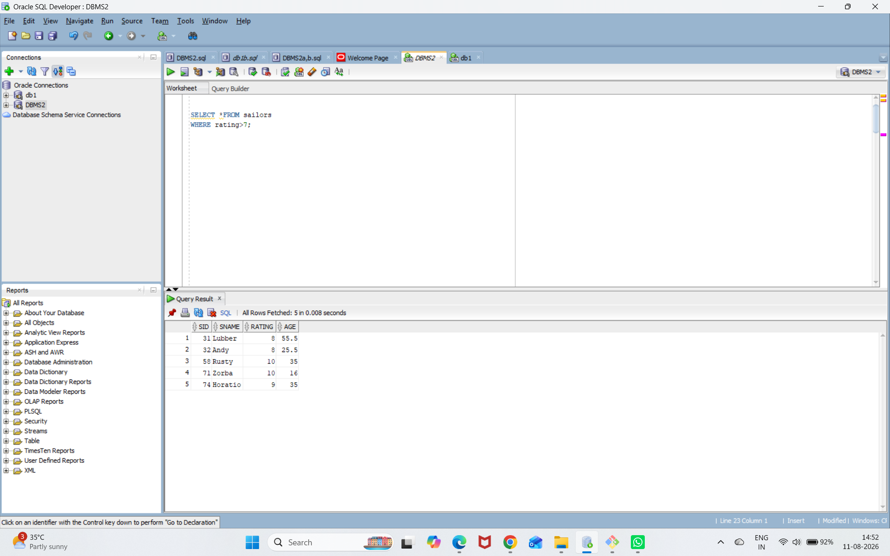

## 3.Find the names of sailors who have reserved boat number 103
```
SELECT sname
FROM sailors s,Reserves r
WHERE s.sid = r.sid
AND r.bid=103;
```


## 4.Find the sids of sailors who have reserved a red boat.
```
SELECT DISTINCT r.sid FROM Reserves r, Boat b
WHERE r.bid=b.bid 
AND b.color='red';
SELECT DISTINCT r.sid FROM Reserves r, Boat b
WHERE r.bid = b.bid
AND b.color = 'red';
```

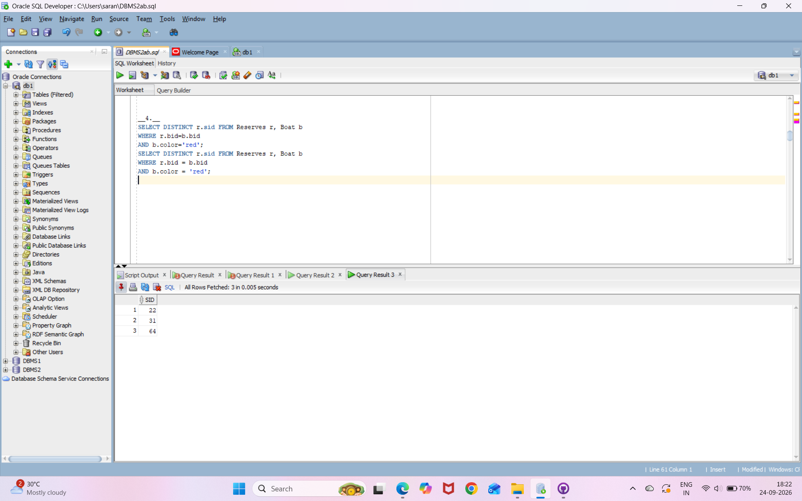

## 5.Find the names of sailors who have reserved a red boat.
```
SELECT DISTINCT sname FROM sailors s, Reserves r, Boat b
WHERE s.sid=r.sid AND r.bid=b.bid AND b.color='red';
```

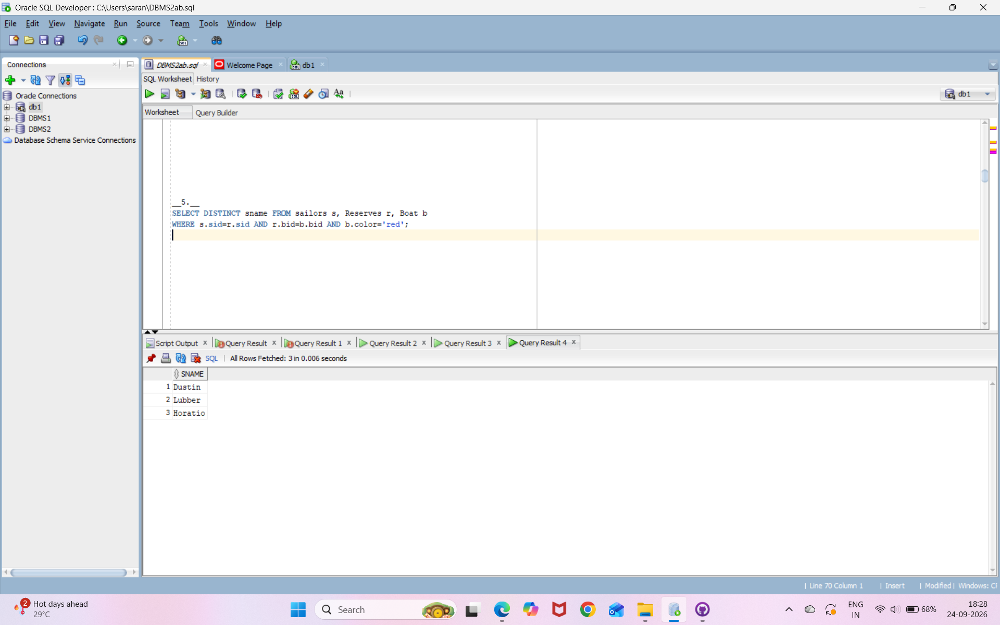

## 6.Find the colors of boats reserved by Lubber.
```
SELECT DISTINCT b.color
FROM sailors s, Reserves r, Boat b
WHERE s.sid = r.sid
AND r.bid = b.bid
AND sname = 'Lubber';
```

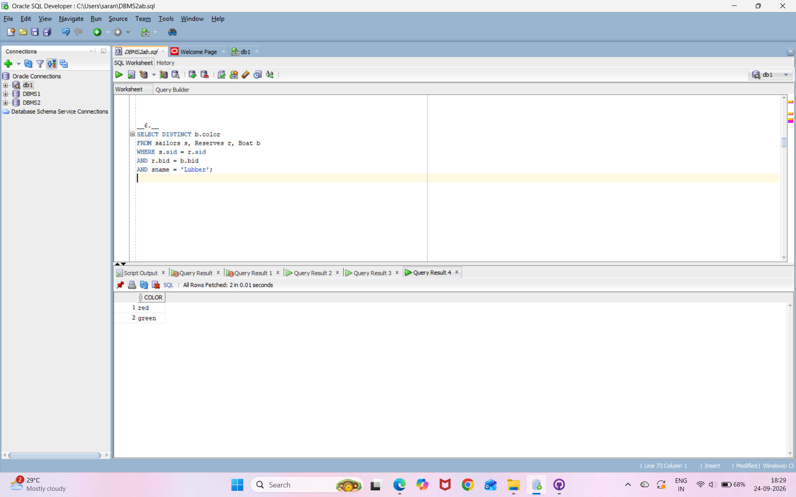

## 7.Find the names of sailors who have reserved at least one boat.
```
SELECT DISTINCT s.sname
FROM sailors s,Reserves r
WHERE s.sid=r.sid;
```

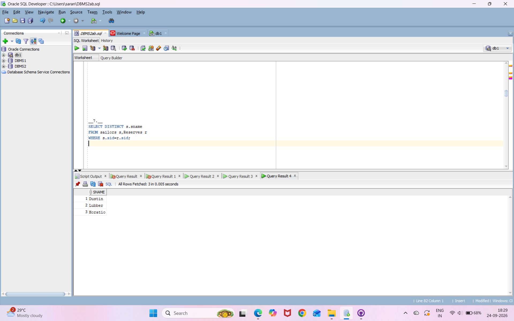

## 8.Compute increments for the ratings of persons who have sailed two different boats on the same day.
```
UPDATE sailors
SET rating = rating+1
WHERE sid IN (
SELECT r1.sid FROM Reserves r1,Reserves r2
WHERE r1.sid = r2.sid
AND r1.day = r2.day
AND r1.bid<>r2.bid 
);
```

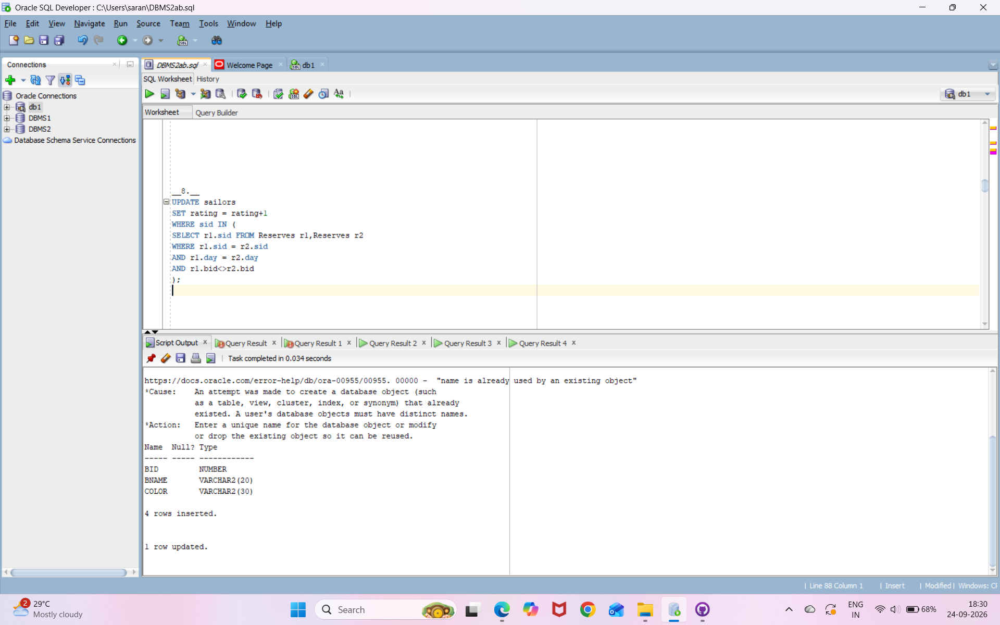

## 9.Compute increments for the ratings of persons who have sailed two different boats on the same day.
``` 
SELECT age FROM sailors
WHERE sname LIKE 'B-%B';
```

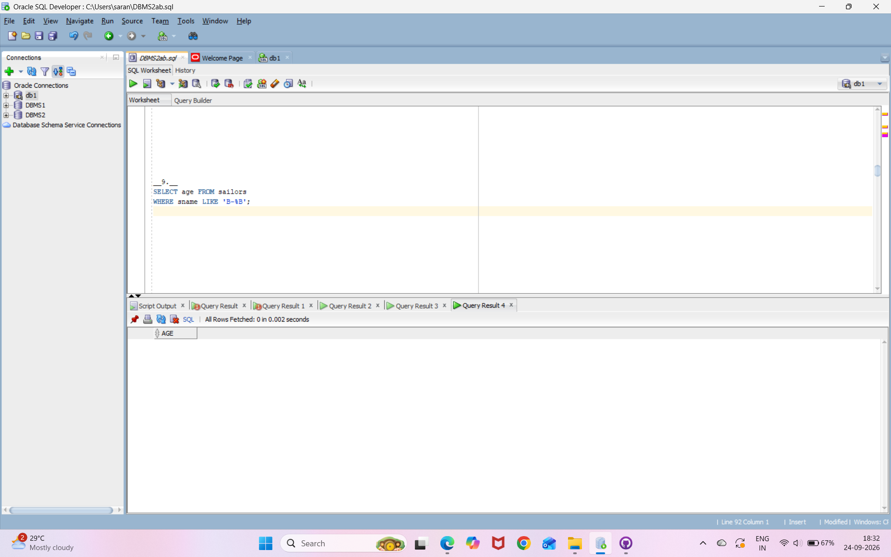

## 10.Find the names of Sailors who reserved a red boat or a green boat.
```
SELECT DISTINCT bname
FROM sailors s,Reserves r,Boat b
WHERE s.sid = r.sid
AND r.bid = b.bid
AND b.color IN('red','green');
```

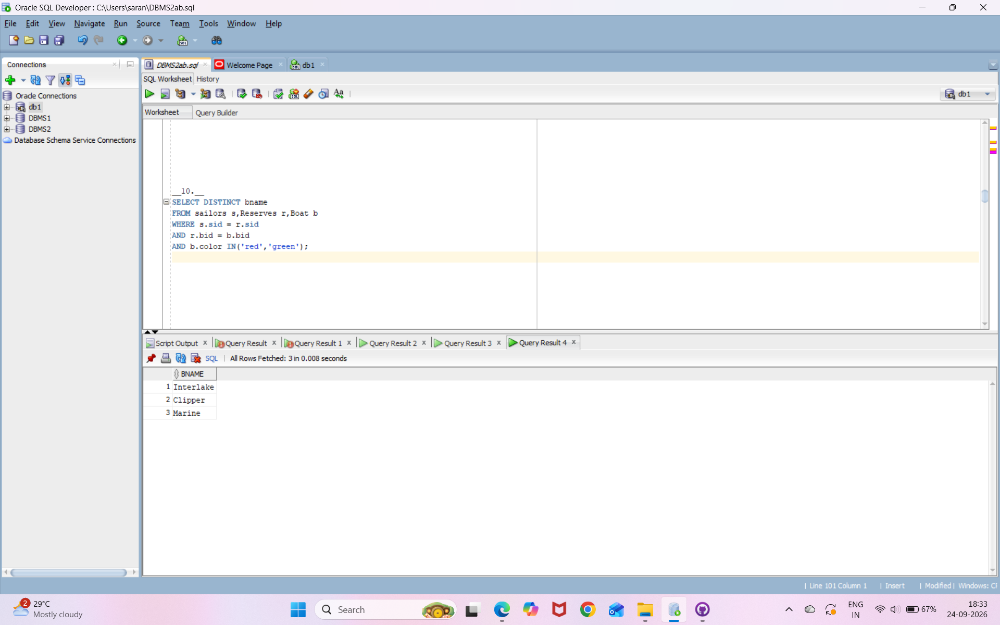

## 11.Find the names of sailors who have reserved both a red and a green boat.
```
SELECT s.sname 
FROM sailors s
WHERE EXISTS (
SELECT * FROM Reserves r, Boat b
WHERE s.sid = r.sid
AND r.bid = b.bid
AND b.color = 'red' )
AND EXISTS (
SELECT * FROM Reserves r,Boat b
WHERE s.sid = r.sid
AND r.bid = b.bid
AND b.color = 'green' );
```

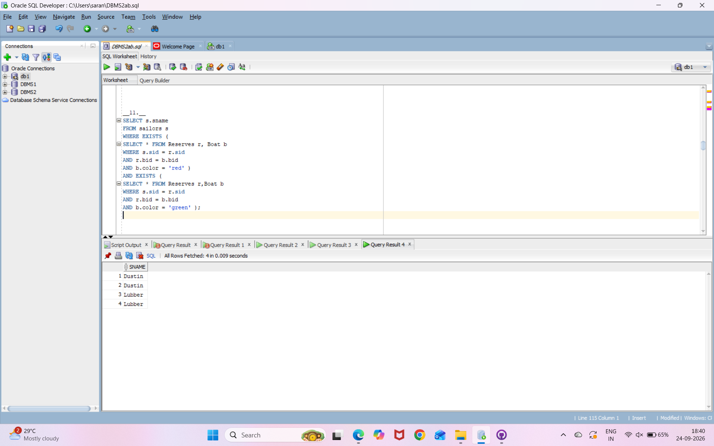

## 12.Find the sids of all sailors who have reserved red boats but not green boats.
```
SELECT DISTINCT r.sid
FROM Reserves r,Boat b
WHERE r.bid = b.bid
AND b.color = 'red'
MINUS
SELECT DISTINCT r.sid FROM Reserves r,Boat b
WHERE r.bid = b.bid
AND b.color = 'green';
```

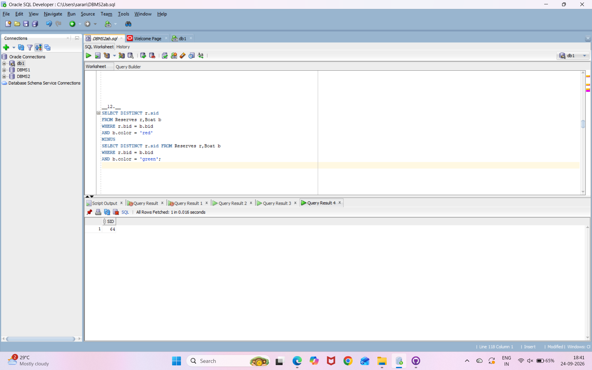

## 13.Find all sids of sailors who have a rating of 10 or have reserved boat 104
```
SELECT sid FROM sailors
WHERE rating = 10 UNION
SELECT sid FROM Reserves 
WHERE bid=104;
```

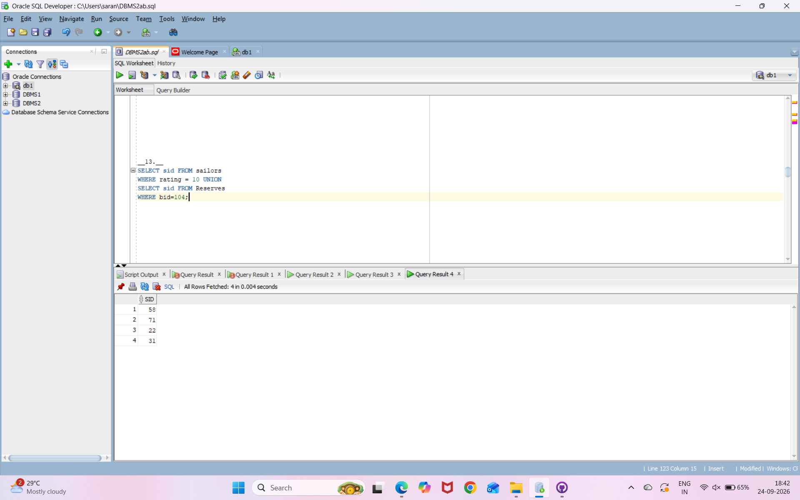

## 14.Find the names of sailors who have reserved boat 103
```
SELECT sname FROM sailors 
WHERE sid IN(
SELECT sid FROM Reserves
WHERE bid=103 );
```

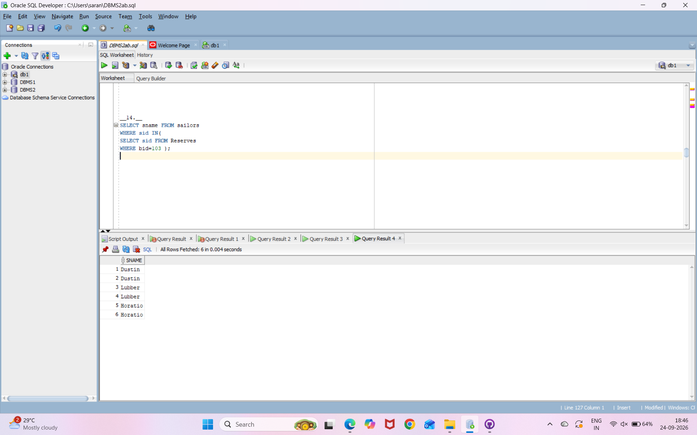

## 15.Find the names of sailors who have reserved a red boat
```
SELECT DISTINCT sname
FROM sailors s,Reserves r,Boat b
WHERE s.sid = r.sid
AND r.bid = b.bid
AND b.color = 'red';
```

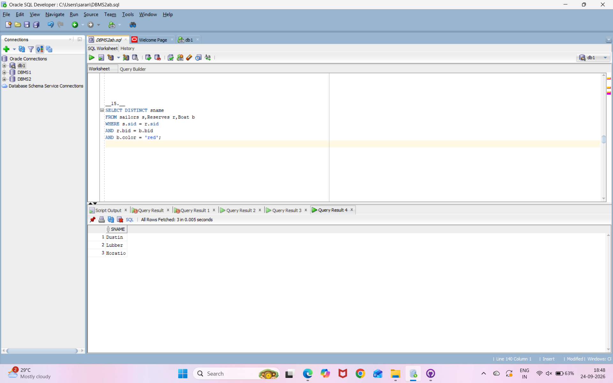

## 16.Find the names of sailors who have reserved boat number 103
```
SELECT sname FROM Sailors
WHERE sid IN (
SELECT sid FROM Reserves
WHERE bid = 103 );
```


## 17.Find sailors whose rating is better than some sailor called Horatio.
```
SELECT * FROM Sailors
WHERE rating > ANY (
SELECT rating FROM Sailors
WHERE sname = 'Horatio' );
```

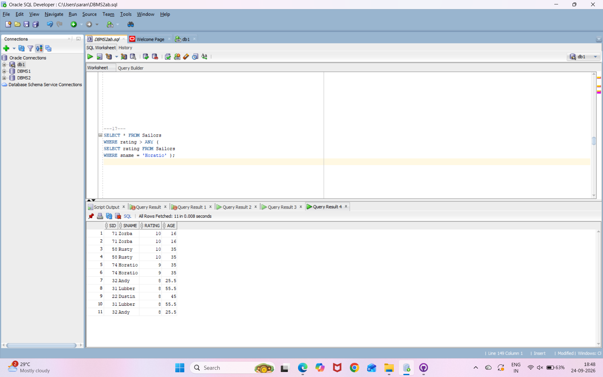

## 18.Find sailors whose rating is better than every sailor called Horatio.
```
SELECT * FROM Sailors
WHERE rating > ALL (
SELECT rating FROM Sailors
WHERE sname = 'Horatio' );
```

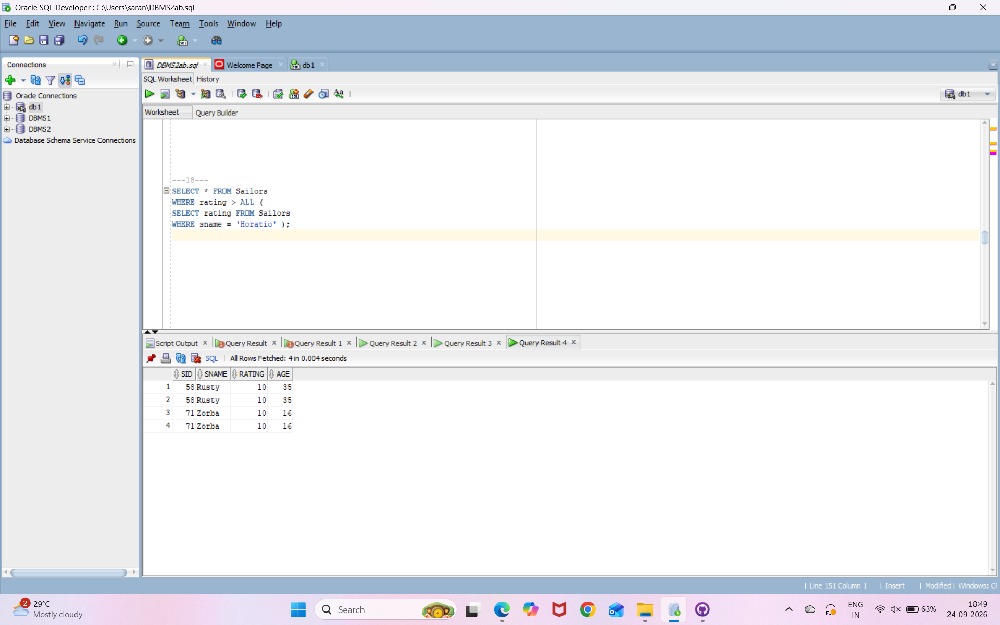

## 19.Find the sailors with the highest rating.
```
SELECT * 
FROM Sailors
WHERE rating = (
SELECT MAX(rating) 
FROM Sailors );
```

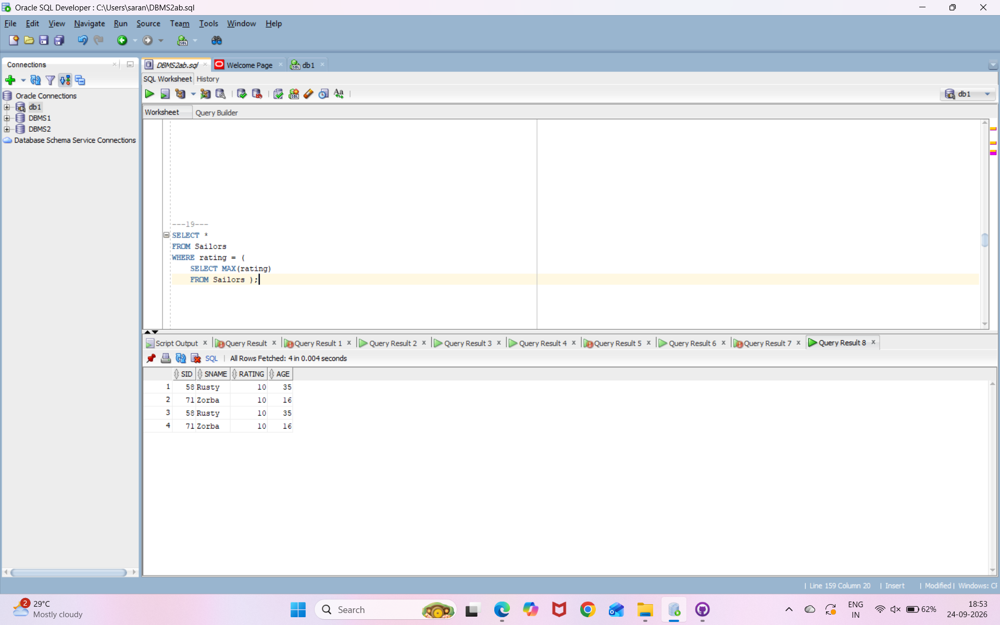

## 20.Find the names of sailors who have reserved both a red and a green boat.
```
SELECT s.sname
FROM Sailors s
WHERE EXISTS (
SELECT * 
FROM Reserves r, Boat b
WHERE s.sid = r.sid
AND r.bid = b.bid
AND b.color = 'red')
AND EXISTS (
SELECT * 
FROM Reserves r, Boat b
WHERE s.sid = r.sid
AND r.bid = b.bid
AND b.color = 'green' );
```

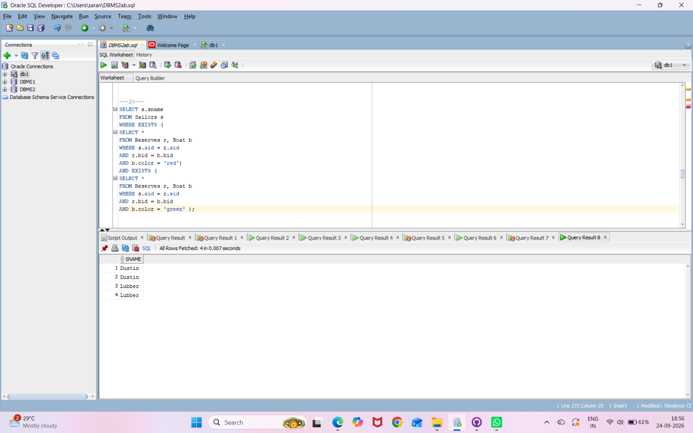

## 21.Find the names of sailors who have reserved all boats.
```
SELECT sname
FROM Sailors s
WHERE NOT EXISTS (
SELECT bid 
FROM Boat
MINUS
SELECT bid 
FROM Reserves
WHERE sid = s.sid);
```

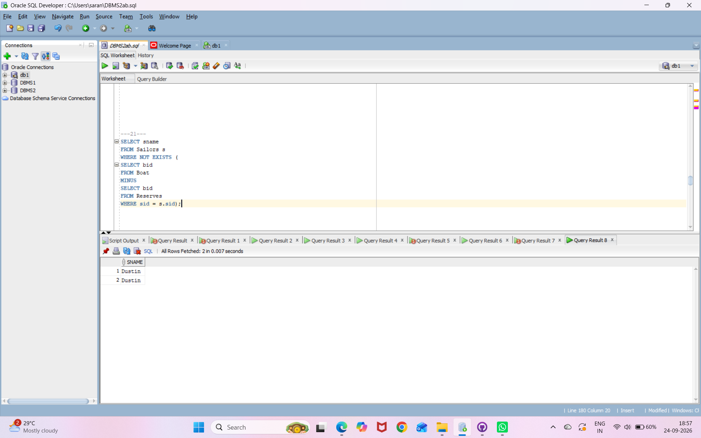

## 22.Find the average age of all sailors.
```
SELECT AVG(age) FROM Sailors;
```

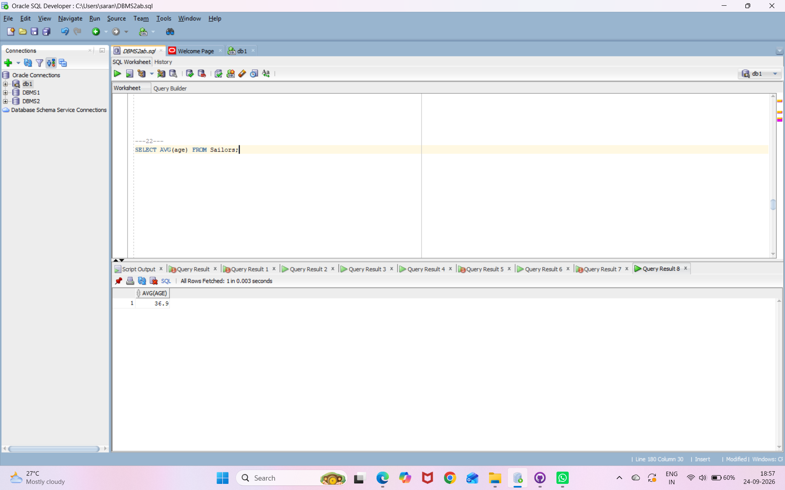

## 23.Find the average age of sailors with a rating of 10.
```
SELECT AVG(age) FROM Sailors
WHERE rating = 10;
```

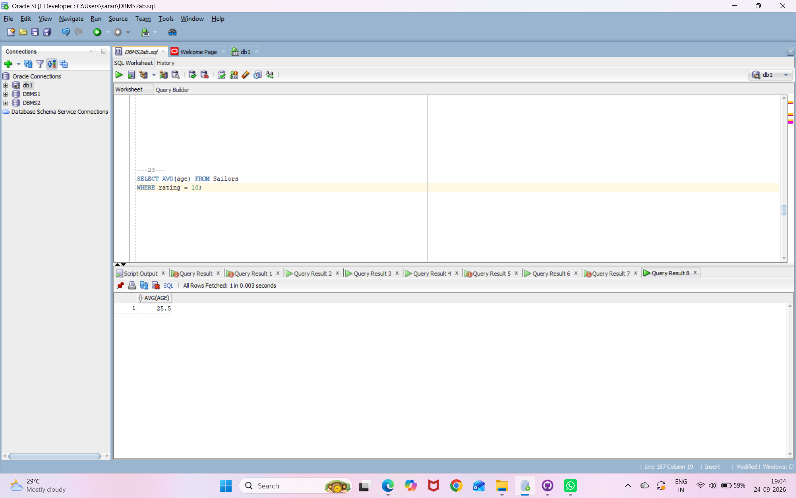

## 24.Find the name and age of the oldest sailor.
```
SELECT sname, age FROM Sailors
WHERE age = (
SELECT MAX(age) FROM Sailors);
```

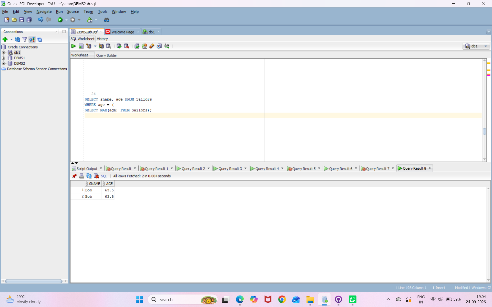

## 25.Count the number of sailors.
```
SELECT COUNT(*) FROM Sailors;
```


## 26.Count the number of different sailor names.
```
SELECT COUNT(DISTINCT sname) FROM Sailors;
```


## 27.Find the names of sailors who are older than the oldest sailor with a rating of 10.
```
SELECT sname FROM Sailors
WHERE age > (
SELECT MAX(age) FROM Sailors
WHERE rating = 10);
```

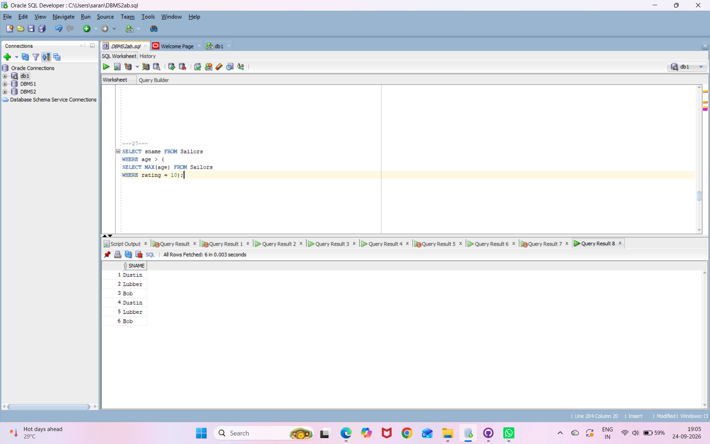

## 28.Find the age of the youngest sailor for each rating level.
```
SELECT rating, MIN(age)
FROM Sailors
GROUP BY rating;
```


## 29.Find the age of the youngest sailor who is eligible to vote (i.e., is at least 18 years old) for each rating level with at least two such sailors.
```
SELECT rating, MIN(age)
FROM Sailors
WHERE age >= 18
GROUP BY rating
HAVING COUNT(*) >= 2;
```

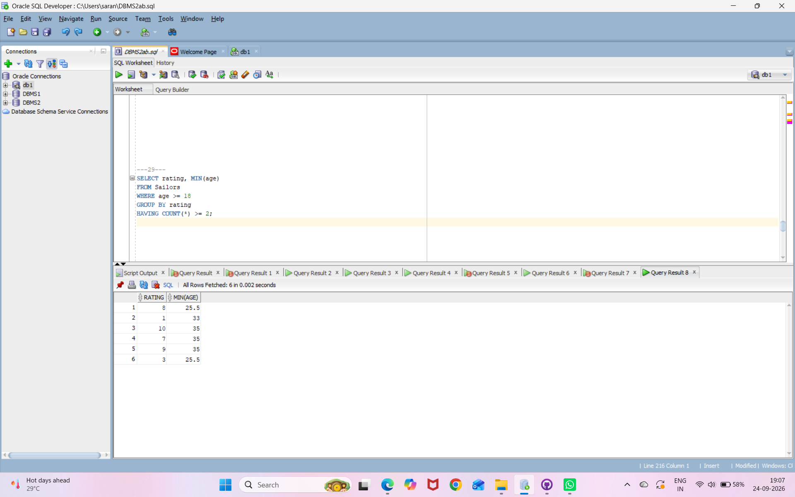

## 30.For each red boat, find the number of reservations for this boat.
```
SELECT b.bid, COUNT(*)
FROM Boat b, Reserves r
WHERE b.bid = r.bid
AND b.color = 'red'
GROUP BY b.bid;
```

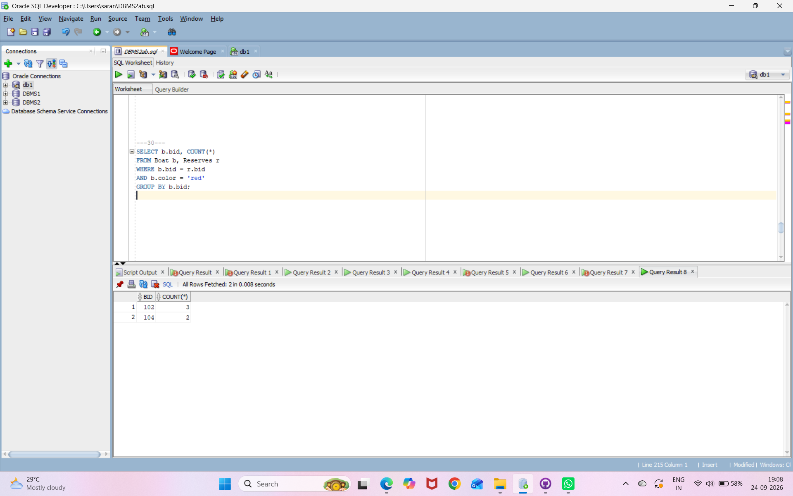

## 31.Find the average age of sailors for each rating level that has at least two sailors.
```
SELECT rating, AVG(age)
FROM Sailors
GROUP BY rating
HAVING COUNT(*) >= 2;
```

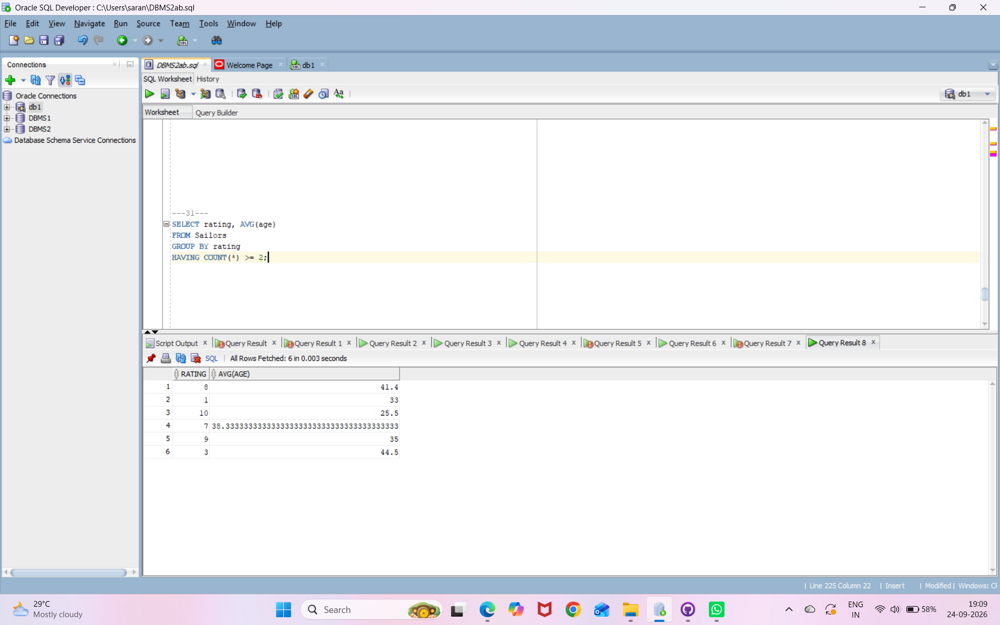

## 32.Find the average age of sailors who are of voting age (i.e., at least 18 years old) for each rating level that has at least two sailors.
```
SELECT rating, AVG(age)
FROM Sailors
WHERE age >= 18
GROUP BY rating
HAVING COUNT(*) >= 2;
```

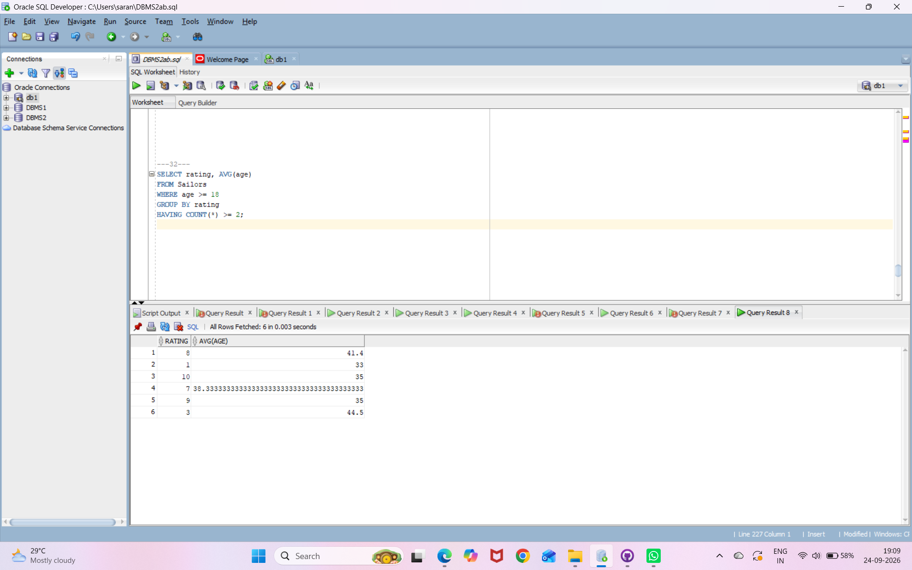

## 33.Find the average age of sailors who are of voting age (i.e., at least 18 years old) for each rating level that has at least two such sailors.
```
SELECT rating, AVG(age)
FROM Sailors
WHERE age >= 18
GROUP BY rating
HAVING COUNT(*) >= 2;
```

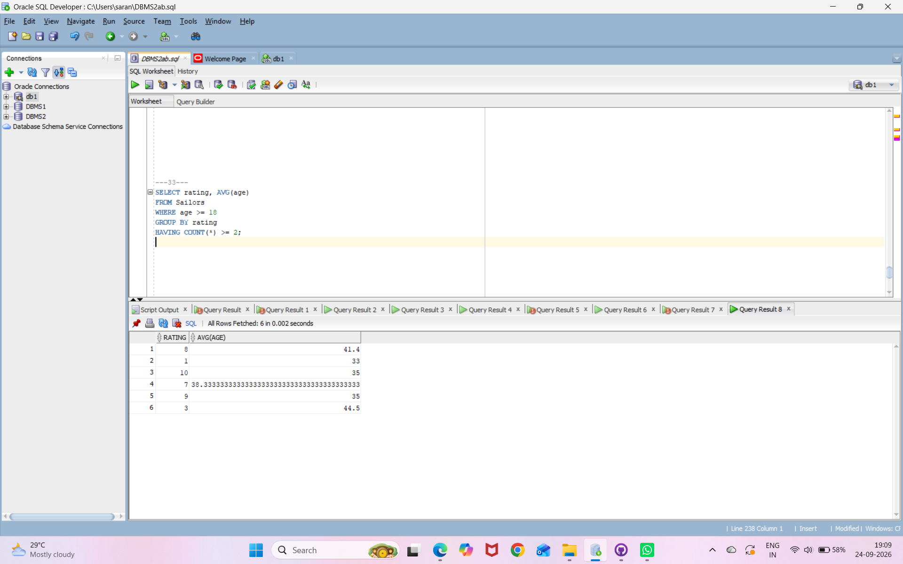

## 34.Find those ratings for which the average age of sailors is the minimum over all ratings.
```
SELECT rating FROM Sailors
GROUP BY rating
HAVING AVG(age) <= ALL (
SELECT AVG(age) FROM Sailors
GROUP BY rating);
```
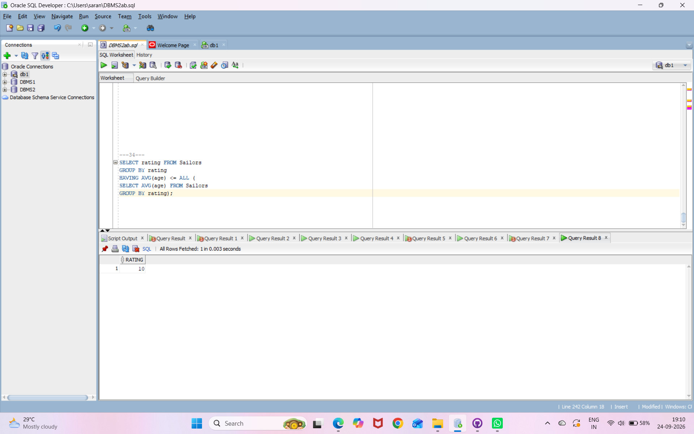
