## Creating employee table
```
CREATE TABLE EMPLOYEE
(
    EMPLOYEE_ID NUMBER(4) PRIMARY KEY,
    FIRST_NAME VARCHAR2(20),
    LAST_NAME VARCHAR2(20),
    GENDER CHAR(1),
    JOB_ID VARCHAR2(15),
    DEPARTMENT VARCHAR2(20),
    SALARY NUMBER(8),
    COMMISSION NUMBER(5),
    HIRE_DATE DATE,
    CITY VARCHAR2(20)
);
```

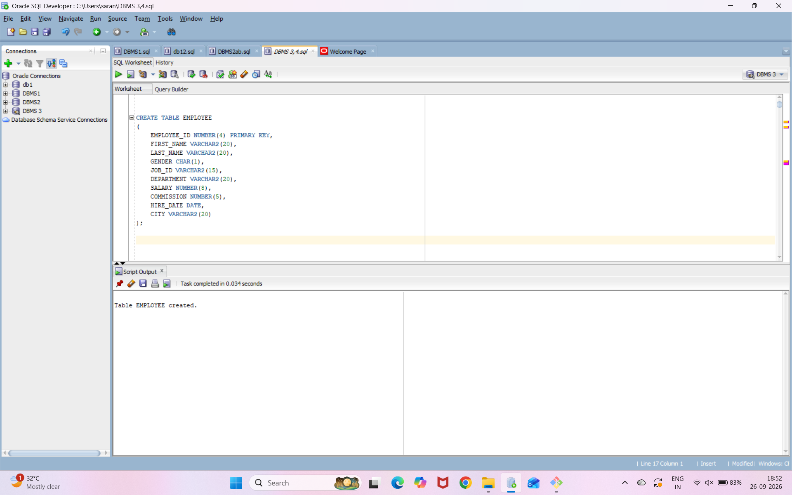

## Inserting values into Employee table
```
INSERT INTO EMPLOYEE
VALUES (101, 'John', 'Smith', 'M', 'IT_PROG', 'IT', 65000, 5,
        TO_DATE('15-JAN-2020','DD-MON-YYYY'), 'Hyderabad');

INSERT INTO EMPLOYEE
VALUES (102, 'Anita', 'Sharma', 'F', 'HR_REP', 'HR', 52000, 3,
        TO_DATE('10-JUN-2019','DD-MON-YYYY'), 'Bengaluru');

INSERT INTO EMPLOYEE
VALUES (103, 'Rahul', 'Kumar', 'M', 'SA_REP', 'Sales', 48000, 8,
        TO_DATE('25-AUG-2021','DD-MON-YYYY'), 'Chennai');

INSERT INTO EMPLOYEE
VALUES (104, 'Priya', 'Reddy', 'F', 'MK_MAN', 'Marketing', 72000, 10,
        TO_DATE('05-MAR-2018','DD-MON-YYYY'), 'Hyderabad');

INSERT INTO EMPLOYEE
VALUES (105, 'David', 'Wilson', 'M', 'FI_ACCOUNT', 'Finance', 58000, NULL,
        TO_DATE('18-DEC-2017','DD-MON-YYYY'), 'Mumbai');

INSERT INTO EMPLOYEE
VALUES (106, 'Sneha', 'Patel', 'F', 'IT_PROG', 'IT', 69000, 6,
        TO_DATE('12-NOV-2022','DD-MON-YYYY'), 'Pune');

INSERT INTO EMPLOYEE
VALUES (107, 'Amit', 'Verma', 'M', 'SA_REP', 'Sales', 45000, 4,
        TO_DATE('20-JUL-2023','DD-MON-YYYY'), 'Delhi');

INSERT INTO EMPLOYEE
VALUES (108, 'Kiran', 'Rao', 'M', 'HR_REP', 'HR', 50000, NULL,
        TO_DATE('09-FEB-2021','DD-MON-YYYY'), 'Hyderabad');

INSERT INTO EMPLOYEE
VALUES (109, 'Lakshmi', 'Nair', 'F', 'IT_PROG', 'IT', 76000, 7,
        TO_DATE('14-SEP-2016','DD-MON-YYYY'), 'Kochi');

INSERT INTO EMPLOYEE
VALUES (110, 'Arjun', 'Singh', 'M', 'MK_MAN', 'Marketing', 68000, 5,
        TO_DATE('30-APR-2019','DD-MON-YYYY'), 'Jaipur');
```

[output](3a1.png)

## Displaying Employee table
```    
SELECT * FROM EMPLOYEE;
```

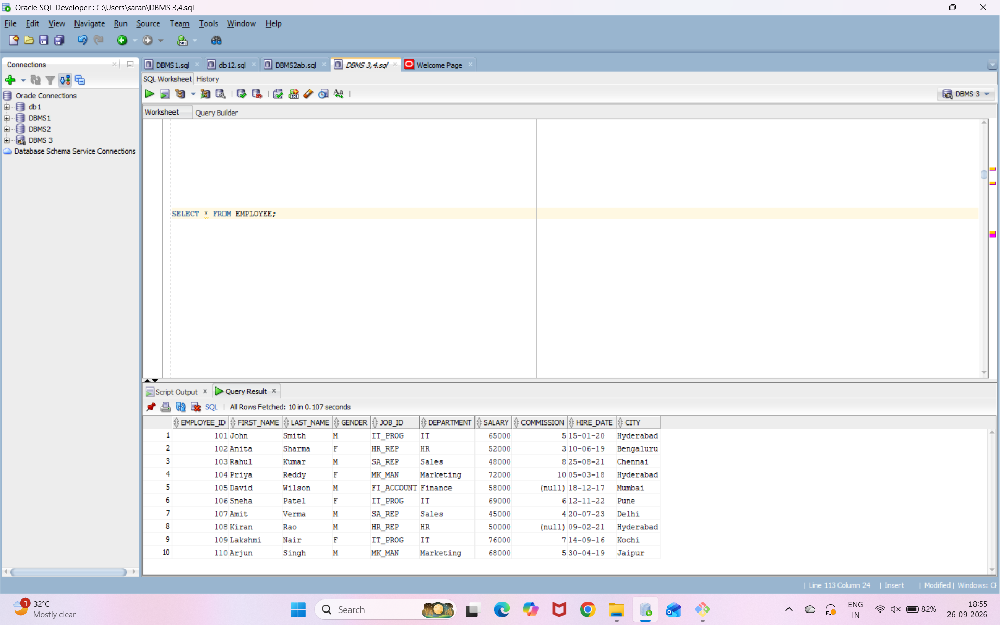

## Q1. Write an SQL query to display the employee ID, first name, and hire date in the format
```
DD-MON-YYYY using the TO_CHAR function.
SELECT EMPLOYEE_ID, FIRST_NAME,
       TO_CHAR(HIRE_DATE, 'DD-MON-YYYY') AS HIRE_DATE
FROM EMPLOYEE;
```


## Q2. Write an SQL query to display the employee ID, first name, and salary formatted with a currency symbol using the TO_CHAR function.
```
SELECT EMPLOYEE_ID, FIRST_NAME,
       TO_CHAR(SALARY, 'L99,999,999') AS SALARY
FROM EMPLOYEE;
```

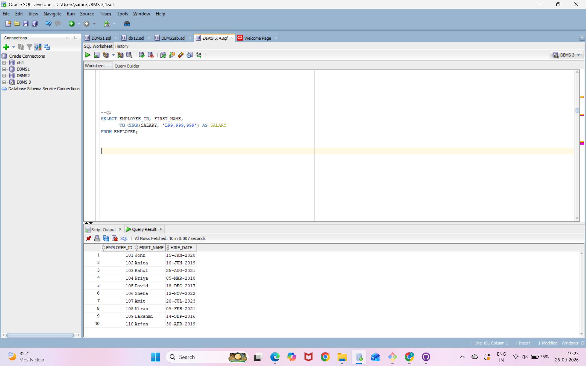

## Q3. Write an SQL query to add 5000 to each employee's salary using the TO_NUMBER function.
```
SELECT EMPLOYEE_ID, FIRST_NAME,
       TO_NUMBER(SALARY) + 5000 AS NEW_SALARY
FROM EMPLOYEE;
```

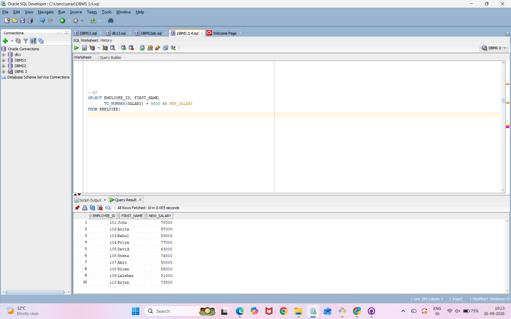

## Q4. Write an SQL query to display the details of employees who were hired after 01-JAN-2020 using the TO_DATE function.
```
SELECT *
FROM EMPLOYEE
WHERE HIRE_DATE > TO_DATE('01-JAN-2020', 'DD-MON-YYYY');
```

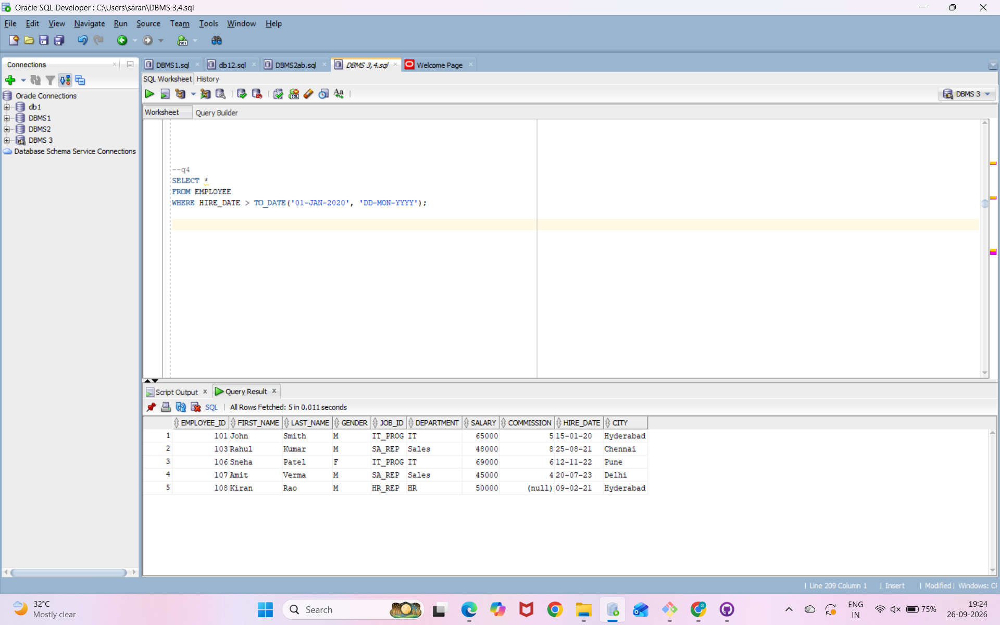

## Q5. Write an SQL query to display the full name of each employee by concatenating the first name and last name using the concatenation (||) operator.
```
SELECT EMPLOYEE_ID,
       FIRST_NAME || ' ' || LAST_NAME AS FULL_NAME
FROM EMPLOYEE;
```

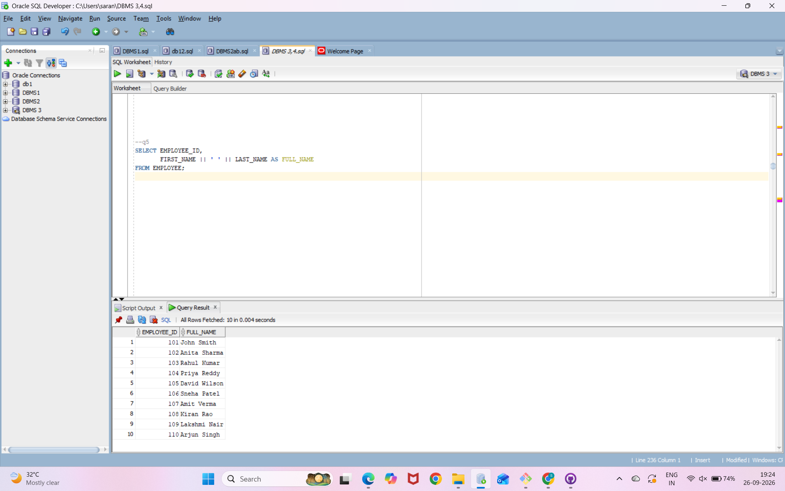

## Q6. Write an SQL query to concatenate the first name and last name of each employee using the CONCAT function.
```
SELECT EMPLOYEE_ID,
       CONCAT(FIRST_NAME, CONCAT(' ', LAST_NAME)) AS FULL_NAME
FROM EMPLOYEE;
```

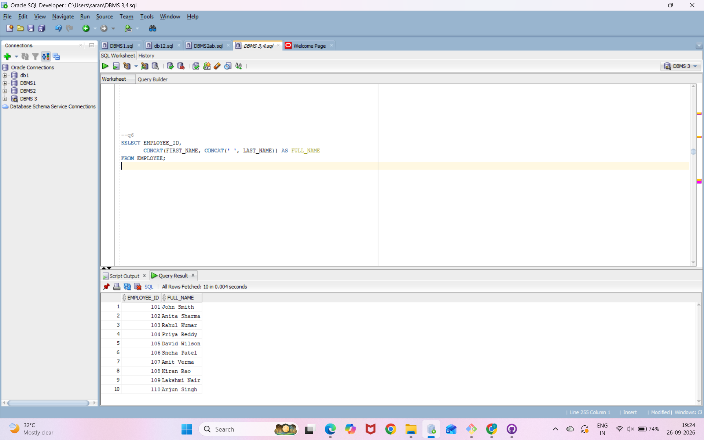

## Q7. Write an SQL query to display each employee's first name left-padded with * characters using the LPAD function.
```
SELECT FIRST_NAME,
       LPAD(FIRST_NAME, 10, '*') AS PADDED_NAME
FROM EMPLOYEE;
```

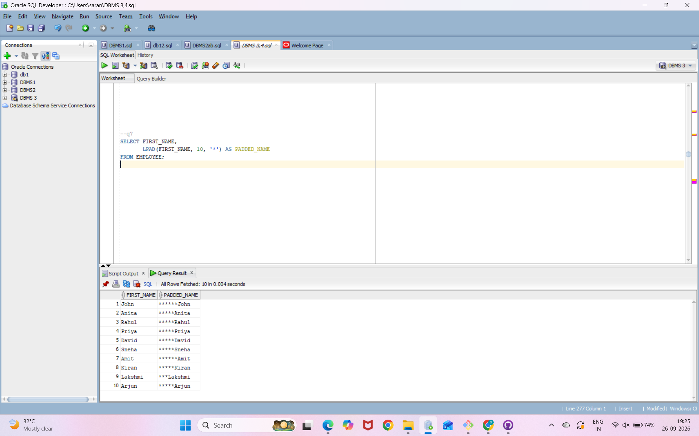

## Q8. Write an SQL query to display each employee's first name right-padded with * characters using the RPAD function.
```
SELECT FIRST_NAME,
       RPAD(FIRST_NAME, 10, '*') AS PADDED_NAME
FROM EMPLOYEE;
```


## Q9. Write an SQL query to remove leading spaces from employee names using the LTRIM function.
```
SELECT FIRST_NAME,
       LTRIM(FIRST_NAME) AS TRIMMED_NAME
FROM EMPLOYEE;
```

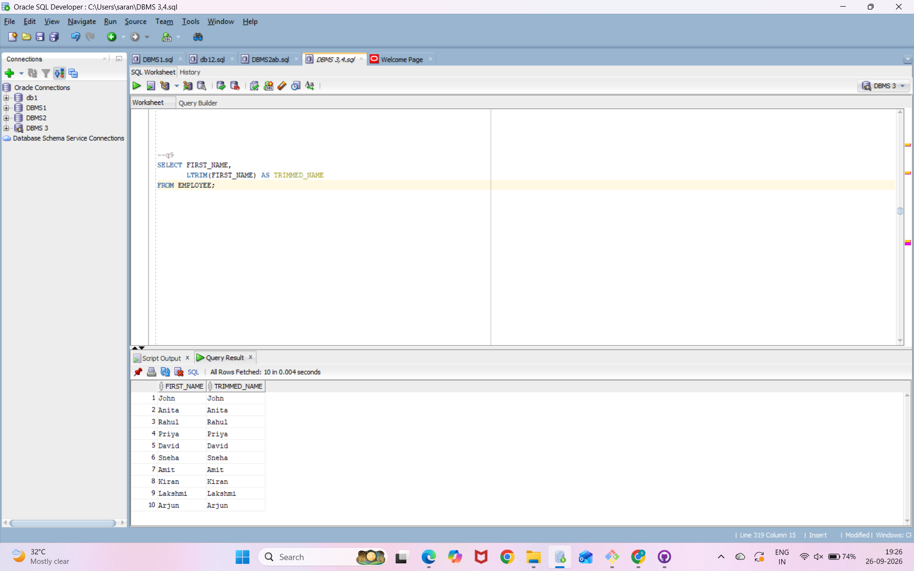

## Q10. Write an SQL query to remove trailing spaces from employee names using the RTRIM function.
```
SELECT FIRST_NAME,
       RTRIM(FIRST_NAME) AS TRIMMED_NAME
FROM EMPLOYEE;
```

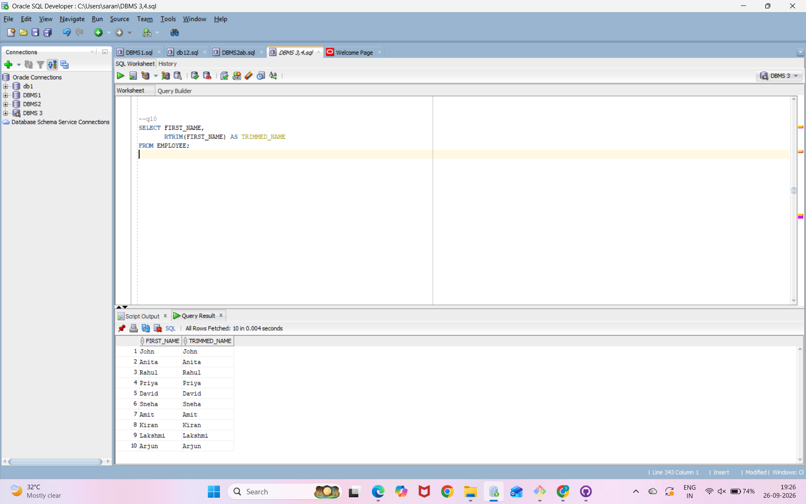

## Q11. Write an SQL query to display all employee first names in lowercase using the LOWER function.
```
SELECT FIRST_NAME,
       LOWER(FIRST_NAME) AS LOWERCASE_NAME
FROM EMPLOYEE;
```

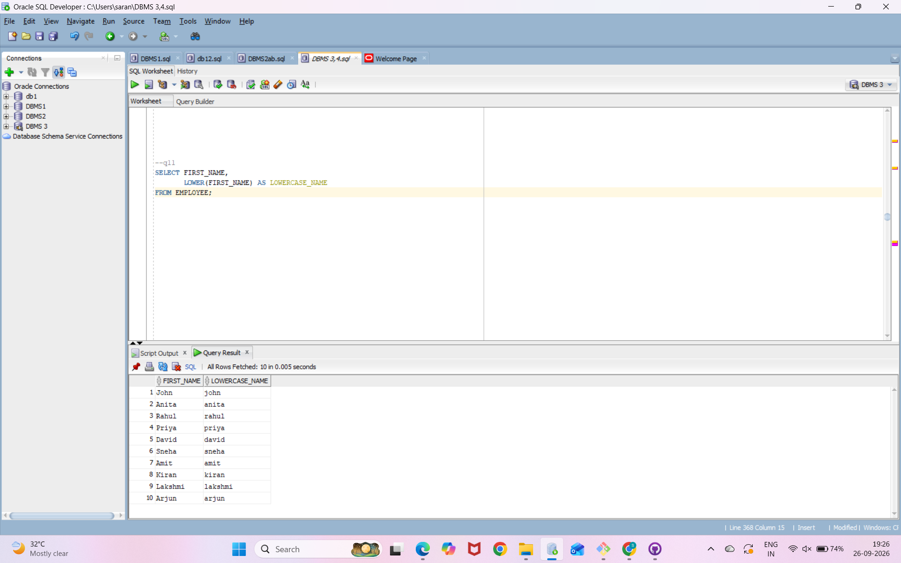

## Q12. Write an SQL query to display all employee first names in uppercase using the UPPER function.
```
SELECT FIRST_NAME,
       UPPER(FIRST_NAME) AS UPPERCASE_NAME
FROM EMPLOYEE;
```

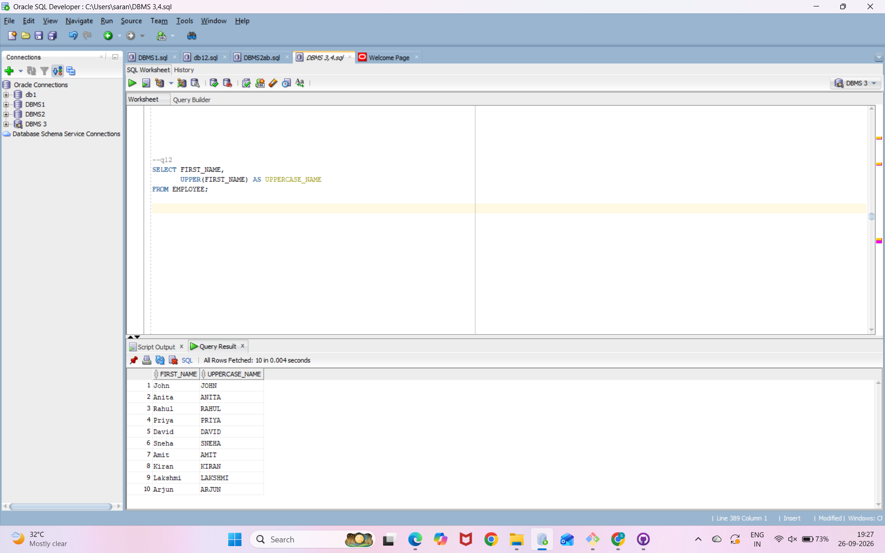

## Q13. Write an SQL query to display employee first names in proper case using the INITCAP function.
```
SELECT FIRST_NAME,
       INITCAP(FIRST_NAME) AS PROPER_NAME
FROM EMPLOYEE;
```

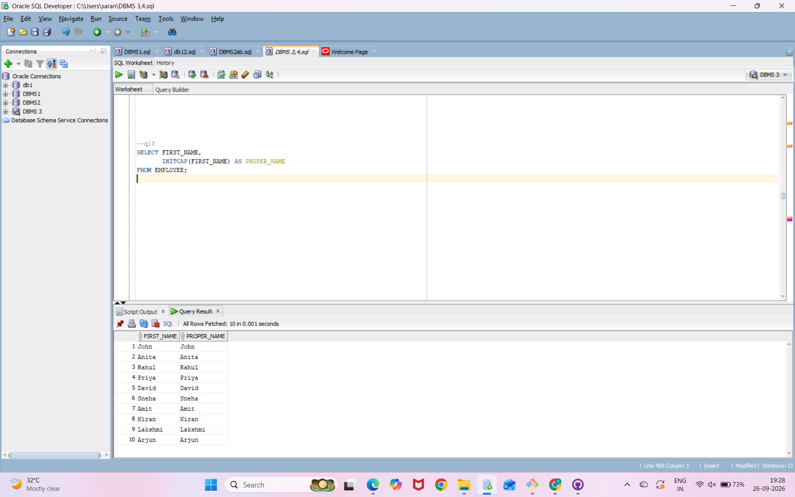

## Q14. Write an SQL query to display the length of each employee's first name using the LENGTH function.
```
SELECT FIRST_NAME,
       LENGTH(FIRST_NAME) AS NAME_LENGTH
FROM EMPLOYEE;
```

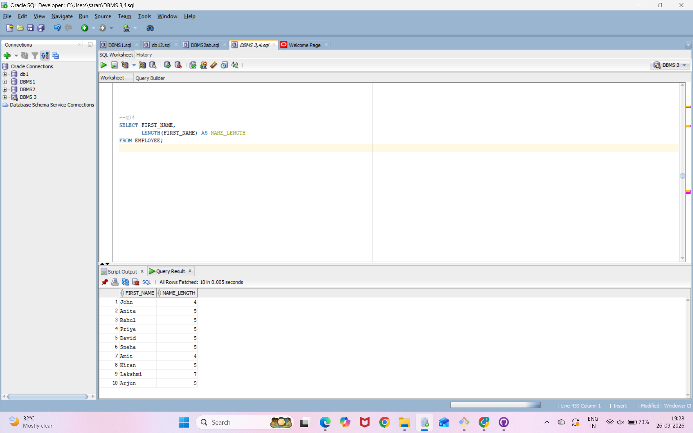

## Q15. Write an SQL query to display the first three characters of each employee's first name using the SUBSTR function.
```
SELECT FIRST_NAME,
       SUBSTR(FIRST_NAME, 1, 3) AS FIRST_THREE
FROM EMPLOYEE;
```

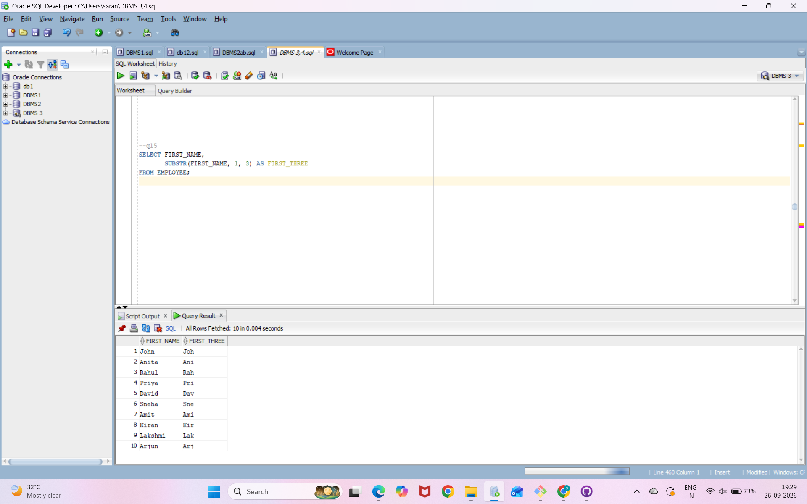

## Q16. Write an SQL query to find the position of the character 'a' in each employee's first name using the INSTR function.
```
SELECT FIRST_NAME,
       INSTR(LOWER(FIRST_NAME), 'a') AS POSITION_OF_A
FROM EMPLOYEE;
```

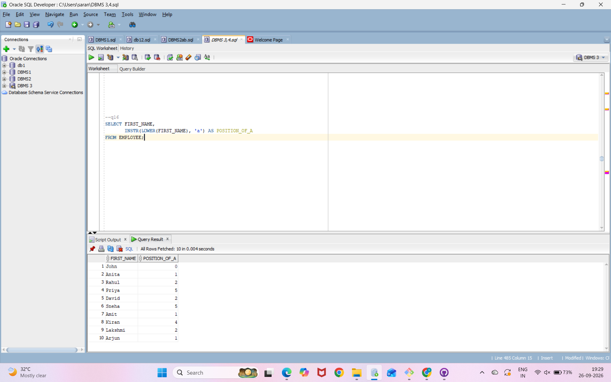

## Q17. Write an SQL query to display the current system date along with each employee's details using the SYSDATE function.
```
SELECT EMPLOYEE_ID, FIRST_NAME, LAST_NAME,
       HIRE_DATE, SYSDATE AS CURRENT_DATE
FROM EMPLOYEE;
```

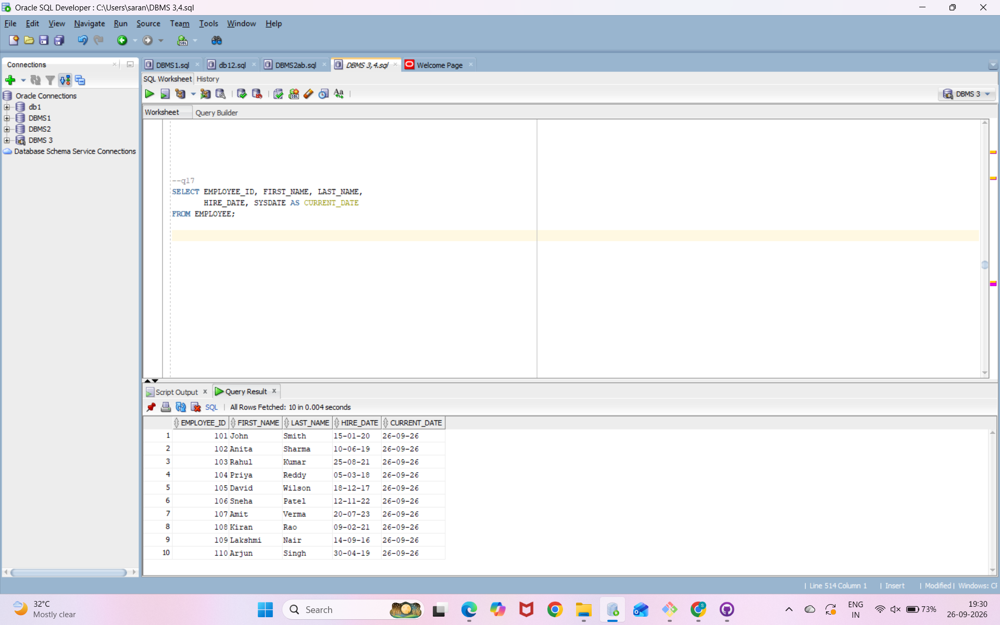

## Q18. Write an SQL query to display the next Monday after each employee's hire date using the NEXT_DAY function.
```
SELECT EMPLOYEE_ID, FIRST_NAME, HIRE_DATE,
       NEXT_DAY(HIRE_DATE, 'MONDAY') AS NEXT_MONDAY
FROM EMPLOYEE;
```


## Q19. Write an SQL query to display the date obtained by adding six months to each employee's hire date using the ADD_MONTHS function.
```
SELECT EMPLOYEE_ID, FIRST_NAME, HIRE_DATE,
       ADD_MONTHS(HIRE_DATE, 6) AS AFTER_SIX_MONTHS
FROM EMPLOYEE;
```

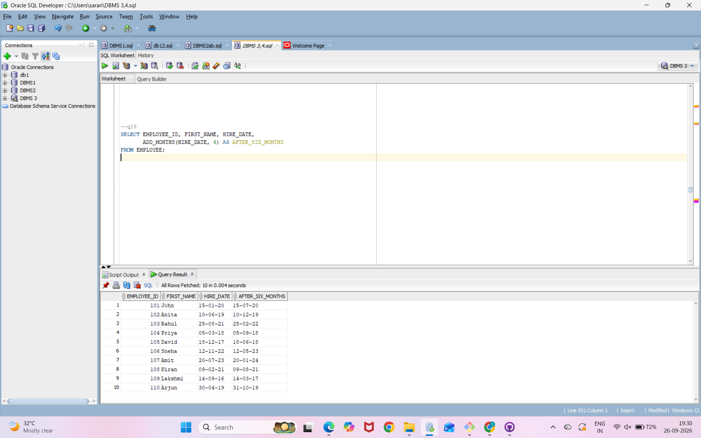

## Q20. Write an SQL query to display the last day of the month for each employee's hire date using the LAST_DAY function.
```
SELECT EMPLOYEE_ID, FIRST_NAME, HIRE_DATE,
       LAST_DAY(HIRE_DATE) AS LAST_DAY_OF_MONTH
FROM EMPLOYEE;
```

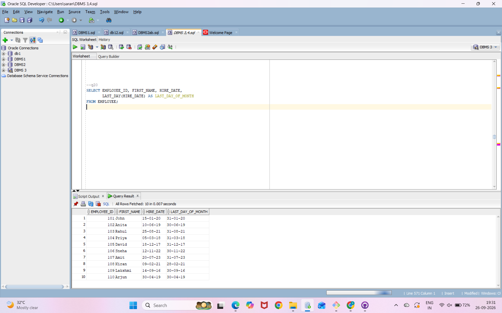

## Q21. Write an SQL query to calculate the total number of months each employee has worked using the MONTHS_BETWEEN function.
```
SELECT EMPLOYEE_ID, FIRST_NAME, HIRE_DATE,
       ROUND(MONTHS_BETWEEN(SYSDATE, HIRE_DATE), 2) AS MONTHS_WORKED
FROM EMPLOYEE;
```

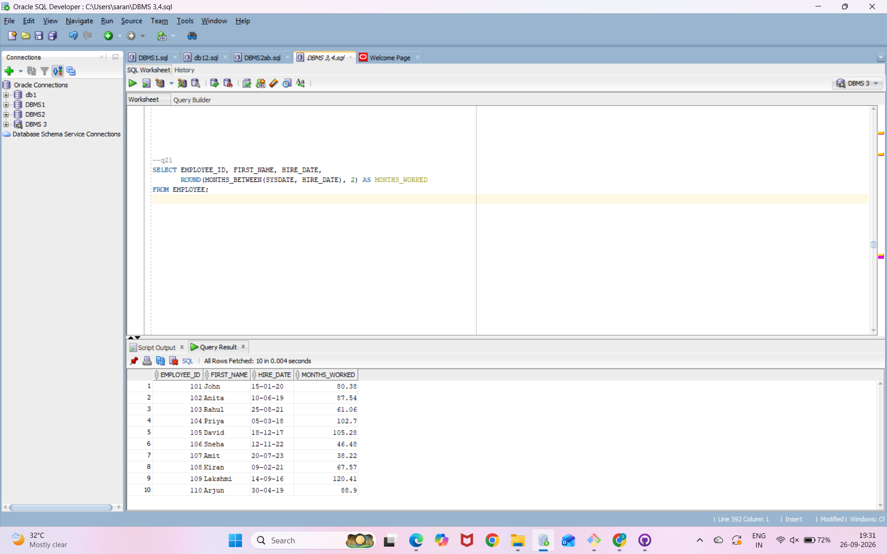

## Q22. Write an SQL query to display the smaller value between each employee's salary and 60000 using the LEAST function.
```
SELECT EMPLOYEE_ID, FIRST_NAME, SALARY,
       LEAST(SALARY, 60000) AS SMALLER_VALUE
FROM EMPLOYEE;
```

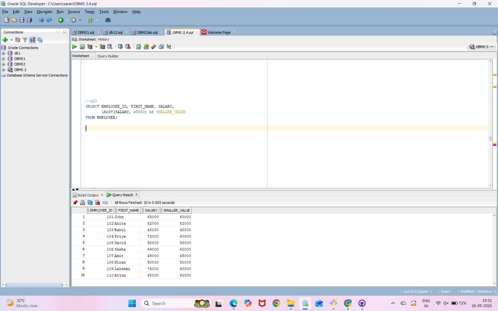

## Q23. Write an SQL query to display the greater value between each employee's salary and 60000 using the GREATEST function.
```
SELECT EMPLOYEE_ID, FIRST_NAME, SALARY,
       GREATEST(SALARY, 60000) AS GREATER_VALUE
FROM EMPLOYEE;
```

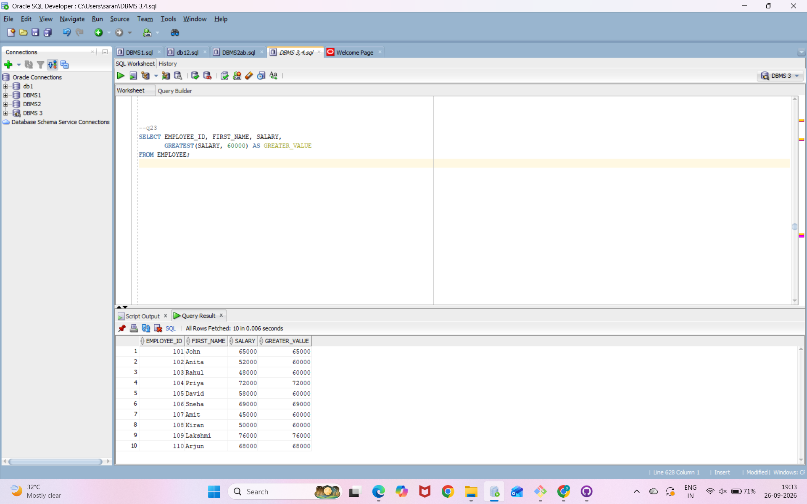

## Q24. Write an SQL query to display the first day of the month of each employee's hire date using the TRUNC function.
```
SELECT EMPLOYEE_ID, FIRST_NAME, HIRE_DATE,
       TRUNC(HIRE_DATE, 'MONTH') AS FIRST_DAY_OF_MONTH
FROM EMPLOYEE;
```


## Q25. Write an SQL query to round each employee's hire date to the nearest month using the ROUND function.
```
SELECT EMPLOYEE_ID, FIRST_NAME, HIRE_DATE,
       ROUND(HIRE_DATE, 'MONTH') AS ROUNDED_DATE
FROM EMPLOYEE;
```

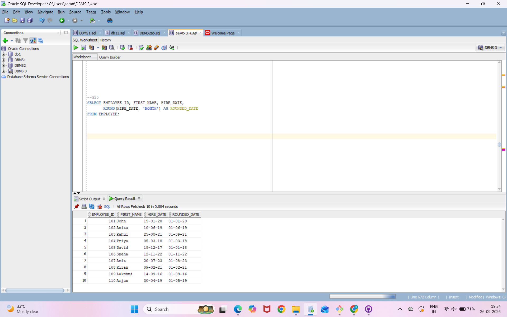

## Q26. Write an SQL query to display each employee's hire date in the format DAY, DD-MON-YYYY using the TO_CHAR function.
```
SELECT EMPLOYEE_ID, FIRST_NAME,
       TO_CHAR(HIRE_DATE, 'DAY, DD-MON-YYYY') AS FORMATTED_DATE
FROM EMPLOYEE;
```

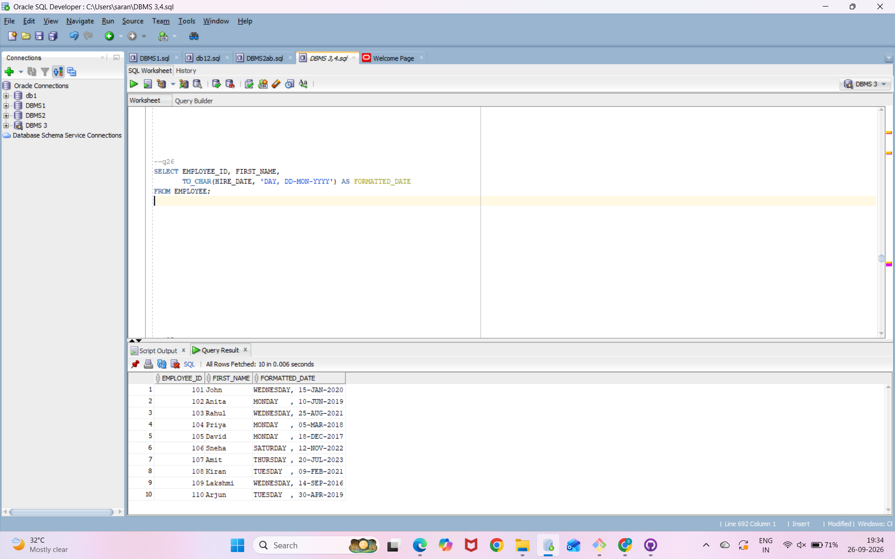

## Q27. Write an SQL query to display the details of employees who were hired before 01-JAN-2019 using the TO_DATE function.
```
SELECT *
FROM EMPLOYEE
WHERE HIRE_DATE < TO_DATE('01-JAN-2019', 'DD-MON-YYYY');
```
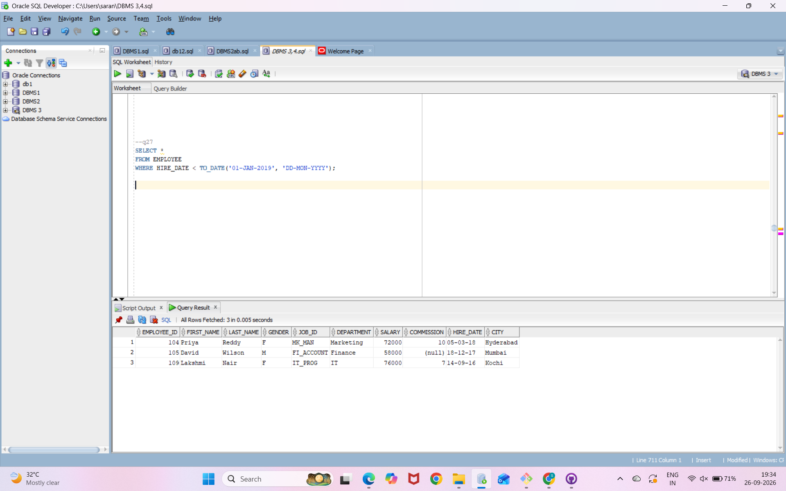
