## 1. Create a dept table having dno, dname as columns.
```
CREATE TABLE DEPT
(
    DNO NUMBER PRIMARY KEY,
    DNAME VARCHAR2(30) NOT NULL
);
```
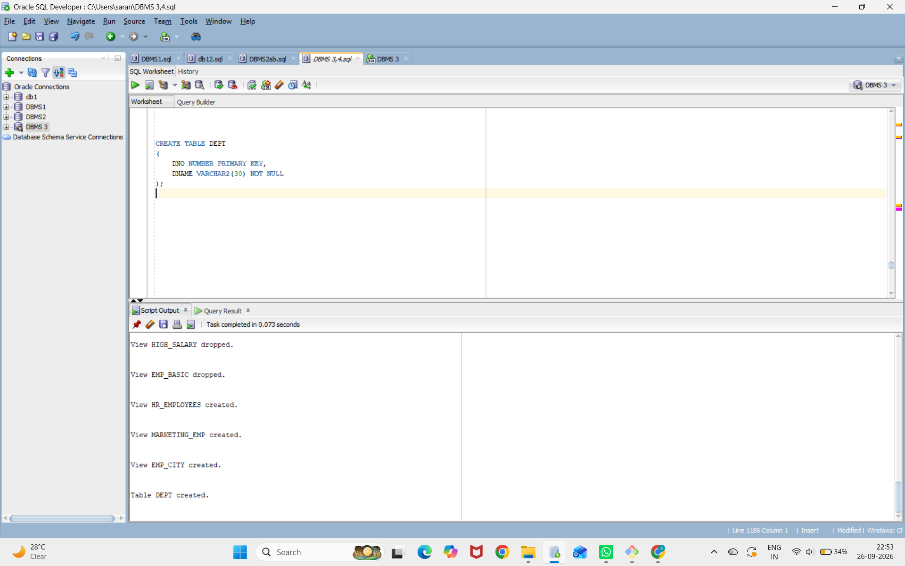
## 2. Apply 'Primary Key Constraint' for dno and NOT NULL Constraint for dname to dept table
```
CREATE TABLE STUDENT5
(
    SID NUMBER PRIMARY KEY,
    SNAME VARCHAR2(30) NOT NULL,
    DID NUMBER );
```
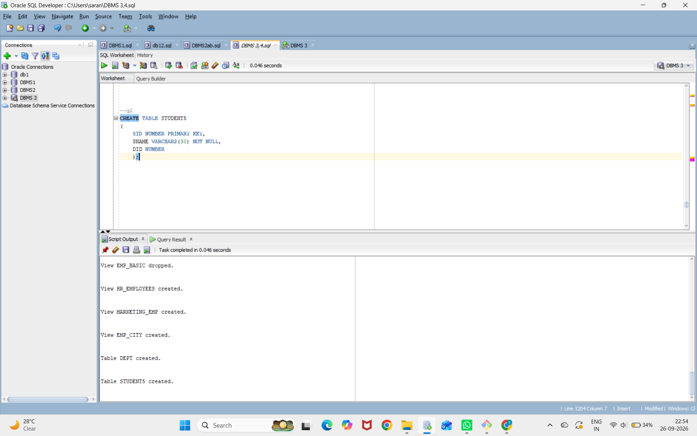

## 3. Create a student table having sid, sname, and did as columns.
```
ALTER TABLE STUDENT5
ADD CONSTRAINT FK_DID
FOREIGN KEY(DID)
REFERENCES DEPT(DNO);
```
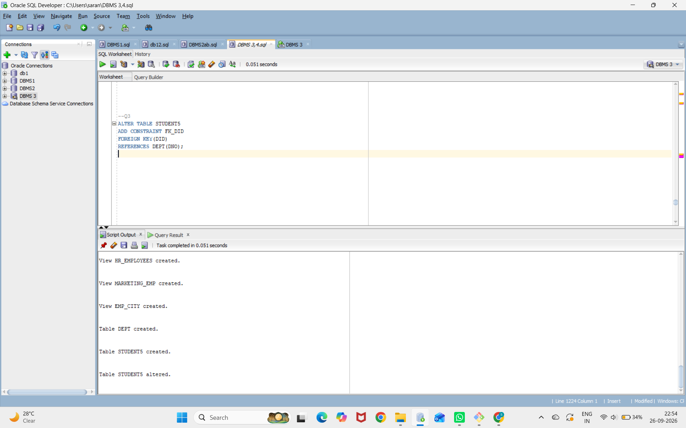

## 4. Apply Primary Key Constraint to sid, NOT NULL Constraint to Sname and Foreign Key Constraint to did refers to dept table
```
ALTER TABLE STUDENT5
ADD CONSTRAINT STUDENT5_PK PRIMARY KEY (SID);

ALTER TABLE STUDENT5
MODIFY SNAME NOT NULL;

ALTER TABLE STUDENT5
ADD CONSTRAINT STUDENT5_FK
FOREIGN KEY (DID) REFERENCES DEPT(DNO);
```
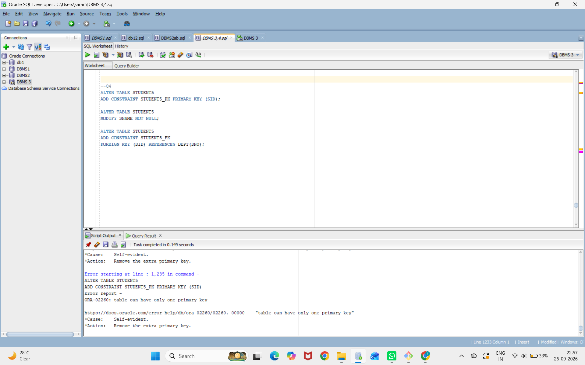

## 5. Insert all department details like cse, me, ce, eee, ece, csm, csd in the dept table.
```
INSERT INTO DEPT VALUES (10, 'CSE');
INSERT INTO DEPT VALUES (20, 'ME');
INSERT INTO DEPT VALUES (30, 'CE');
INSERT INTO DEPT VALUES (40, 'EEE');
INSERT INTO DEPT VALUES (50, 'ECE');
INSERT INTO DEPT VALUES (60, 'CSM');
INSERT INTO DEPT VALUES (70, 'CSD');

COMMIT;
```
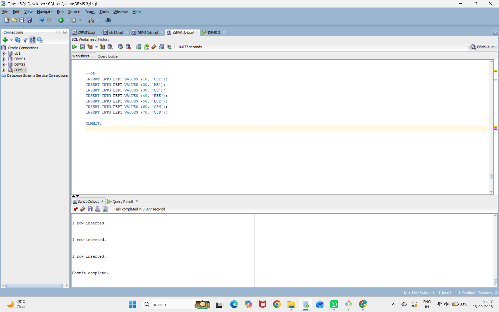

## 6. Insert at least 10 rows in the student table, take values of your own
```
INSERT INTO STUDENT5 VALUES (101, 'Rahul', 10);
INSERT INTO STUDENT5 VALUES (102, 'Sneha', 20);
INSERT INTO STUDENT5 VALUES (103, 'Arjun', 10);
INSERT INTO STUDENT5 VALUES (104, 'Priya', 30);
INSERT INTO STUDENT5 VALUES (105, 'Kiran', 40);
INSERT INTO STUDENT5 VALUES (106, 'Nikhil', 50);
INSERT INTO STUDENT5 VALUES (107, 'Anjali', 60);
INSERT INTO STUDENT5 VALUES (108, 'Ravi', 10);
INSERT INTO STUDENT5 VALUES (109, 'Pooja', 20);
INSERT INTO STUDENT5 VALUES (110, 'Aman', NULL);

COMMIT;
````
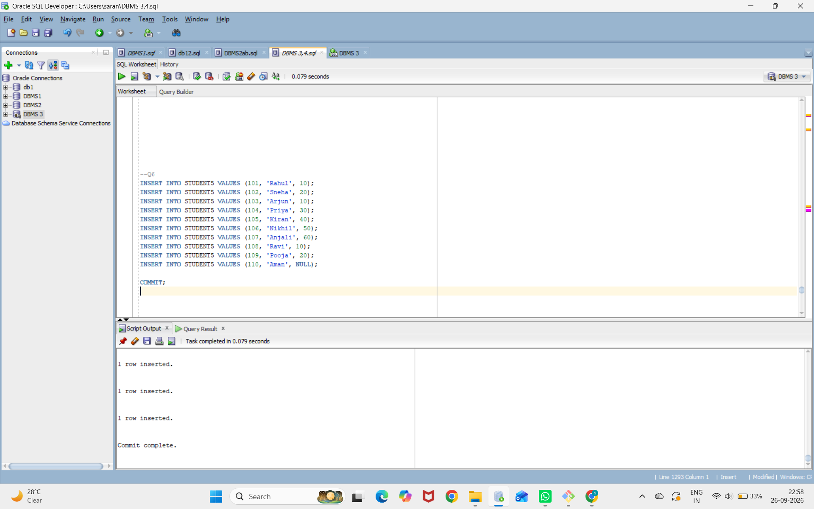

## 7. Write a SQL Query to implement NATURAL JOIN between Student and Dept.
```
SELECT SID, SNAME, DNO, DNAME
FROM STUDENT5 S
JOIN DEPT D
ON S.DID=D.DNO;

SELECT * FROM STUDENT5;
SELECT * FROM DEPT;
```
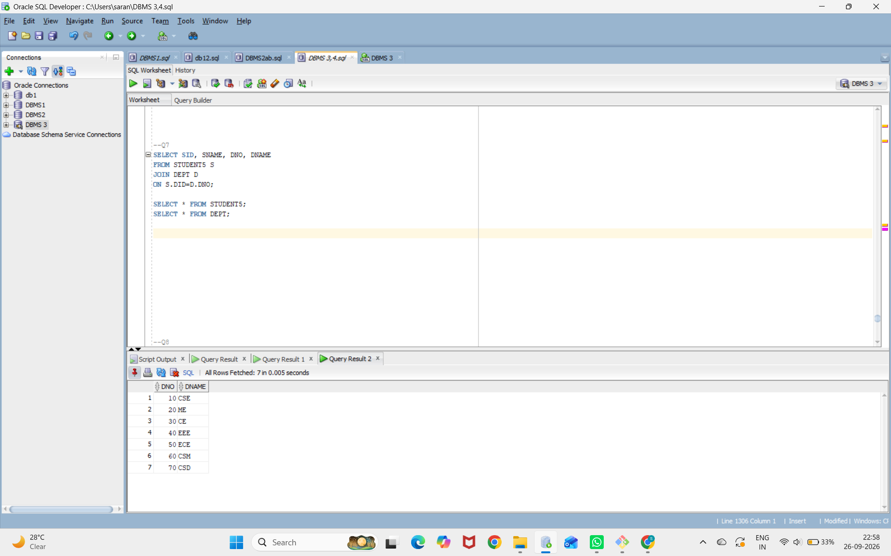

## 8. Write a SQL Query to implement EQUI JOIN between Student and Dept.
```
SELECT S.SID,
       S.SNAME,
       D.DNO,
       D.DNAME
FROM STUDENT5 S
INNER JOIN DEPT D
ON S.DID = D.DNO;
```
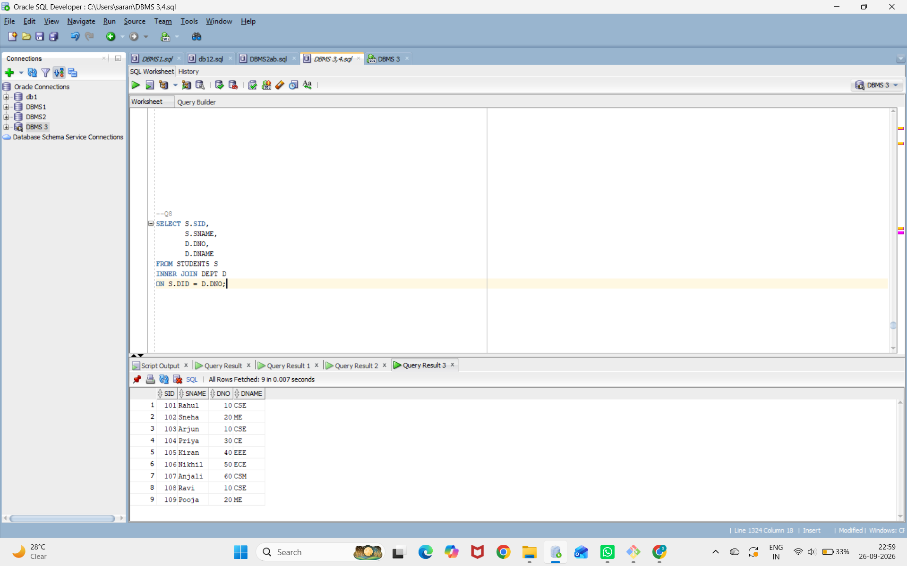

## 9. Write a SQL Query to implement CONDITIONAL JOIN between Student and Dept.
```
SELECT S.SID,
       S.SNAME,
       D.DNO,
       D.DNAME
FROM STUDENT5 S
JOIN DEPT D
ON S.DID > D.DNO;
````
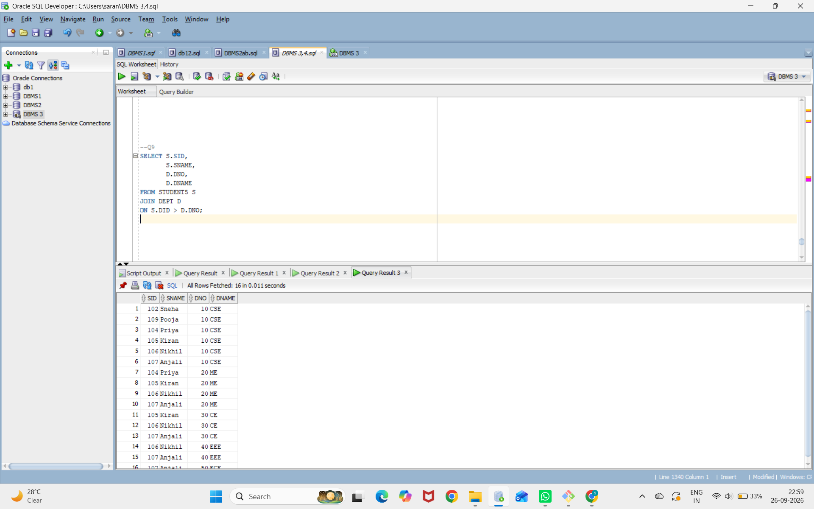

## 10. Write a SQL Query to implement LEFT OUTER NATURAL JOIN between Student and Dept.
```
SELECT S.SID,
       S.SNAME,
       S.DID,
       D.DNAME
FROM STUDENT5 S
LEFT OUTER JOIN DEPT D
ON S.DID = D.DNO;
```
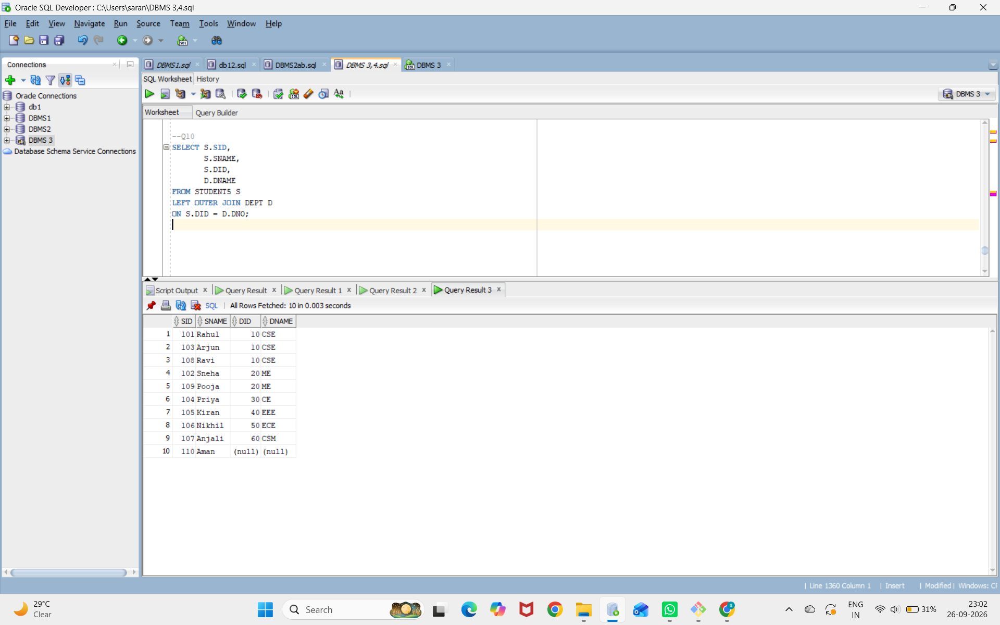

## 11. Write a SQL Query to implement RIGHT OUTER NATURAL JOIN between Student and Dept.
```
SELECT S.SID,
       S.SNAME,
       D.DNO,
       D.DNAME
FROM STUDENT5 S
RIGHT OUTER JOIN DEPT D
ON S.DID = D.DNO;
```
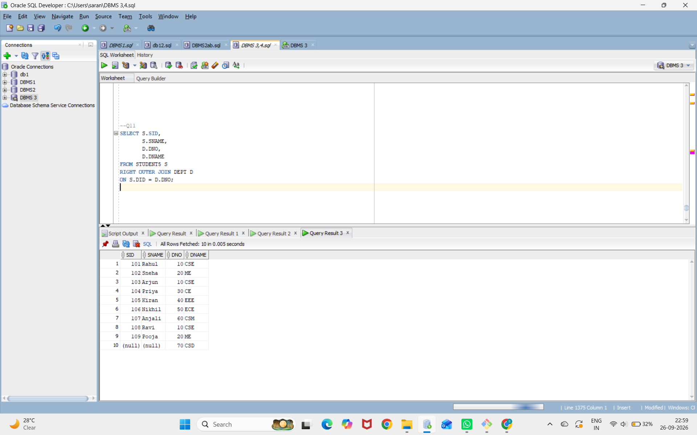

## 12. Write a SQL Query to implement FULL OUTER NATURAL JOIN between Student and Dept.
```
SELECT S.SID,
       S.SNAME,
       D.DNO,
       D.DNAME
FROM STUDENT5 S
FULL OUTER JOIN DEPT D
ON S.DID = D.DNO;
```
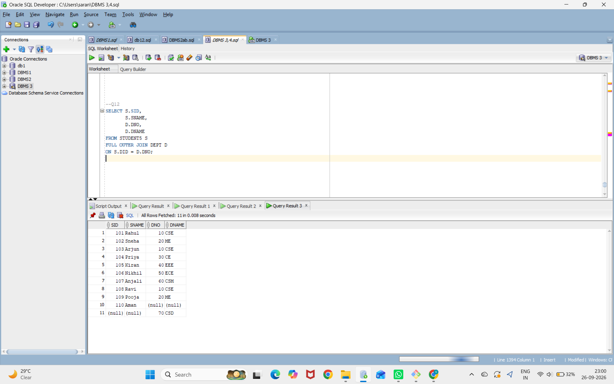

## 13. Write a SQL Query to implement LEFT OUTER EQUI JOIN between Student and Dept.
``` SELECT S.SID,
       S.SNAME,
       D.DNAME
FROM STUDENT5 S
LEFT OUTER JOIN DEPT D
ON S.DID = D.DNO;
```
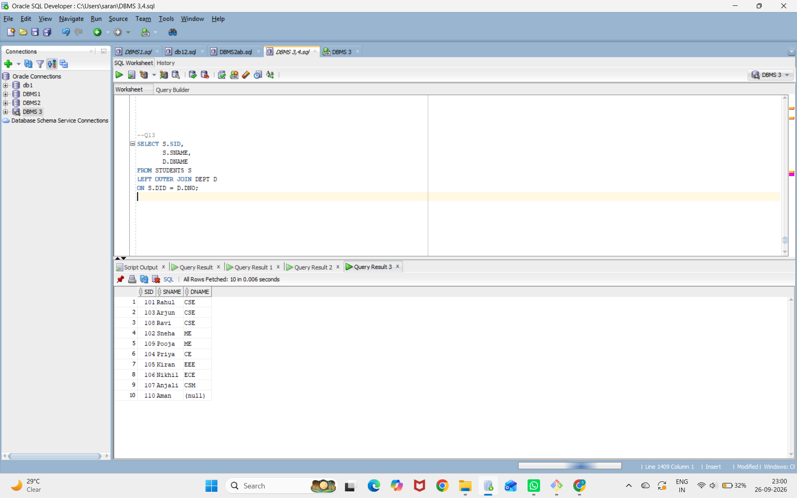

## 14. Write a SQL Query to implement RIGHT OUTER EQUI JOIN between Student and Dept.
```
SELECT S.SID,
       S.SNAME,
       D.DNAME
FROM STUDENT5 S
RIGHT OUTER JOIN DEPT D
ON S.DID = D.DNO;
```
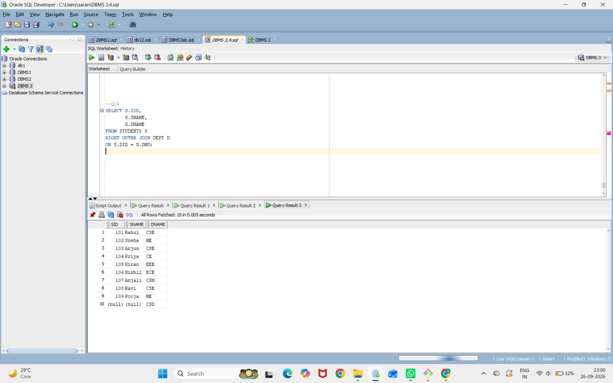

## 15. Write a SQL Query to implement FULL OUTER EQUI JOIN between Student and Dept.
```
SELECT S.SID,
       S.SNAME,
       D.DNAME
FROM STUDENT5 S
FULL OUTER JOIN DEPT D
ON S.DID = D.DNO;
```
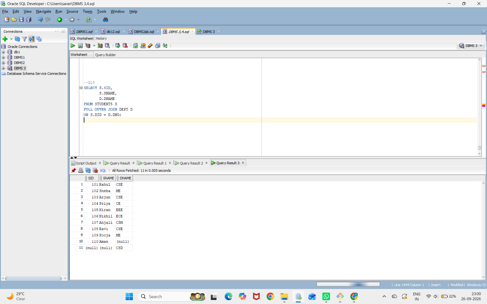

## 16. Write a SQL Query to implement LEFT OUTER CONDITIONAL JOIN between Student and Dept.
```
SELECT S.SID,
       S.SNAME,
       D.DNO,
       D.DNAME
FROM STUDENT5 S
LEFT OUTER JOIN DEPT D
ON S.DID >= D.DNO;
```
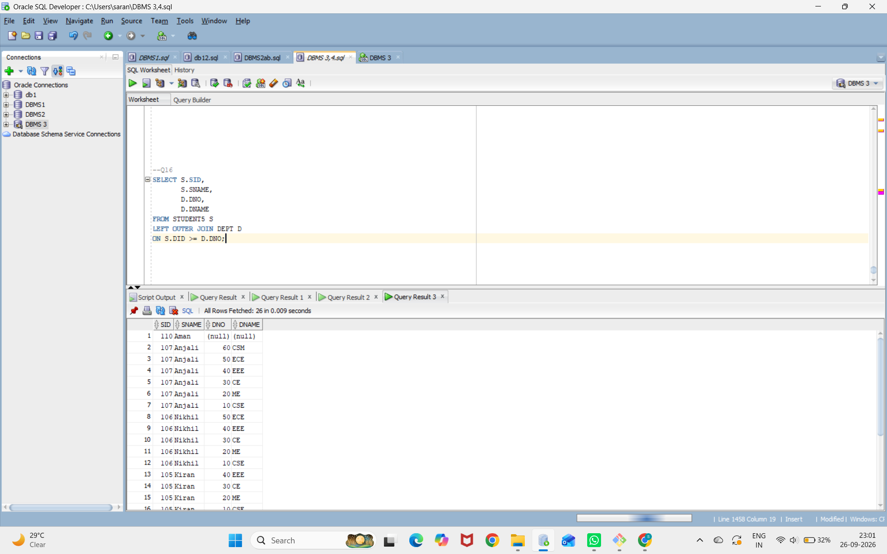

## 17. Write a SQL Query to implement RIGHT OUTER CONDITIONAL JOIN between Student and Dept.
```
SELECT S.SID,
       S.SNAME,
       D.DNO,
       D.DNAME
FROM STUDENT5 S
RIGHT OUTER JOIN DEPT D
ON S.DID >= D.DNO;
```
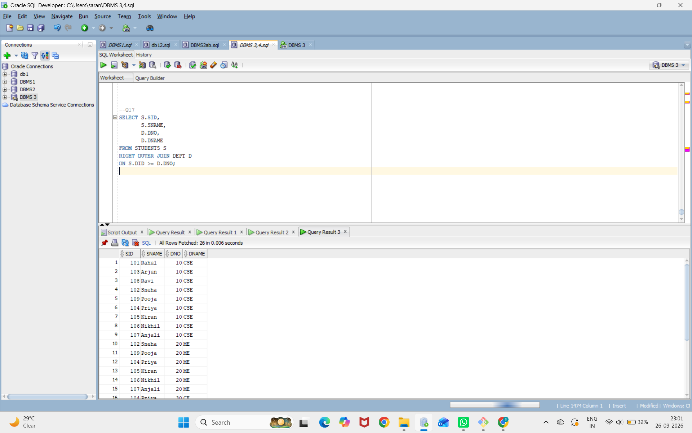

## 18. Write a SQL Query to implement FULL OUTER CONDITIONAL JOIN between Student and Dept.
```
SELECT S.SID,
       S.SNAME,
       D.DNO,
       D.DNAME
FROM STUDENT5 S
FULL OUTER JOIN DEPT D
ON S.DID >= D.DNO;
```
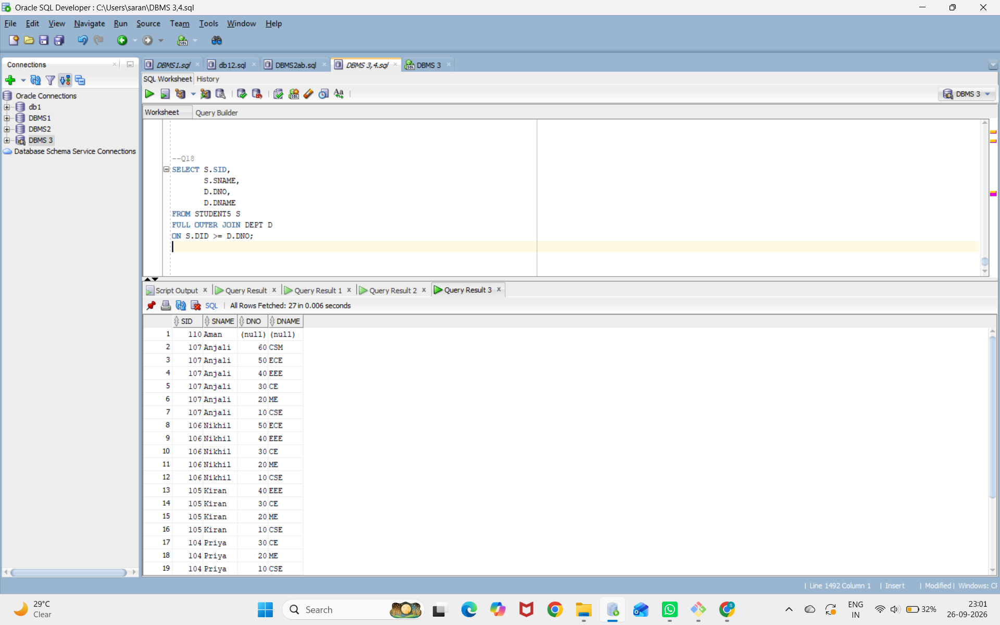

## 19. Write a SQL Query to Implement CROSS JOIN between Student and Dept.
```
SELECT S.SID,
       S.SNAME,
       D.DNO,
       D.DNAME
FROM STUDENT5 S
CROSS JOIN DEPT D;
```
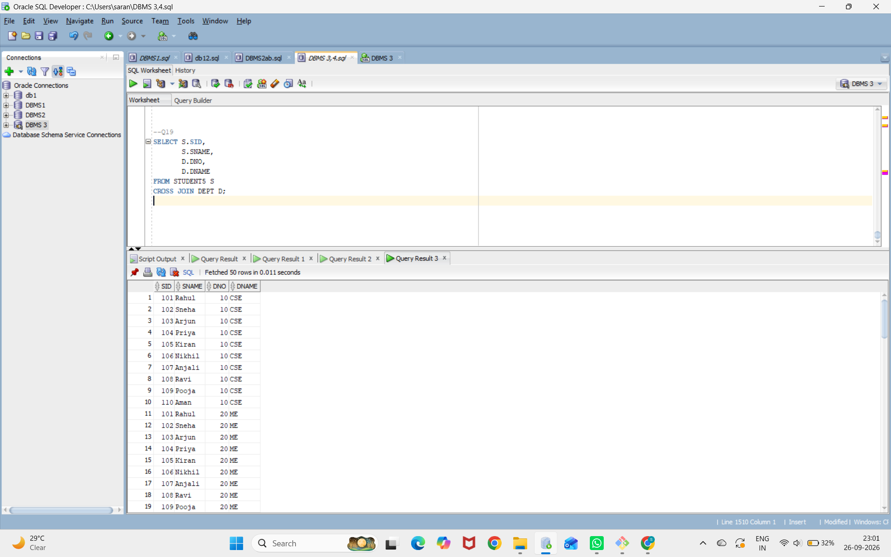
