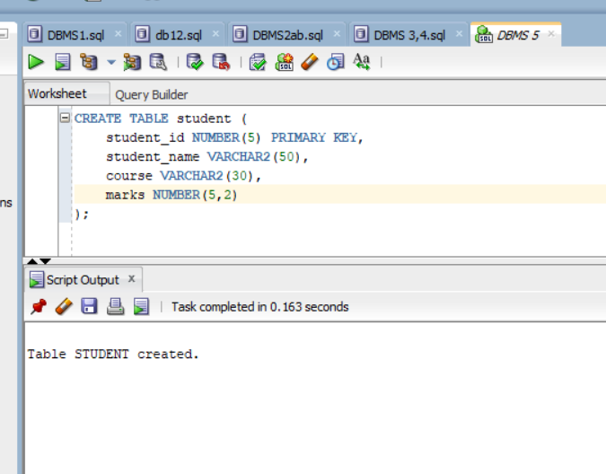
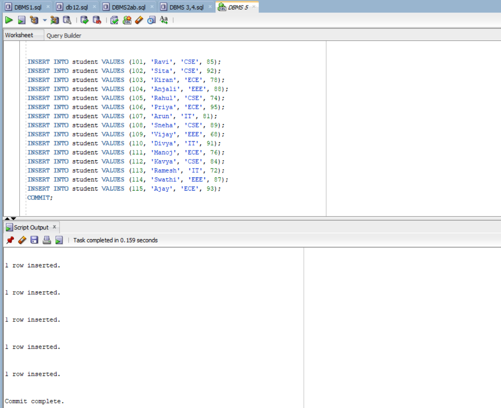
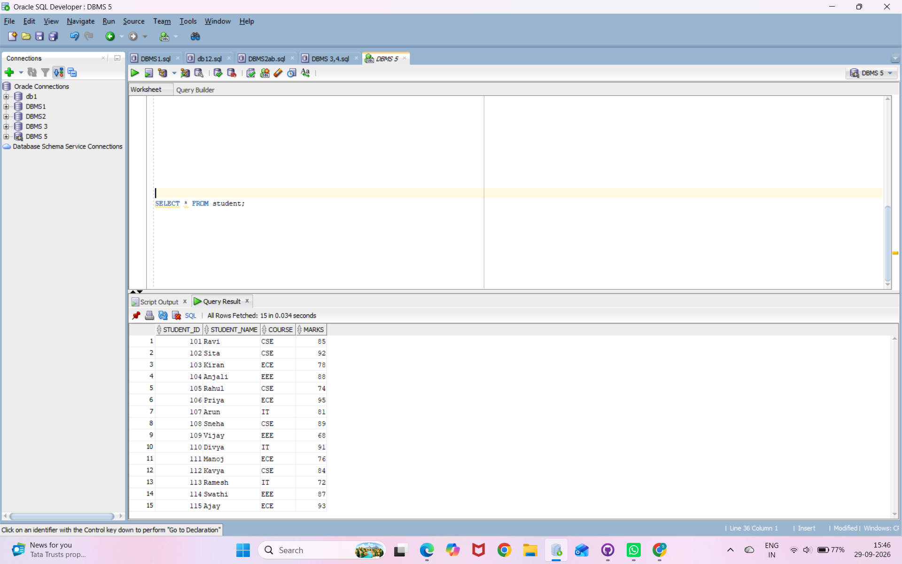
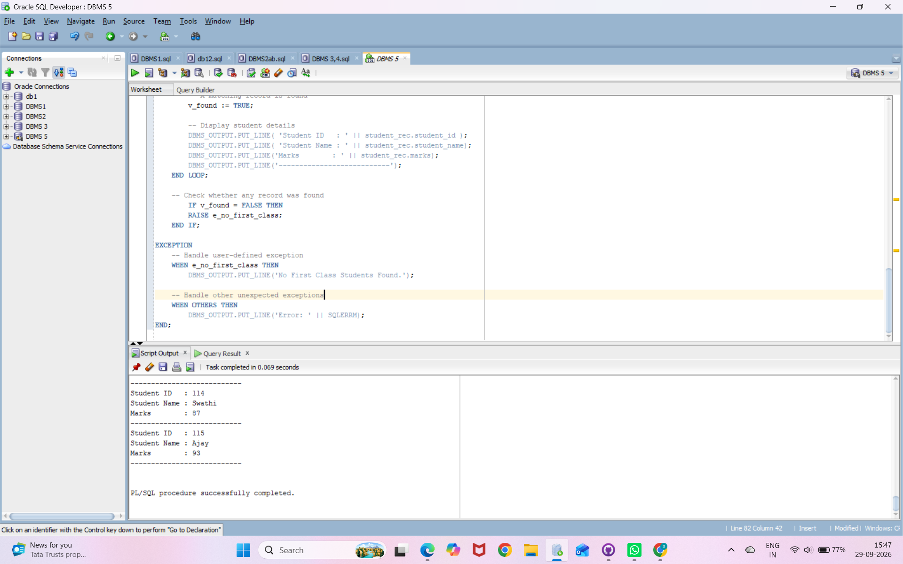
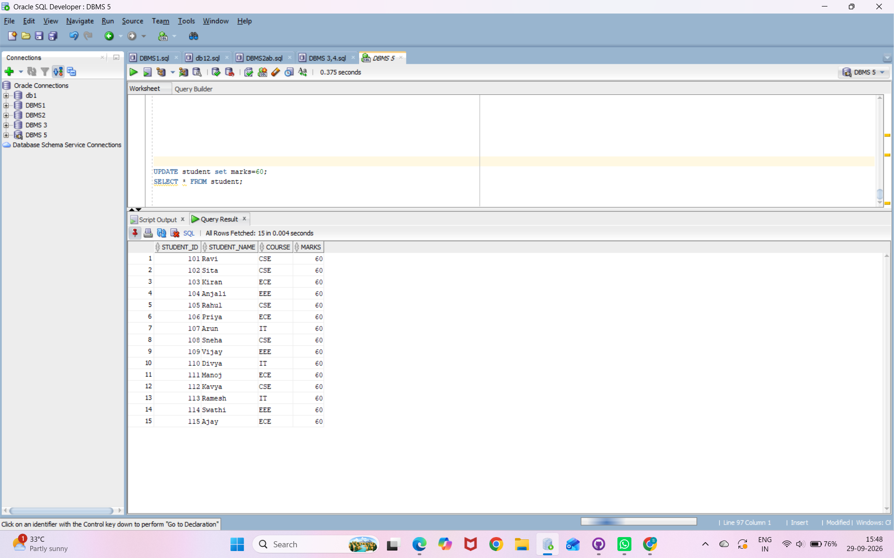

## Creating student table
```
CREATE TABLE student (
    student_id NUMBER(5) PRIMARY KEY,
    student_name VARCHAR2(50),
    course VARCHAR2(30),
    marks NUMBER(5,2)
);
```

## Inserting values into student table
```
INSERT INTO student VALUES (101, 'Ravi', 'CSE', 85);
INSERT INTO student VALUES (102, 'Sita', 'CSE', 92);
INSERT INTO student VALUES (103, 'Kiran', 'ECE', 78);
INSERT INTO student VALUES (104, 'Anjali', 'EEE', 88);
INSERT INTO student VALUES (105, 'Rahul', 'CSE', 74);
INSERT INTO student VALUES (106, 'Priya', 'ECE', 95);
INSERT INTO student VALUES (107, 'Arun', 'IT', 81);
INSERT INTO student VALUES (108, 'Sneha', 'CSE', 89);
INSERT INTO student VALUES (109, 'Vijay', 'EEE', 68);
INSERT INTO student VALUES (110, 'Divya', 'IT', 91);
INSERT INTO student VALUES (111, 'Manoj', 'ECE', 76);
INSERT INTO student VALUES (112, 'Kavya', 'CSE', 84);
INSERT INTO student VALUES (113, 'Ramesh', 'IT', 72);
INSERT INTO student VALUES (114, 'Swathi', 'EEE', 87);
INSERT INTO student VALUES (115, 'Ajay', 'ECE', 93);
COMMIT;
```

## Displaying student table
``` 
SELECT * FROM student;
```

## PL/SQL Code:
```
SET SERVEROUTPUT ON;
DECLARE
    -- Boolean variable to check whether any student is found
    v_found BOOLEAN := FALSE;

    -- User-defined exception
    e_no_first_class EXCEPTION;

    -- Cursor to retrieve First Class students
    CURSOR c_first_class IS
        SELECT student_id, student_name, marks
        FROM student
        WHERE marks >= 60;
BEGIN
    -- Open cursor and process each student
    FOR student_rec IN c_first_class
    LOOP
        -- A matching record is found
        v_found := TRUE;

        -- Display student details
        DBMS_OUTPUT.PUT_LINE( 'Student ID   : ' || student_rec.student_id );
        DBMS_OUTPUT.PUT_LINE( 'Student Name : ' || student_rec.student_name);
        DBMS_OUTPUT.PUT_LINE('Marks        : ' || student_rec.marks);
        DBMS_OUTPUT.PUT_LINE('---------------------------');

    -- Check whether any record was found
        IF v_found = FALSE THEN
        RAISE e_no_first_class;
    END IF;

EXCEPTION
    -- Handle user-defined exception
   	WHEN e_no_first_class THEN
        	DBMS_OUTPUT.PUT_LINE('No First Class Students Found.');


    -- Handle other unexpected exceptions
       WHEN OTHERS THEN
              DBMS_OUTPUT.PUT_LINE('Error: ' || SQLERRM);
END;
```


## updating all marks to less than 60
```
UPDATE student set marks=60;
SELECT * FROM student;
```

