EXPERIMENT-8

```
Program 1 – Cursor with Parameters (Banking System)
```
## 1. Create the ACCOUNT Table
```
CREATE TABLE account (
    account_number NUMBER(10) PRIMARY KEY,
    customer_name  VARCHAR2(50),
    account_type   VARCHAR2(20),
    balance        NUMBER(12,2)
);
```

## 2. Insert Sample Records
```
INSERT INTO account VALUES (1001, 'Ravi',   'SAVINGS', 25000);
INSERT INTO account VALUES (1002, 'Sita',   'CURRENT', 50000);
INSERT INTO account VALUES (1003, 'Kiran',  'SAVINGS', 35000);
INSERT INTO account VALUES (1004, 'Anjali', 'CURRENT', 45000);
INSERT INTO account VALUES (1005, 'Rahul',  'SAVINGS', 18000);
INSERT INTO account VALUES (1006, 'Priya',  'SAVINGS', 60000);
INSERT INTO account VALUES (1007, 'Arun',   'CURRENT', 75000);
INSERT INTO account VALUES (1008, 'Sneha',  'SAVINGS', 42000);

COMMIT;
```
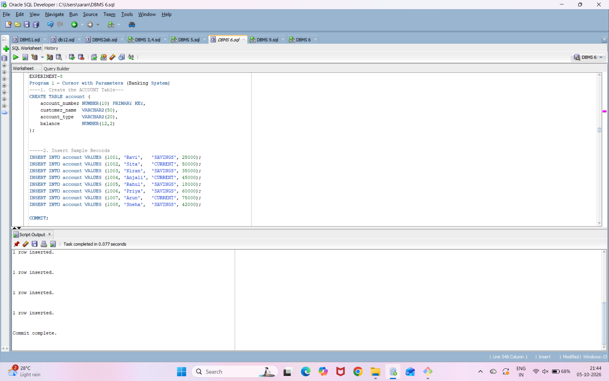
## 3. PL/SQL Code with Parameterized Cursor
```
SET SERVEROUTPUT ON;

DECLARE

    -- Parameterized cursor
    CURSOR C_ACCOUNT (p_account_type VARCHAR2) IS
        SELECT account_number,
               customer_name,
               account_type,
               balance
        FROM account
        WHERE account_type = p_account_type;

    -- Variables to store fetched values
    v_account_number account.account_number%TYPE;
    v_customer_name  account.customer_name%TYPE;
    v_account_type   account.account_type%TYPE;
    v_balance        account.balance%TYPE;

BEGIN

    -- Open cursor by passing account type
    OPEN C_ACCOUNT('SAVINGS');

    -- Fetch records one by one
    LOOP

        FETCH C_ACCOUNT
        INTO v_account_number,
             v_customer_name,
             v_account_type,
             v_balance;

        -- Exit when all records are processed
        EXIT WHEN C_ACCOUNT%NOTFOUND;

        -- Display account details
        DBMS_OUTPUT.PUT_LINE(
            'Account Number : ' || v_account_number
        );

        DBMS_OUTPUT.PUT_LINE(
            'Customer Name  : ' || v_customer_name
        );

        DBMS_OUTPUT.PUT_LINE(
            'Account Type   : ' || v_account_type
        );

        DBMS_OUTPUT.PUT_LINE(
            'Balance        : ' || v_balance
        );

        DBMS_OUTPUT.PUT_LINE(
            '-----------------------------'
        );

    END LOOP;

    -- Close the cursor
    CLOSE C_ACCOUNT;

END;
/
```

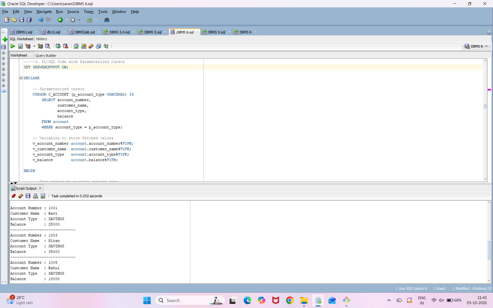
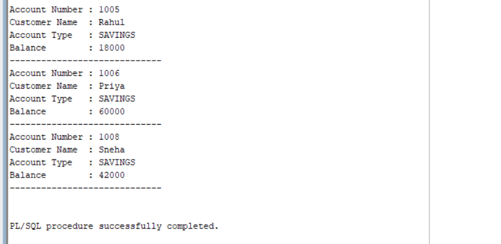


```
Program 2 – Cursor with Parameters (Hospital Management)
```

## 1. Create the PATIENT Table
```
CREATE TABLE patient (
    patient_id   NUMBER(5) PRIMARY KEY,
    patient_name VARCHAR2(50),
    department   VARCHAR2(30),
    doctor_name  VARCHAR2(50)
);
```

## 2. Insert Sample Records
```
INSERT INTO patient VALUES (101, 'Ravi',   'Cardiology', 'Dr. Kumar');
INSERT INTO patient VALUES (102, 'Sita',   'Neurology',  'Dr. Ramesh');
INSERT INTO patient VALUES (103, 'Kiran',  'Cardiology', 'Dr. Kumar');
INSERT INTO patient VALUES (104, 'Anjali', 'Orthopedic', 'Dr. Priya');
INSERT INTO patient VALUES (105, 'Rahul',  'Cardiology', 'Dr. Sharma');
INSERT INTO patient VALUES (106, 'Divya',  'Neurology',  'Dr. Ramesh');
INSERT INTO patient VALUES (107, 'Arun',   'Cardiology', 'Dr. Kumar');
INSERT INTO patient VALUES (108, 'Sneha',  'Orthopedic', 'Dr. Priya');

COMMIT;
```
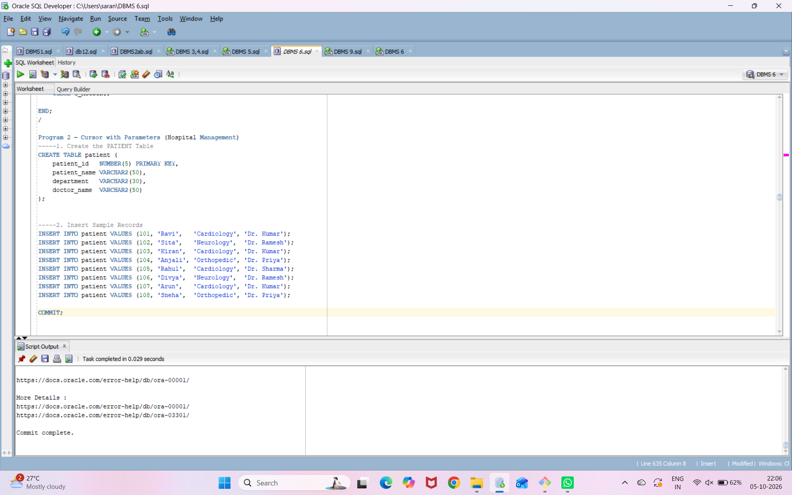

## 3. PL/SQL Program with Parameterized Cursor
```
SET SERVEROUTPUT ON;

DECLARE

    -- Parameterized cursor
    CURSOR C_PATIENT (p_department VARCHAR2) IS
        SELECT patient_id,
               patient_name,
               department,
               doctor_name
        FROM patient
        WHERE department = p_department;

    -- Variables to store fetched values
    v_patient_id   patient.patient_id%TYPE;
    v_patient_name patient.patient_name%TYPE;
    v_department   patient.department%TYPE;
    v_doctor_name  patient.doctor_name%TYPE;

BEGIN

    -- Open cursor by passing the department name
    OPEN C_PATIENT('Cardiology');

    -- Fetch records one at a time
    LOOP

        FETCH C_PATIENT
        INTO v_patient_id,
             v_patient_name,
             v_department,
             v_doctor_name;

        -- Exit when all records have been processed
        EXIT WHEN C_PATIENT%NOTFOUND;

        -- Display patient details
        DBMS_OUTPUT.PUT_LINE(
            'Patient ID   : ' || v_patient_id
        );

        DBMS_OUTPUT.PUT_LINE(
            'Patient Name : ' || v_patient_name
        );

        DBMS_OUTPUT.PUT_LINE(
            'Department   : ' || v_department
        );

        DBMS_OUTPUT.PUT_LINE(
            'Doctor Name  : ' || v_doctor_name
        );

        DBMS_OUTPUT.PUT_LINE(
            '-----------------------------'
        );

    END LOOP;

    -- Close the cursor
    CLOSE C_PATIENT;

END;
/
```
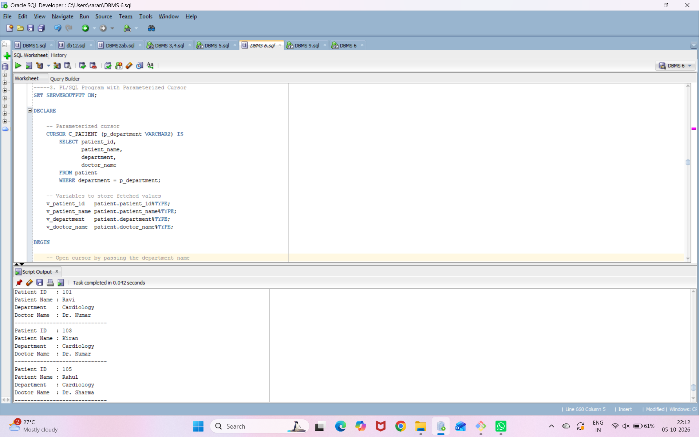
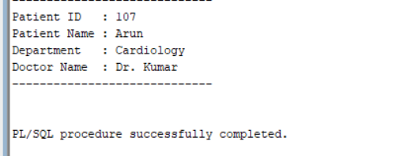


```
Program 3 – FOR UPDATE Cursor (Employee Payroll)
```

## 1. Create the EMPLOYEE Table
```
CREATE TABLE employee (
    employee_id   NUMBER(5) PRIMARY KEY,
    employee_name VARCHAR2(50),
    department    VARCHAR2(30),
    salary        NUMBER(10,2)
);
```
## 2. Insert Sample Employee Records
```
INSERT INTO employee VALUES (101, 'Ravi',   'CSE', 25000);
INSERT INTO employee VALUES (102, 'Sita',   'ECE', 30000);
INSERT INTO employee VALUES (103, 'Kiran',  'EEE', 28000);
INSERT INTO employee VALUES (104, 'Anjali', 'IT',  35000);
INSERT INTO employee VALUES (105, 'Rahul',  'CSE', 40000);

COMMIT;
```
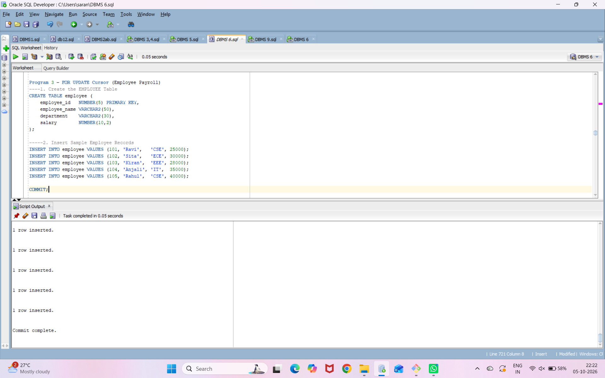

## 3. PL/SQL Program
```
SET SERVEROUTPUT ON;

DECLARE

    -- Declare cursor with FOR UPDATE
    CURSOR C_EMPLOYEE IS
        SELECT employee_id,
               employee_name,
               department,
               salary
        FROM employee
        FOR UPDATE;

BEGIN

    -- Open and process the cursor
    FOR emp_rec IN C_EMPLOYEE
    LOOP

        -- Increase salary by 10%
        UPDATE employee
        SET salary = emp_rec.salary * 1.10
        WHERE CURRENT OF C_EMPLOYEE;

        -- Display updated employee details
        DBMS_OUTPUT.PUT_LINE(
            'Employee ID   : ' || emp_rec.employee_id
        );

        DBMS_OUTPUT.PUT_LINE(
            'Employee Name : ' || emp_rec.employee_name
        );

        DBMS_OUTPUT.PUT_LINE(
            'Old Salary    : ' || emp_rec.salary
        );

        DBMS_OUTPUT.PUT_LINE(
            'New Salary    : ' || (emp_rec.salary * 1.10)
        );

        DBMS_OUTPUT.PUT_LINE(
            '-----------------------------'
        );

    END LOOP;

    -- Commit the transaction
    COMMIT;

    -- Display success message
    DBMS_OUTPUT.PUT_LINE(
        'Salary updated successfully for all employees.'
    );

END;
/

```
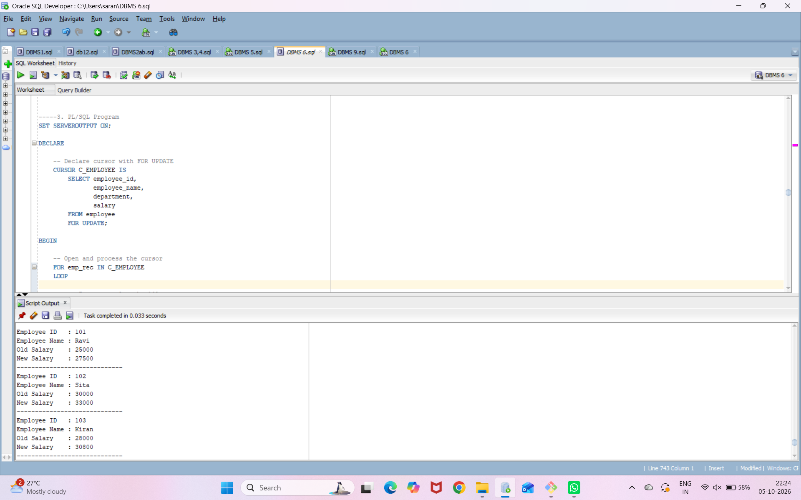
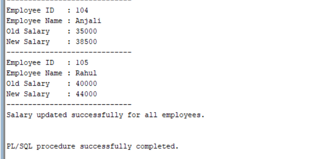

## 4. Verify the Updated Records
```
SELECT
    employee_id,
    employee_name,
    department,
    salary
FROM employee;
```
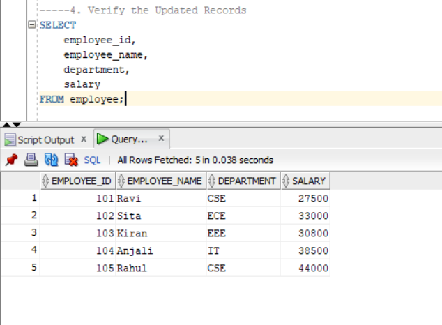


```
Program 4 – FOR UPDATE Cursor (Library Management)
```
## 1. Create the BOOK Table
```
CREATE TABLE book (
    book_id          NUMBER(5) PRIMARY KEY,
    book_title       VARCHAR2(100),
    author           VARCHAR2(50),
    available_copies NUMBER(5)
);
```

## 2. Insert Sample Book Records
```
INSERT INTO book VALUES (101, 'Database Management Systems', 'Raghu Ramakrishnan', 10);
INSERT INTO book VALUES (102, 'Operating System Concepts', 'Abraham Silberschatz', 8);
INSERT INTO book VALUES (103, 'Computer Networks', 'Andrew S. Tanenbaum', 12);
INSERT INTO book VALUES (104, 'Programming in C', 'Dennis Ritchie', 6);
INSERT INTO book VALUES (105, 'Artificial Intelligence', 'Stuart Russell', 15);

COMMIT;
```
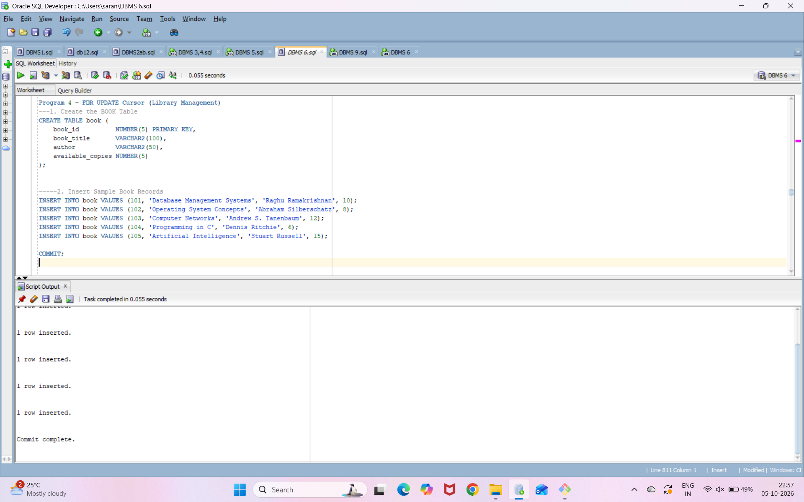

## 3. PL/SQL Program
```
SET SERVEROUTPUT ON;

DECLARE

    -- Variables to store fetched values
    v_book_id          book.book_id%TYPE;
    v_book_title       book.book_title%TYPE;
    v_author            book.author%TYPE;
    v_available_copies book.available_copies%TYPE;

    -- FOR UPDATE cursor
    CURSOR C_BOOK IS
        SELECT book_id,
               book_title,
               author,
               available_copies
        FROM book
        FOR UPDATE;

BEGIN

    -- Open the cursor
    OPEN C_BOOK;

    LOOP

        -- Fetch one record at a time
        FETCH C_BOOK
        INTO v_book_id,
             v_book_title,
             v_author,
             v_available_copies;

        -- Exit when all records are processed
        EXIT WHEN C_BOOK%NOTFOUND;

        -- Increase available copies by 5
        v_available_copies := v_available_copies + 5;

        -- Update the current record
        UPDATE book
        SET available_copies = v_available_copies
        WHERE CURRENT OF C_BOOK;

    END LOOP;

    -- Commit the changes
    COMMIT;

    -- Display success message
    DBMS_OUTPUT.PUT_LINE(
        'All book records have been updated successfully.'
    );

    -- Close the cursor
    CLOSE C_BOOK;

END;
/
```
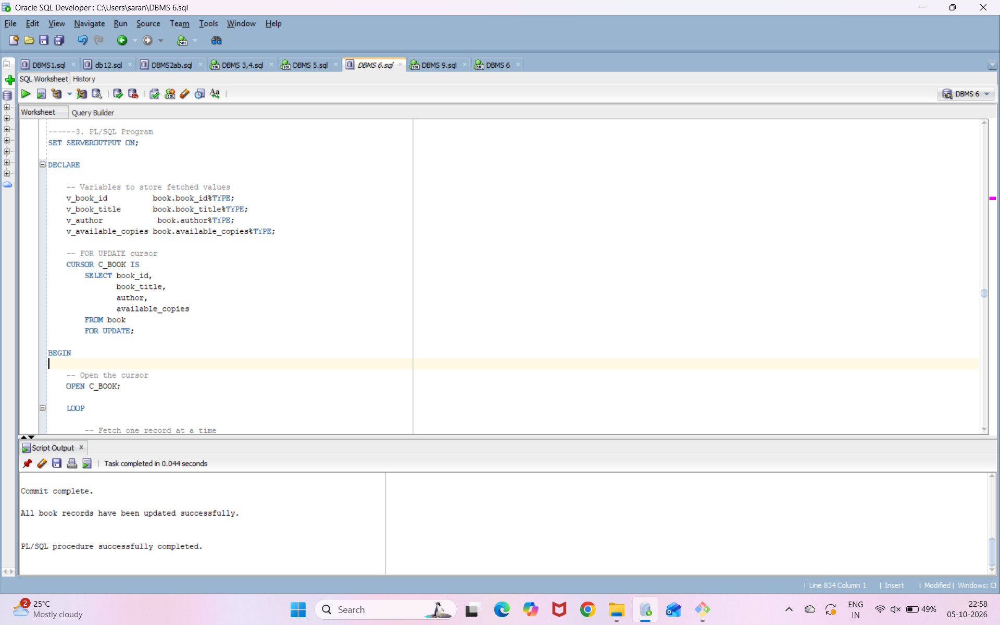


## 4. Verify the Updated Records
```
SELECT *
FROM book;
```
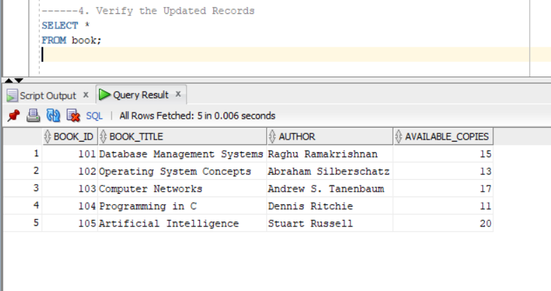


```
Program 5 – WHERE CURRENT OF (Inventory Management)
```

## 1. Create the PRODUCT Table
```
CREATE TABLE product (
    product_id NUMBER(5) PRIMARY KEY,
    product_na0me VARCHAR2(50),
    price NUMBER(10,2),
    quantity NUMBER(5)
);
```

## 2. Insert Sample Product Records
```
INSERT INTO product VALUES (101, 'Laptop', 50000, 10);
INSERT INTO product VALUES (102, 'Mobile Phone', 25000, 20);
INSERT INTO product VALUES (103, 'Keyboard', 1500, 30);
INSERT INTO product VALUES (104, 'Mouse', 800, 40);
INSERT INTO product VALUES (105, 'Printer', 12000, 15);

COMMIT;
```
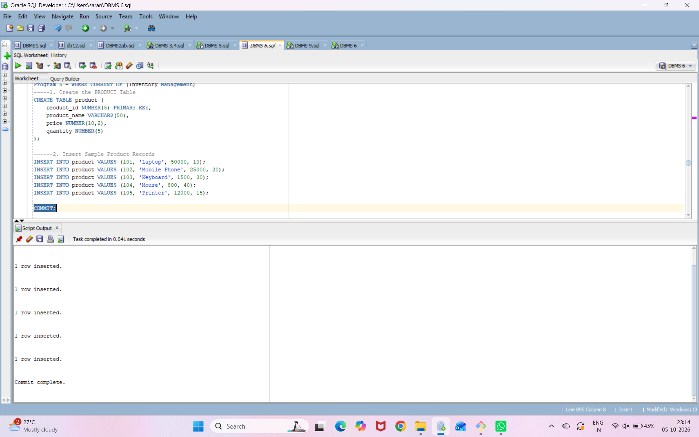

## 3. Check the Original Records
```
SELECT * FROM product;
```
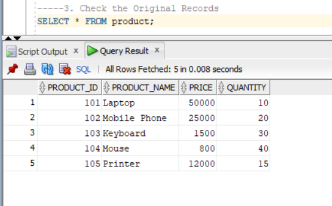


## 4. PL/SQL Program
```
SET SERVEROUTPUT ON;

DECLARE
    v_product_id       product.product_id%TYPE;
    v_product_name     product.product_name%TYPE;
    v_price            product.price%TYPE;
    v_quantity         product.quantity%TYPE;

    CURSOR C_PRODUCT IS
        SELECT product_id,
               product_name,
               price,
               quantity
        FROM product
        FOR UPDATE;

BEGIN
    OPEN C_PRODUCT;

    LOOP
        FETCH C_PRODUCT
        INTO v_product_id,
             v_product_name,
             v_price,
             v_quantity;

        EXIT WHEN C_PRODUCT%NOTFOUND;

        -- Increase price by 5%
        v_price := v_price + (v_price * 5 / 100);

        -- Update the currently fetched record
        UPDATE product
        SET price = v_price
        WHERE CURRENT OF C_PRODUCT;
    END LOOP;

    COMMIT;

    DBMS_OUTPUT.PUT_LINE(
        'All product prices have been increased by 5% successfully.'
    );

    CLOSE C_PRODUCT;

EXCEPTION
    WHEN OTHERS THEN
        DBMS_OUTPUT.PUT_LINE('Error: ' || SQLERRM);

        IF C_PRODUCT%ISOPEN THEN
            CLOSE C_PRODUCT;
        END IF;
END;
/
```
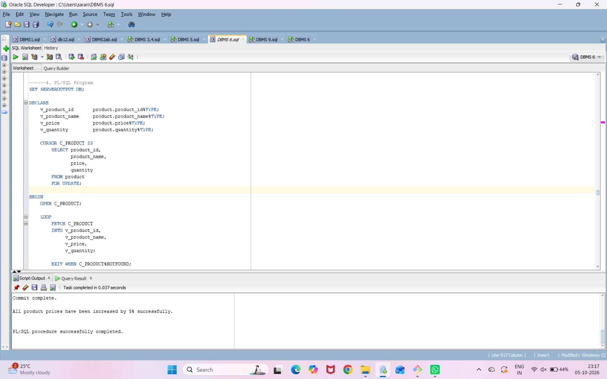

## 5. Verify the Updated Records
```
SELECT * FROM product;
```
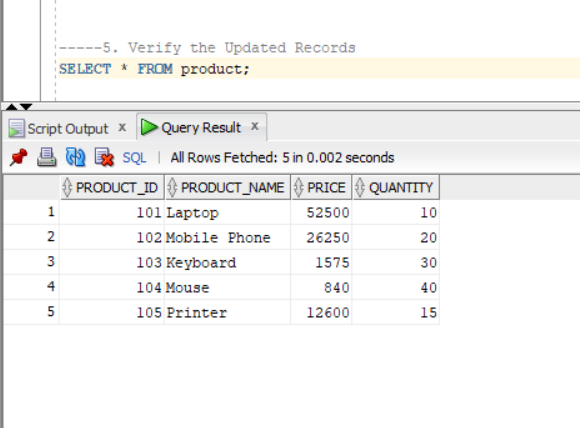


```
Program 6 – Cursor Variable (University Management)
```

## 1. Create the STUDENT Table
```
CREATE TABLE student (
    student_id NUMBER(5) PRIMARY KEY,
    student_name VARCHAR2(50),
    course VARCHAR2(30),
    marks NUMBER(5,2)
);
```

## 2. Insert Sample Student Records
```
INSERT INTO student VALUES (101, 'Ravi', 'CSE', 85);
INSERT INTO student VALUES (102, 'Sita', 'ECE', 92);
INSERT INTO student VALUES (103, 'Kiran', 'EEE', 78);
INSERT INTO student VALUES (104, 'Anjali', 'CSE', 88);
INSERT INTO student VALUES (105, 'Rahul', 'IT', 74);
INSERT INTO student VALUES (106, 'Priya', 'CSE', 95);
INSERT INTO student VALUES (107, 'Arun', 'ECE', 81);
INSERT INTO student VALUES (108, 'Sneha', 'IT', 89);

COMMIT;
```
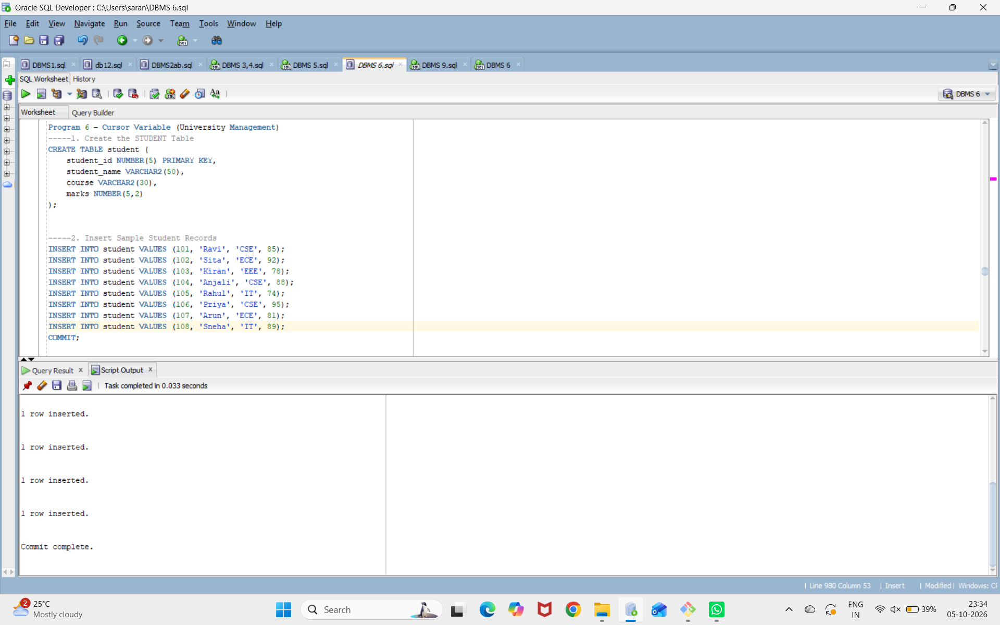

## 3. PL/SQL Program Using REF CURSOR
```
SET SERVEROUTPUT ON;

DECLARE

    -- Declare REF CURSOR type
    TYPE student_ref_cursor IS REF CURSOR;

    -- Declare cursor variable
    v_student_cursor student_ref_cursor;

    -- Variables to store fetched values
    v_student_id   student.student_id%TYPE;
    v_student_name student.student_name%TYPE;
    v_course       student.course%TYPE;
    v_marks        student.marks%TYPE;

BEGIN

    -- Open the REF CURSOR for the SELECT query
    OPEN v_student_cursor FOR
        SELECT student_id,
               student_name,
               course,
               marks
        FROM student;

    -- Fetch one record at a time
    LOOP

        FETCH v_student_cursor
        INTO v_student_id,
             v_student_name,
             v_course,
             v_marks;

        -- Exit when there are no more records
        EXIT WHEN v_student_cursor%NOTFOUND;

        -- Display student details
        DBMS_OUTPUT.PUT_LINE('Student ID   : ' || v_student_id);
        DBMS_OUTPUT.PUT_LINE('Student Name : ' || v_student_name);
        DBMS_OUTPUT.PUT_LINE('Course       : ' || v_course);
        DBMS_OUTPUT.PUT_LINE('Marks        : ' || v_marks);
        DBMS_OUTPUT.PUT_LINE('-----------------------------');

    END LOOP;

    -- Close the REF CURSOR
    CLOSE v_student_cursor;

END;
/
```
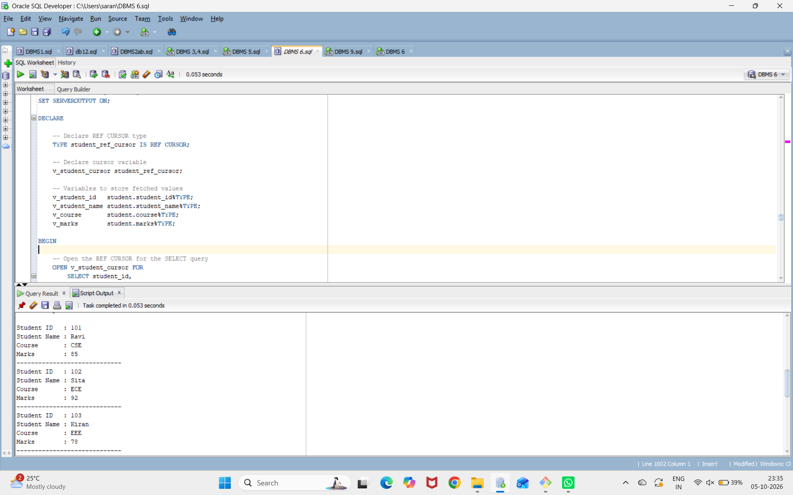
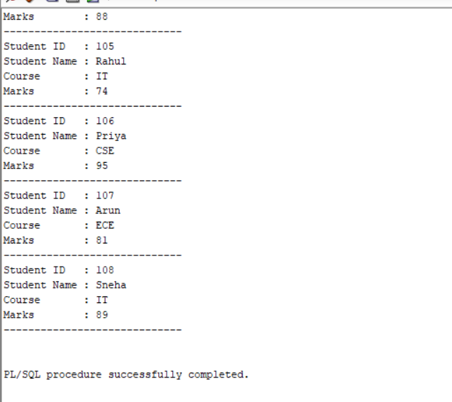


```
Program 7 – Cursor Variable (Hospital Management)
```

## 1. Create the DOCTOR Table
```
CREATE TABLE doctor (
    doctor_id NUMBER(5) PRIMARY KEY,
    doctor_name VARCHAR2(50),
    specialization VARCHAR2(50),
    experience NUMBER(3)
);
```

## 2. Insert Sample Doctor Records
```
INSERT INTO doctor VALUES (101, 'Dr. Kumar', 'Cardiology', 15);
INSERT INTO doctor VALUES (102, 'Dr. Ramesh', 'Neurology', 12);
INSERT INTO doctor VALUES (103, 'Dr. Priya', 'Orthopedics', 10);
INSERT INTO doctor VALUES (104, 'Dr. Sharma', 'Dermatology', 8);
INSERT INTO doctor VALUES (105, 'Dr. Anjali', 'Pediatrics', 7);
INSERT INTO doctor VALUES (106, 'Dr. Ravi', 'General Medicine', 14);
INSERT INTO doctor VALUES (107, 'Dr. Suresh', 'ENT', 9);
INSERT INTO doctor VALUES (108, 'Dr. Lakshmi', 'Gynecology', 11);

COMMIT;
```
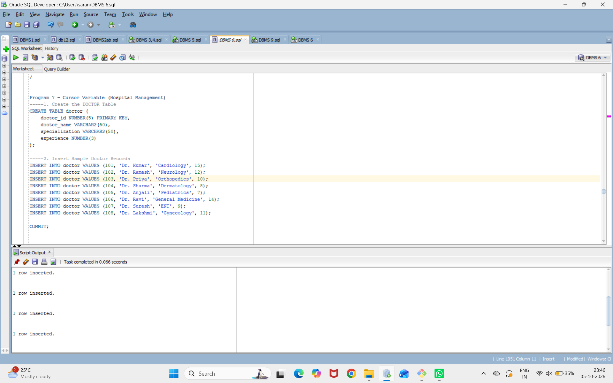

## 3. PL/SQL Program Using REF CURSOR
```
SET SERVEROUTPUT ON;

DECLARE

    -- Declare REF CURSOR type
    TYPE doctor_ref_cursor IS REF CURSOR;

    -- Declare cursor variable
    v_doctor_cursor doctor_ref_cursor;

    -- Variables to store fetched values
    v_doctor_id       doctor.doctor_id%TYPE;
    v_doctor_name     doctor.doctor_name%TYPE;
    v_specialization  doctor.specialization%TYPE;
    v_experience      doctor.experience%TYPE;

BEGIN

    -- Open the REF CURSOR for the DOCTOR table
    OPEN v_doctor_cursor FOR
        SELECT doctor_id,
               doctor_name,
               specialization,
               experience
        FROM doctor;

    -- Fetch one doctor record at a time
    LOOP

        FETCH v_doctor_cursor
        INTO v_doctor_id,
             v_doctor_name,
             v_specialization,
             v_experience;

        -- Exit when all records are fetched
        EXIT WHEN v_doctor_cursor%NOTFOUND;

        -- Display doctor details
        DBMS_OUTPUT.PUT_LINE('Doctor ID      : ' || v_doctor_id);
        DBMS_OUTPUT.PUT_LINE('Doctor Name    : ' || v_doctor_name);
        DBMS_OUTPUT.PUT_LINE('Specialization : ' || v_specialization);
        DBMS_OUTPUT.PUT_LINE('Experience     : ' || v_experience || ' years');
        DBMS_OUTPUT.PUT_LINE('-----------------------------');

    END LOOP;

    -- Close the REF CURSOR
    CLOSE v_doctor_cursor;

END;
/
```
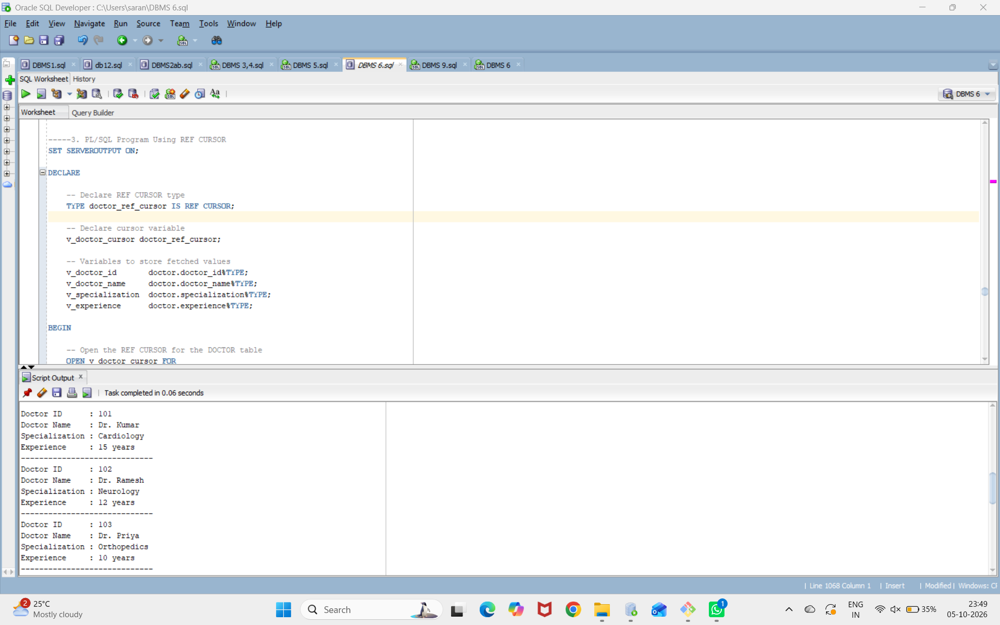
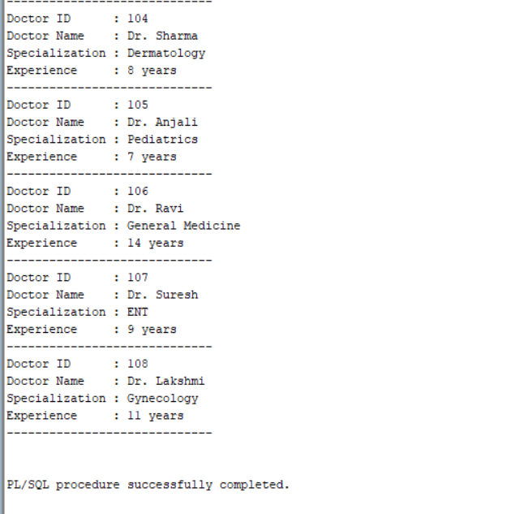


```
Program 8 – Cursor Variable (Online Shopping System)
```

## 1. Create the ORDERS Table
```
CREATE TABLE orders (
    order_id NUMBER(5) PRIMARY KEY,
    customer_name VARCHAR2(50),
    product_name VARCHAR2(50),
    quantity NUMBER(5),
    total_amount NUMBER(10,2)
);
```


## 2. Insert Sample Order Records
```
INSERT INTO orders VALUES (101, 'Ravi', 'Laptop', 1, 50000);
INSERT INTO orders VALUES (102, 'Sita', 'Mobile Phone', 2, 50000);
INSERT INTO orders VALUES (103, 'Kiran', 'Keyboard', 3, 4500);
INSERT INTO orders VALUES (104, 'Anjali', 'Printer', 1, 12000);
INSERT INTO orders VALUES (105, 'Rahul', 'Mouse', 5, 4000);
INSERT INTO orders VALUES (106, 'Priya', 'Monitor', 2, 30000);
INSERT INTO orders VALUES (107, 'Arun', 'Headphones', 2, 5000);
INSERT INTO orders VALUES (108, 'Sneha', 'Tablet', 1, 25000);

COMMIT;
```
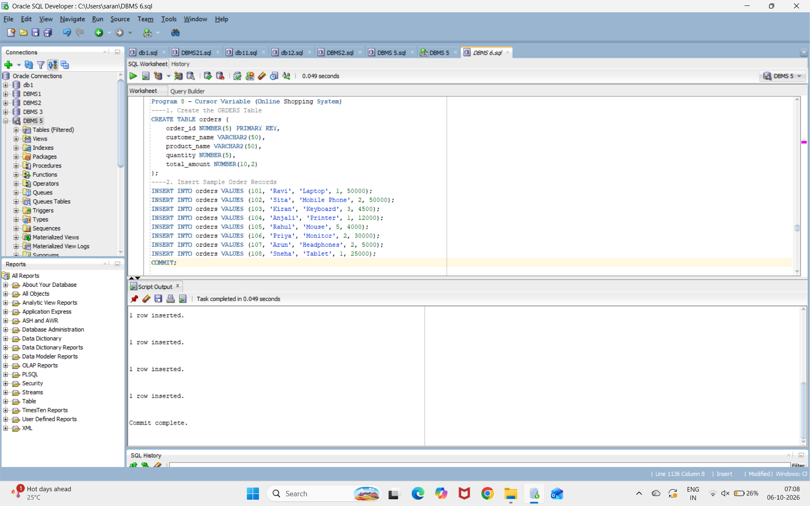

## 3.PL/SQL Program Using REF CURSOR
```
SET SERVEROUTPUT ON;

DECLARE

    -- Declare REF CURSOR type
    TYPE orders_ref_cursor IS REF CURSOR;

    -- Declare cursor variable
    v_orders_cursor orders_ref_cursor;

    -- Variables to store fetched values
    v_order_id      orders.order_id%TYPE;
    v_customer_name orders.customer_name%TYPE;
    v_product_name  orders.product_name%TYPE;
    v_quantity      orders.quantity%TYPE;
    v_total_amount  orders.total_amount%TYPE;

BEGIN

    -- Open the REF CURSOR for the ORDERS table
    OPEN v_orders_cursor FOR
        SELECT order_id,
               customer_name,
               product_name,
               quantity,
               total_amount
        FROM orders;

    -- Fetch one order record at a time
    LOOP

        FETCH v_orders_cursor
        INTO v_order_id,
             v_customer_name,
             v_product_name,
             v_quantity,
             v_total_amount;

        -- Exit when all records are fetched
        EXIT WHEN v_orders_cursor%NOTFOUND;

        -- Display order details
        DBMS_OUTPUT.PUT_LINE('Order ID      : ' || v_order_id);
        DBMS_OUTPUT.PUT_LINE('Customer Name : ' || v_customer_name);
        DBMS_OUTPUT.PUT_LINE('Product Name  : ' || v_product_name);
        DBMS_OUTPUT.PUT_LINE('Quantity      : ' || v_quantity);
        DBMS_OUTPUT.PUT_LINE('Total Amount  : ' || v_total_amount);
        DBMS_OUTPUT.PUT_LINE('-----------------------------');

    END LOOP;

    -- Close the REF CURSOR
    CLOSE v_orders_cursor;

END;
/
```
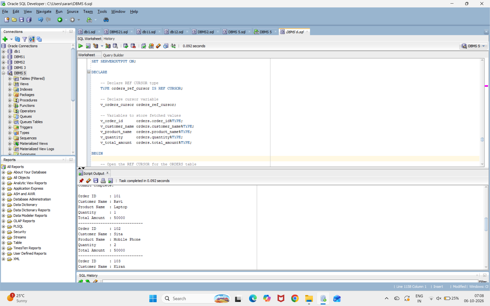
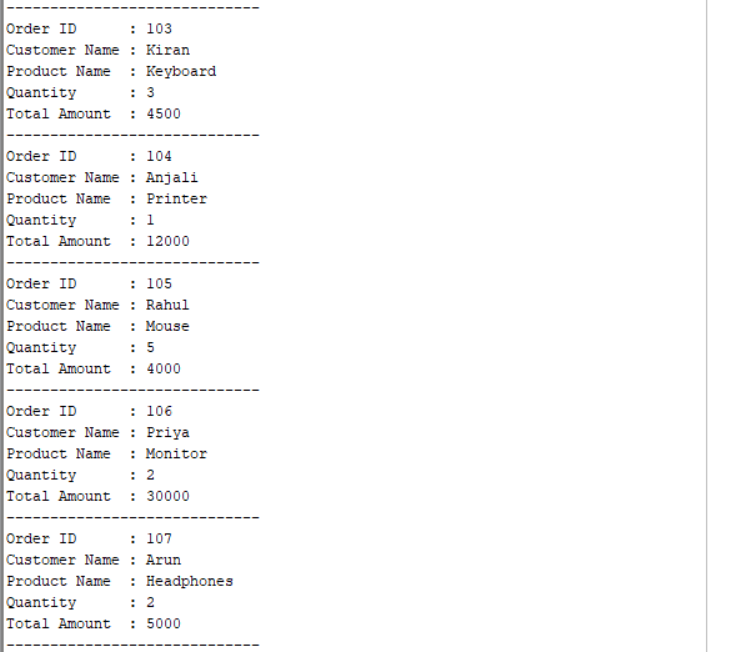
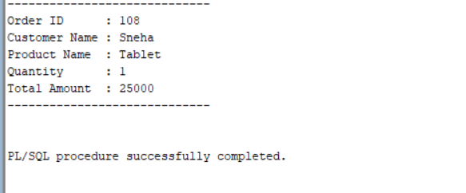


```
Program 9 – Combined Cursor Features (Employee Management System)
```

## 1. Create the EMPLOYEE Table
```
CREATE TABLE employee (
    employee_id NUMBER(5) PRIMARY KEY,
    employee_name VARCHAR2(50),
    department VARCHAR2(30),
    salary NUMBER(10,2)
);
```

## 2. Insert Sample Employee Records
```
INSERT INTO employee VALUES (101, 'Ravi', 'CSE', 30000);
INSERT INTO employee VALUES (102, 'Sita', 'ECE', 35000);
INSERT INTO employee VALUES (103, 'Kiran', 'CSE', 40000);
INSERT INTO employee VALUES (104, 'Anjali', 'EEE', 32000);
INSERT INTO employee VALUES (105, 'Rahul', 'CSE', 38000);
INSERT INTO employee VALUES (106, 'Priya', 'ECE', 45000);
INSERT INTO employee VALUES (107, 'Arun', 'CSE', 42000);
INSERT INTO employee VALUES (108, 'Sneha', 'EEE', 36000);

COMMIT;
```
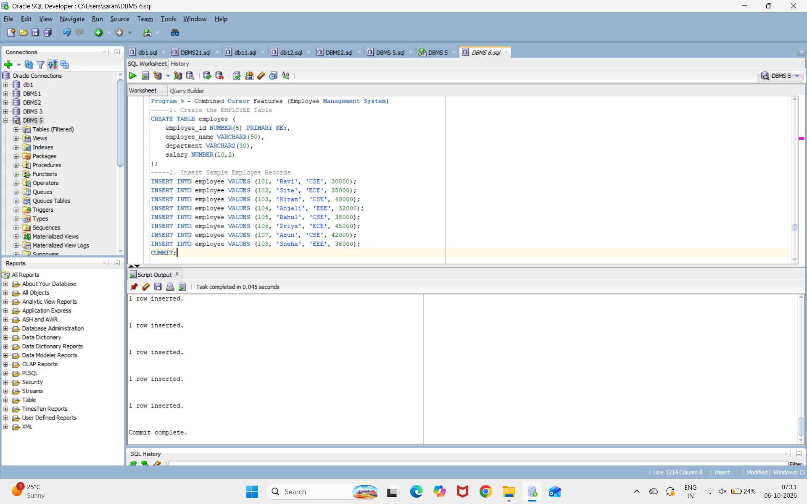

## 3. PL/SQL Program
```
SET SERVEROUTPUT ON;

DECLARE

    -- Variables to store employee details
    v_employee_id   employee.employee_id%TYPE;
    v_employee_name employee.employee_name%TYPE;
    v_department    employee.department%TYPE;
    v_salary        employee.salary%TYPE;

    -- Declare parameterized cursor with FOR UPDATE
    CURSOR C_EMPLOYEE (p_department VARCHAR2) IS
        SELECT employee_id,
               employee_name,
               department,
               salary
        FROM employee
        WHERE department = p_department
        FOR UPDATE;

BEGIN

    -- Open cursor by passing department name
    OPEN C_EMPLOYEE('CSE');

    -- Fetch one employee record at a time
    LOOP

        FETCH C_EMPLOYEE
        INTO v_employee_id,
             v_employee_name,
             v_department,
             v_salary;

        -- Exit when all selected records are processed
        EXIT WHEN C_EMPLOYEE%NOTFOUND;

        -- Increase salary by Rs. 3,000
        v_salary := v_salary + 3000;

        -- Update the current employee record
        UPDATE employee
        SET salary = v_salary
        WHERE CURRENT OF C_EMPLOYEE;

        -- Display updated employee details
        DBMS_OUTPUT.PUT_LINE('Employee ID   : ' || v_employee_id);
        DBMS_OUTPUT.PUT_LINE('Employee Name : ' || v_employee_name);
        DBMS_OUTPUT.PUT_LINE('Department    : ' || v_department);
        DBMS_OUTPUT.PUT_LINE('Updated Salary: Rs. ' || v_salary);
        DBMS_OUTPUT.PUT_LINE('-----------------------------');

    END LOOP;

    -- Commit the transaction
    COMMIT;

    -- Close the cursor
    CLOSE C_EMPLOYEE;

    DBMS_OUTPUT.PUT_LINE(
        'Salary updated successfully for all selected employees.'
    );

EXCEPTION
    WHEN OTHERS THEN
        DBMS_OUTPUT.PUT_LINE('Error: ' || SQLERRM);

        IF C_EMPLOYEE%ISOPEN THEN
            CLOSE C_EMPLOYEE;
        END IF;
END;
/
```

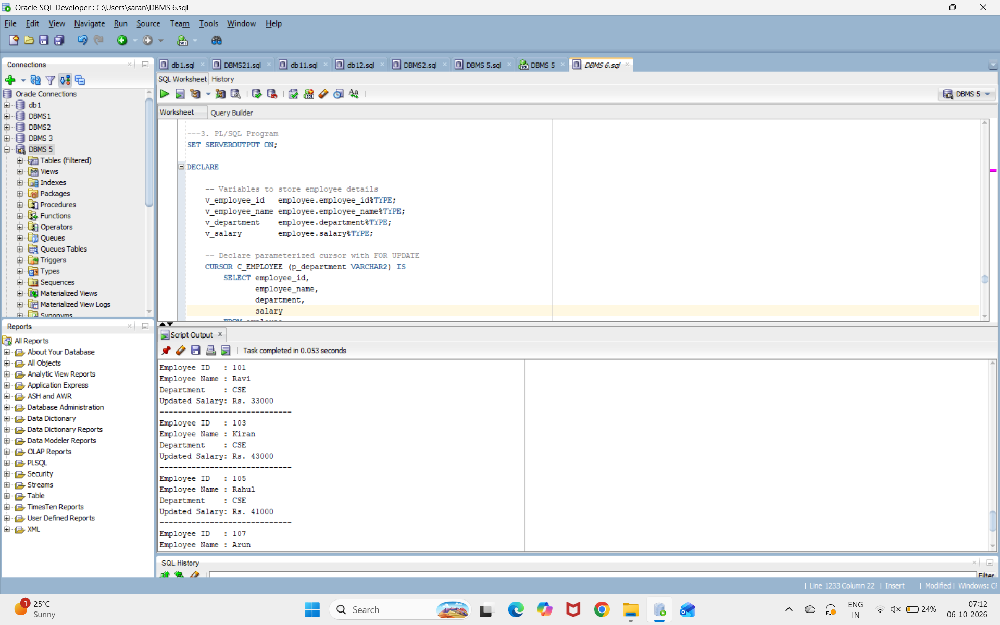
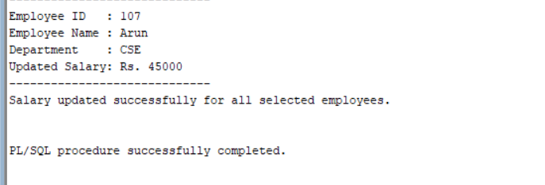


```
Program 10 – Combined Cursor Features (College Management System)
```
## 1. Create the STUDENT Table
```
CREATE TABLE student (
    student_id NUMBER(5) PRIMARY KEY,
    student_name VARCHAR2(50),
    branch VARCHAR2(20),
    semester NUMBER(2),
    cgpa NUMBER(3,2),
    scholarship_status VARCHAR2(20)
);
```

## 2. Insert Sample Student Records
```
INSERT INTO student VALUES (101, 'Ravi',   'CSE', 5, 8.50, 'Not Eligible');
INSERT INTO student VALUES (102, 'Sita',   'CSE', 5, 9.20, 'Not Eligible');
INSERT INTO student VALUES (103, 'Kiran',  'ECE', 4, 8.80, 'Not Eligible');
INSERT INTO student VALUES (104, 'Anjali', 'CSE', 5, 9.50, 'Not Eligible');
INSERT INTO student VALUES (105, 'Rahul',  'CSE', 6, 7.90, 'Not Eligible');
INSERT INTO student VALUES (106, 'Priya',  'ECE', 4, 9.10, 'Not Eligible');
INSERT INTO student VALUES (107, 'Arun',   'CSE', 5, 9.00, 'Not Eligible');
INSERT INTO student VALUES (108, 'Sneha',  'EEE', 3, 8.70, 'Not Eligible');

COMMIT;
```
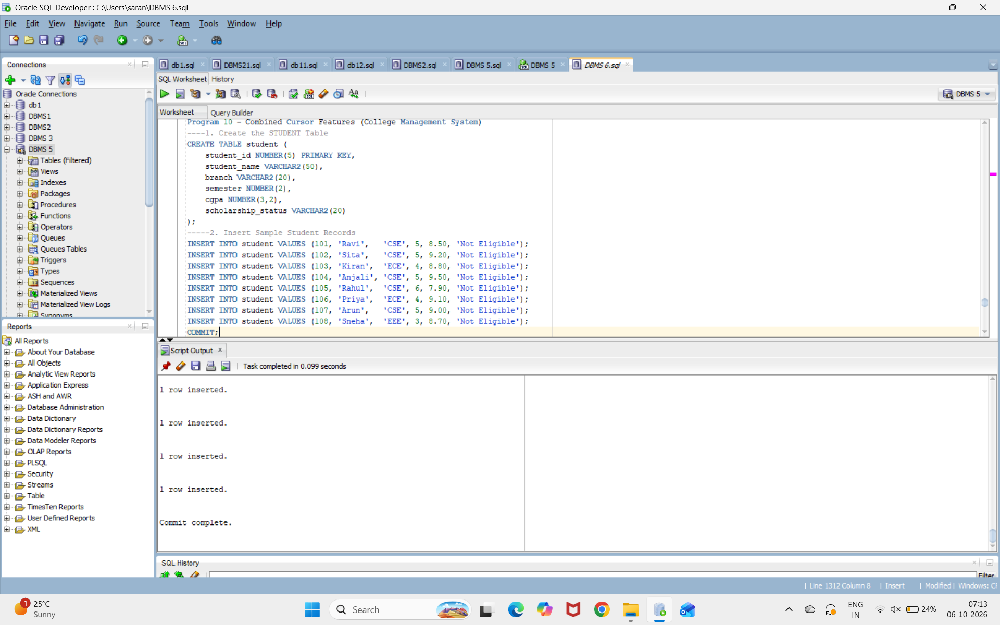

## 3. PL/SQL Program
```
SET SERVEROUTPUT ON;

DECLARE

    -- Variables to store student details
    v_student_id          student.student_id%TYPE;
    v_student_name        student.student_name%TYPE;
    v_branch              student.branch%TYPE;
    v_semester            student.semester%TYPE;
    v_cgpa                student.cgpa%TYPE;
    v_scholarship_status  student.scholarship_status%TYPE;

    -- Parameterized cursor with FOR UPDATE
    CURSOR C_STUDENT (p_branch VARCHAR2) IS
        SELECT student_id,
               student_name,
               branch,
               semester,
               cgpa,
               scholarship_status
        FROM student
        WHERE branch = p_branch
        FOR UPDATE;

    -- REF CURSOR type
    TYPE student_ref_cursor IS REF CURSOR;

    -- REF CURSOR variable
    v_ref_cursor student_ref_cursor;

BEGIN

    -- Open parameterized cursor for the specified branch
    OPEN C_STUDENT('CSE');

    -- Fetch one student record at a time
    LOOP

        FETCH C_STUDENT
        INTO v_student_id,
             v_student_name,
             v_branch,
             v_semester,
             v_cgpa,
             v_scholarship_status;

        EXIT WHEN C_STUDENT%NOTFOUND;

        -- Display student details using DBMS_OUTPUT
        DBMS_OUTPUT.PUT_LINE('Student ID         : ' || v_student_id);
        DBMS_OUTPUT.PUT_LINE('Student Name       : ' || v_student_name);
        DBMS_OUTPUT.PUT_LINE('Branch             : ' || v_branch);
        DBMS_OUTPUT.PUT_LINE('Semester           : ' || v_semester);
        DBMS_OUTPUT.PUT_LINE('CGPA               : ' || v_cgpa);

        -- Check CGPA for scholarship eligibility
        IF v_cgpa >= 9.0 THEN

            -- Update current student record
            UPDATE student
            SET scholarship_status = 'Eligible'
            WHERE CURRENT OF C_STUDENT;

            v_scholarship_status := 'Eligible';

        END IF;

        -- Display scholarship status
        DBMS_OUTPUT.PUT_LINE(
            'Scholarship Status : ' || v_scholarship_status
        );

        DBMS_OUTPUT.PUT_LINE('-----------------------------');

    END LOOP;

    -- Commit all updates
    COMMIT;

    -- Close parameterized cursor
    CLOSE C_STUDENT;

    -- Open REF CURSOR to display updated student details
    OPEN v_ref_cursor FOR
        SELECT student_id,
               student_name,
               branch,
               semester,
               cgpa,
               scholarship_status
        FROM student
        WHERE branch = 'CSE';

    DBMS_OUTPUT.PUT_LINE(
        'UPDATED STUDENT DETAILS USING REF CURSOR'
    );
    DBMS_OUTPUT.PUT_LINE(
        '========================================'
    );

    -- Fetch records using REF CURSOR
    LOOP

        FETCH v_ref_cursor
        INTO v_student_id,
             v_student_name,
             v_branch,
             v_semester,
             v_cgpa,
             v_scholarship_status;

        EXIT WHEN v_ref_cursor%NOTFOUND;

        DBMS_OUTPUT.PUT_LINE(
            'ID: ' || v_student_id ||
            ' | Name: ' || v_student_name ||
            ' | Branch: ' || v_branch ||
            ' | Semester: ' || v_semester ||
            ' | CGPA: ' || v_cgpa ||
            ' | Scholarship: ' || v_scholarship_status
        );

    END LOOP;

    -- Close REF CURSOR
    CLOSE v_ref_cursor;

    -- Display success message
    DBMS_OUTPUT.PUT_LINE(
        'Student scholarship status updated successfully.'
    );

EXCEPTION
    WHEN OTHERS THEN

        DBMS_OUTPUT.PUT_LINE('Error: ' || SQLERRM);

        IF C_STUDENT%ISOPEN THEN
            CLOSE C_STUDENT;
        END IF;

        IF v_ref_cursor%ISOPEN THEN
            CLOSE v_ref_cursor;
        END IF;

END;
/
```
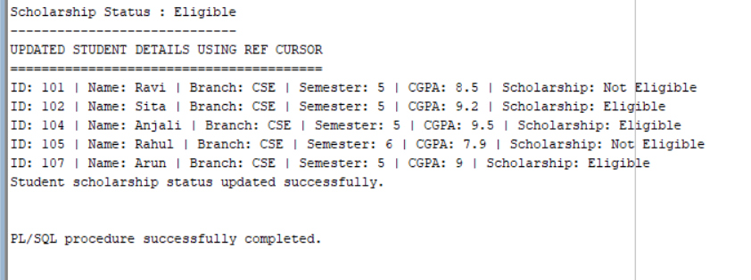


## 4. Verify the Final Table

```
SELECT *
FROM student
WHERE branch = 'CSE';
```


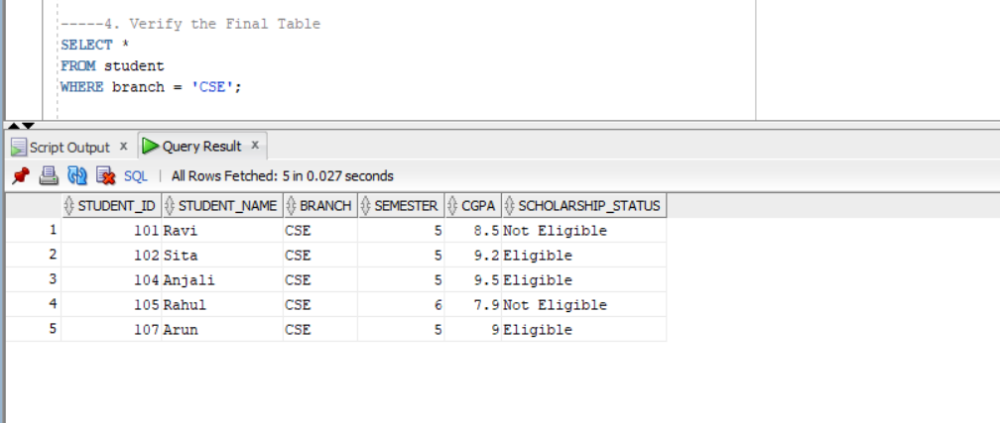
